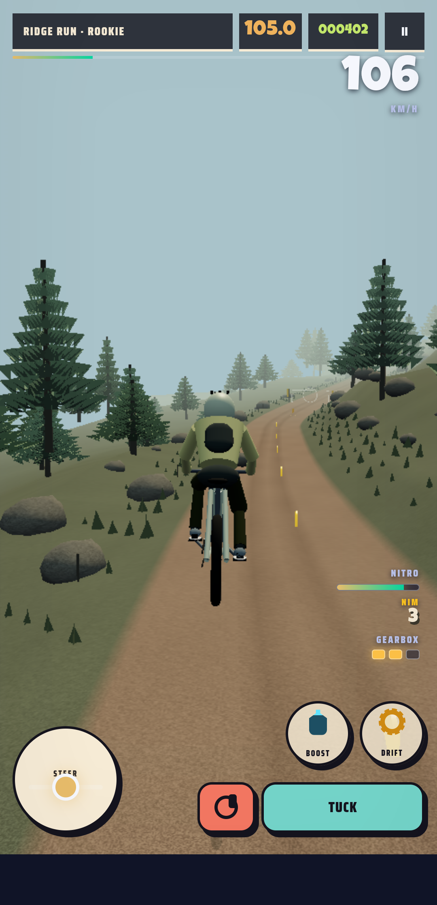
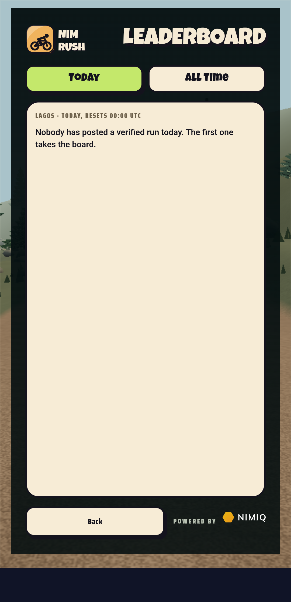
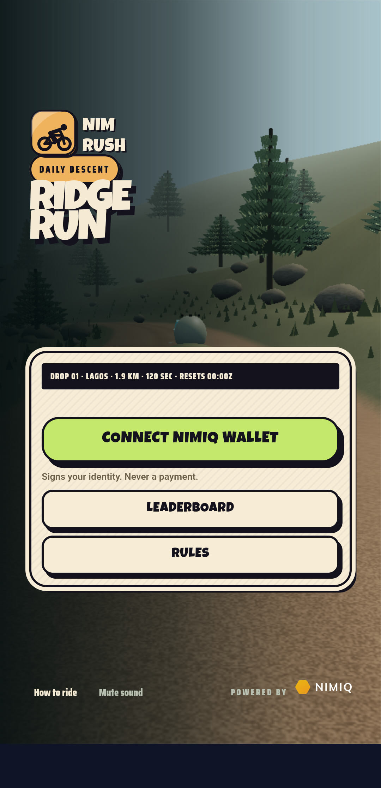
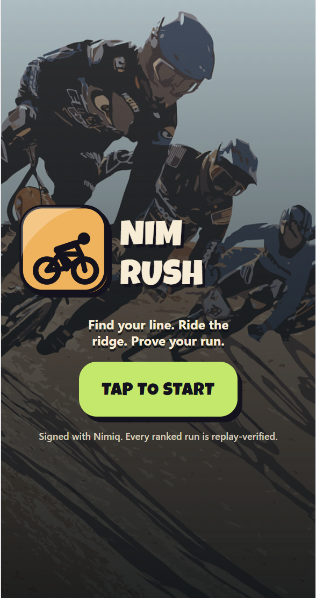
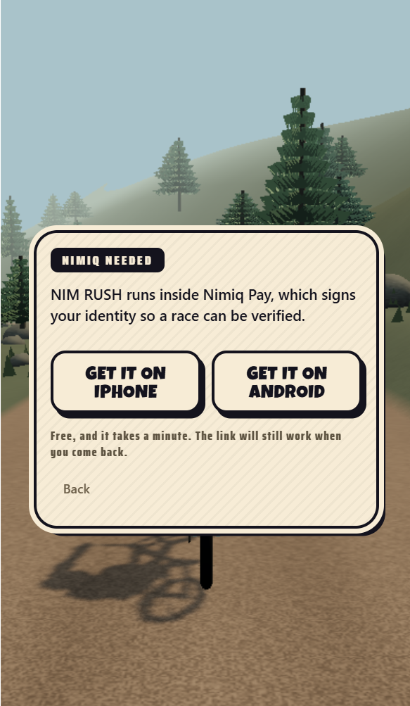

# NIM RUSH

> Race the ridge. Prove the run. Take the NIM.

| Field | Value |
| --- | --- |
| Category | Games |
| Pricing | Free |
| Team name | invincibles |
| Team members | grachidefi |
| X account | Iziedking \| @grachidefi |
| Heard about it via | X |
| Contact email | iziedking17@gmail.com |
| GitHub login | @Iziedking |
| Submitted at | 2026-09-18T22:13:22.030Z |

## Links

| Link | URL |
| --- | --- |
| Repo | [https://github.com/Iziedking/nim-rush](<https://github.com/Iziedking/nim-rush>) |
| Demo | [https://www.nim-rush.xyz](<https://www.nim-rush.xyz>) |
| Video | [https://youtube.com/shorts/4e48mW7nLIs](<https://youtube.com/shorts/4e48mW7nLIs>) |
| Skool post | _Not provided — optional_ |
| Social post | [https://x.com/grachidefi/status/2101069444705333604](<https://x.com/grachidefi/status/2101069444705333604>) |

## Description

NIM RUSH is a daily downhill bike race that runs inside Nimiq Pay — no install,
no seed phrase, no signup. Your wallet signs the run, the server re-rides your
inputs to work out the score itself, and the day's best three split a real NIM
pool on mainnet.

## Builder story

We built NIM RUSH around a simple problem: games can make a player feel skilled, but most web games cannot prove what happened during the run.

A downhill race can look fair while the leaderboard is built from numbers submitted by the browser. The player sends a score, the server stores it, and everyone is expected to trust the result.

NIM RUSH takes a different approach.

It is a daily downhill competition inside Nimiq Pay. Every ranked rider gets the same course, the same rules, the same equipment, and three attempts. Winning depends on decisions made on the hill: when to brake, which line to take, how much speed to carry, where to spend boost, and whether a risky shortcut is worth the collision penalty.

Nimiq is part of the game because the competition needs more than a username.

The wallet gives each run a real rider identity. It signs participation and connects the result to a player-controlled wallet. The Mini App format keeps that identity close to the game, without a separate account system, installation, or seed-phrase flow.

During a ranked run, NIM RUSH records the rider’s sampled control trace. The browser can submit a score claim, but it does not control the result. The server checks the course ticket, wallet binding, ruleset, seed, attempt limit, and trace hash. It then replays the run from the beginning and calculates the score again.

If the trace was altered, the ticket was reused, the run did not finish, or the submitted score disagrees with the replay, the result is rejected.

This gives the leaderboard a verifiable foundation. A player can prove how the run was completed, not only what number appeared at the end.

The same verified runs can become rival lines for later riders. Players compete against recorded decisions from other descents instead of simulated activity.

When a daily reward pool is funded, verified performance can qualify for NIM rewards sent to the rider’s wallet. The treasury balance and settlement can be checked on-chain.

We built NIM RUSH to connect three things that are usually separated: the fun of the game, the proof behind the leaderboard, and the wallet that receives a legitimate reward.

The player makes the run.

The server proves the result.

Nimiq gives that result an identity and a settlement layer.

## Thumbnail

## Screenshots

---

_Generated from the submission form. `submission.yaml` in this folder is the machine-readable source of truth._
