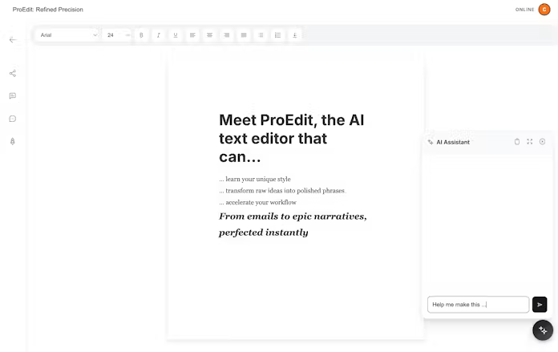
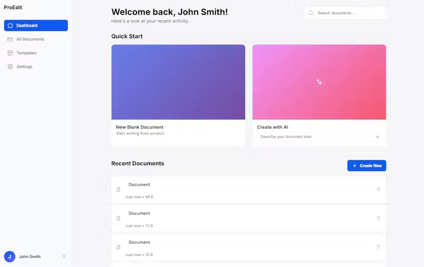

# ProEdit

> Writing, Reimaged with AI

| Field | Value |
| --- | --- |
| Category | Productivity |
| Pricing | Free |
| Team name | _Not provided — optional_ |
| Team members | _Not provided — optional_ |
| X account | _Not provided — optional_ |
| Heard about it via | _Not provided — optional_ |
| Contact email | crazyjackson0728@gmail.com |
| GitHub login | @Jackson-0728 |
| Submitted at | 2026-09-18T04:00:59.742Z |

## Links

| Link | URL |
| --- | --- |
| Repo | [https://github.com/Jackson-0728/ProEdit](<https://github.com/Jackson-0728/ProEdit>) |
| Demo | [https://app-proedit.vercel.app/](<https://app-proedit.vercel.app/>) |
| Video | [https://app-proedit.vercel.app/](<https://app-proedit.vercel.app/>) |
| Skool post | _Not provided — optional_ |
| Social post | _Not provided — optional_ |

## Description

The advanced AI-powered editor for professionals. Write faster, edit smarter, and create content that stands out.

## Builder story

_Not provided — optional_

## Thumbnail

## Screenshots

---

_Generated from the submission form. `submission.yaml` in this folder is the machine-readable source of truth._
