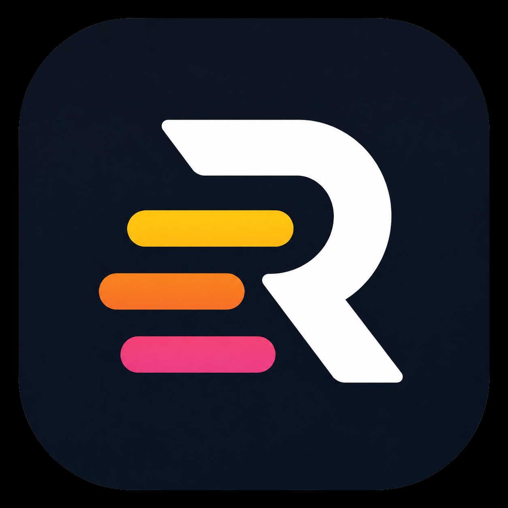
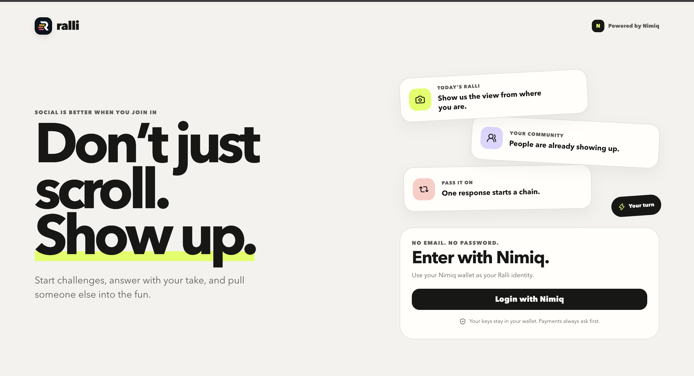
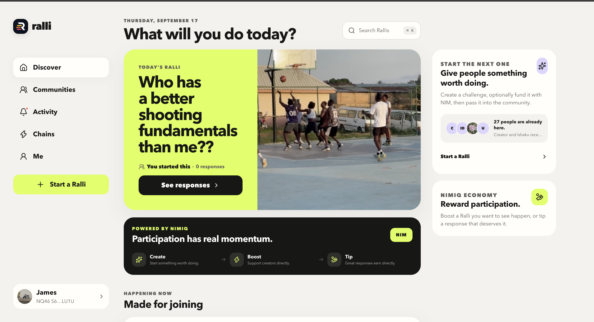
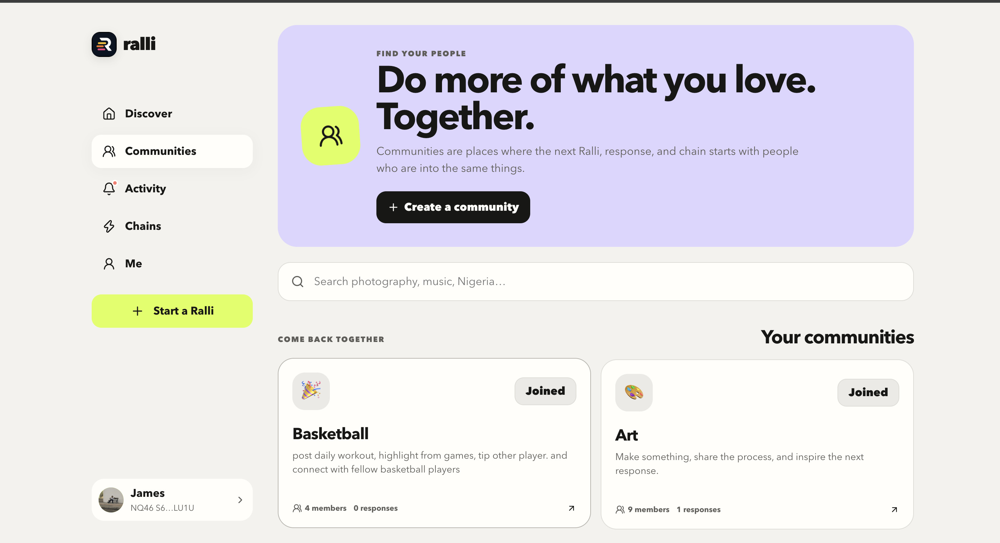
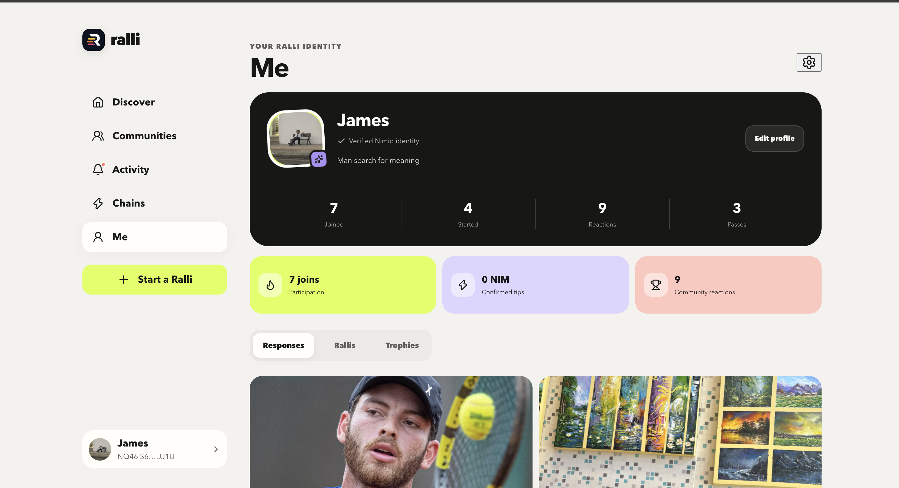
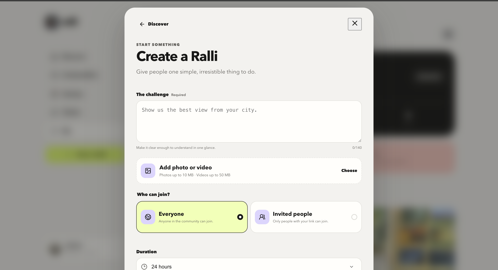

# Ralli

> Start something. Join something. Pass it on.

| Field | Value |
| --- | --- |
| Category | Social |
| Pricing | Free |
| Team name | Ralli |
| Team members | _Not provided — optional_ |
| X account | https://x.com/codeX_james |
| Heard about it via | Nimiq community and X |
| Contact email | victorjames408@gmail.com |
| GitHub login | @JamesVictor-O |
| Submitted at | 2026-09-17T00:48:48.357Z |

## Links

| Link | URL |
| --- | --- |
| Repo | [https://github.com/JamesVictor-O/Ralli](<https://github.com/JamesVictor-O/Ralli>) |
| Demo | [https://ralli-mu.vercel.app](<https://ralli-mu.vercel.app>) |
| Video | [https://youtu.be/El4pCm2UQ9E](<https://youtu.be/El4pCm2UQ9E>) |
| Skool post | [https://x.com/codeX_james/status/2100374339170324956?s=20](<https://x.com/codeX_james/status/2100374339170324956?s=20>) |
| Social post | [https://www.skool.com/miniappscompetition/ralli-a-social-network-on-nimiq?p=1cf023a2](<https://www.skool.com/miniappscompetition/ralli-a-social-network-on-nimiq?p=1cf023a2>) |

## Description

Ralli is a social Mini App on Nimiq Pay where people start challenges, respond with photos or videos, and pass them to friends to build chains of participation. Communities can join Daily Rallis, react to responses, and use NIM to boost challenges they want to see or tip response

## Builder story

Ralli came from a simple series of questions.

The first was: why Mini Apps on Nimiq Pay?

When I started researching, one description stuck with me: Nimiq was turning its payment app into a platform where developers could build Mini Apps that extend what the app can do.

As a frontend developer, that immediately interested me. A lot of what I enjoy building is focused on making blockchain infrastructure disappear into the background, so normal users can use a product without first needing to understand wallets, networks or how crypto works.

That led to a more personal question:

What could I build inside Nimiq Pay that I would genuinely send to my friends who know nothing about Nimiq — and they would have a reason to open it?

I didn't want the answer to be another financial tool. I wanted something they could open because it was fun, because a friend sent them something, or because other people were doing something they wanted to join.

That's where the idea of a social Mini App started.

Ralli became an experiment around a simple idea: give people things to do together, then let Nimiq provide a native value layer underneath those interactions.

A friend can pass you a Ralli. You respond with a photo or video. Someone else joins. A chain starts growing. If people really want to see a Ralli happen, they can Boost it with NIM. If someone's response makes you laugh or genuinely impresses you, you can Tip them directly.

The social interaction comes first; the blockchain stays underneath.

Ultimately, I built Ralli because I wanted to explore a different reason for someone to discover Nimiq Pay: not because they were looking for a crypto wallet, but because someone or something they cared about brought them there.

## Thumbnail

## Screenshots

---

_Generated from the submission form. `submission.yaml` in this folder is the machine-readable source of truth._
