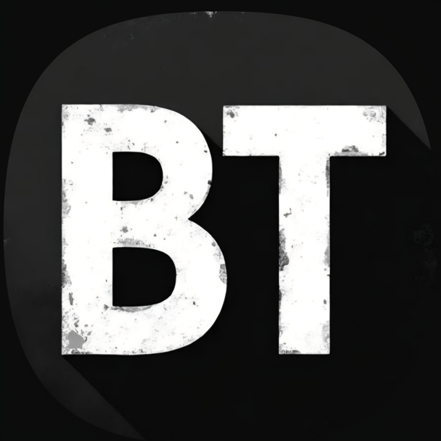
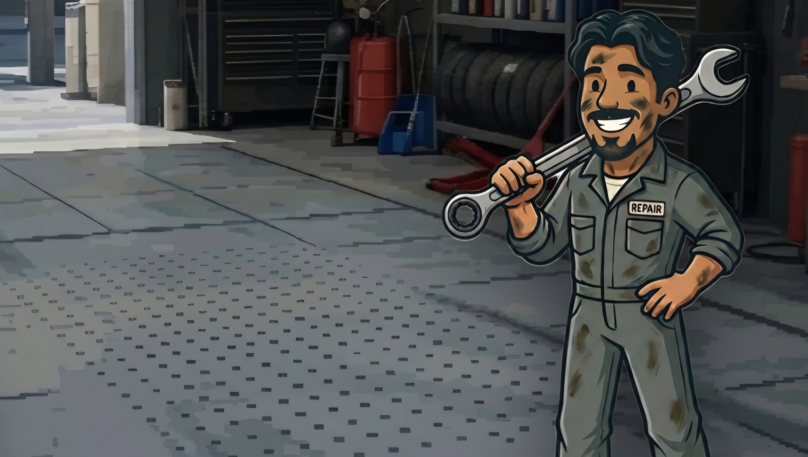
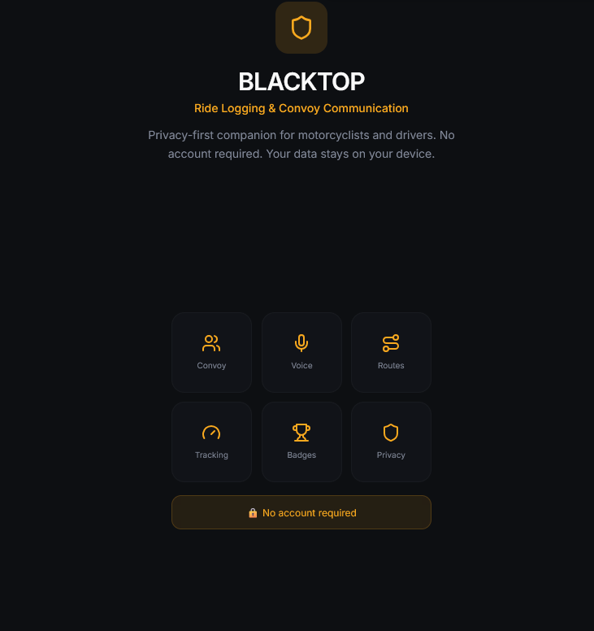
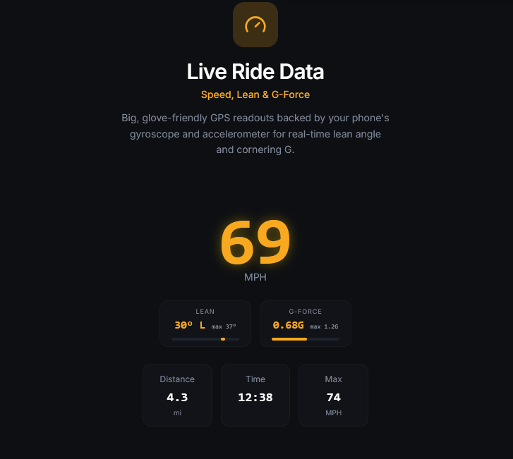
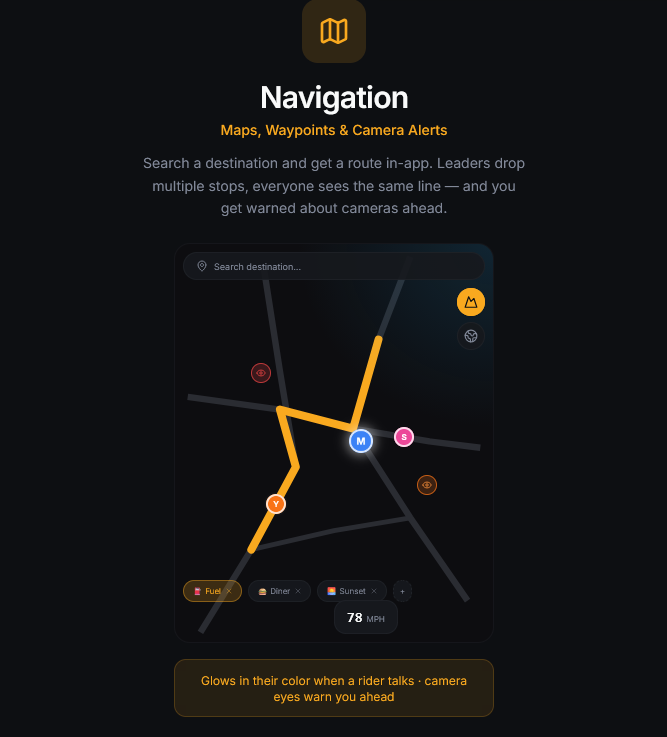
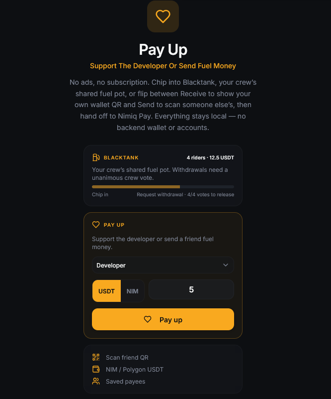
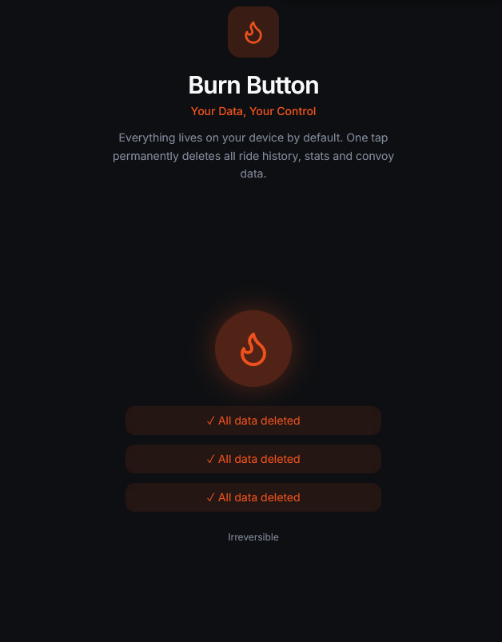

# Blacktop

> Made by a rider, backed by riders

| Field | Value |
| --- | --- |
| Category | Social |
| Pricing | Free |
| Team name | _Not provided — optional_ |
| Team members | Jesse |
| X account | _Not provided — optional_ |
| Heard about it via | Instagram |
| Contact email | jesselukose@gmail.com |
| GitHub login | @Jayobebe |
| Submitted at | 2026-09-17T20:30:16.082Z |

## Links

| Link | URL |
| --- | --- |
| Repo | [https://github.com/Jayobebe/Blacktop.git](<https://github.com/Jayobebe/Blacktop.git>) |
| Demo | [https://blacktoplive.com](<https://blacktoplive.com>) |
| Video | [https://youtu.be/IAYky-1sZzw](<https://youtu.be/IAYky-1sZzw>) |
| Skool post | [https://www.skool.com/miniappscompetition/a-more-formal-introduction?p=68983558](<https://www.skool.com/miniappscompetition/a-more-formal-introduction?p=68983558>) |
| Social post | [https://www.instagram.com/p/DdQrxn1Nu4F/?stkn=MXhvNzR0dDF2a2ZsYw==](<https://www.instagram.com/p/DdQrxn1Nu4F/?stkn=MXhvNzR0dDF2a2ZsYw==>) |

## Description

Blacktop is a privacy-first solo/ group ride companion app with real riders logging real rides. Pay Up is its built-in wallet feature along with Blacktank, a shared crew fuel pot that only pays out on unanimous vote, plus instant QR tips in NIM or USDT with zero fees to us.

## Builder story

I'm a marine engineer who rides motorcycles. Blacktop started because every ride app I tried wanted my data and money more than it wanted to help me track rides. Built solo between stretches of sea time, it grew from a simple ride tracker into convoy comms, live maps, safety tools, and a whole trading-card and badge economy, shaped by feedback from actual riders using it. I cold-pitched it at a local motorcycle shop's open day with zero ad spend, and it's grown past 200 riders since, word of mouth, not budget.

## Thumbnail

## Screenshots

---

_Generated from the submission form. `submission.yaml` in this folder is the machine-readable source of truth._
