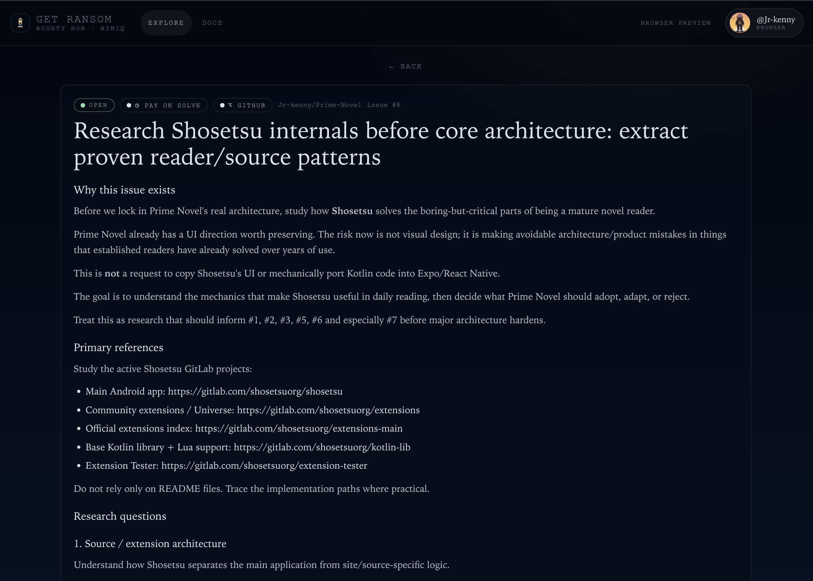
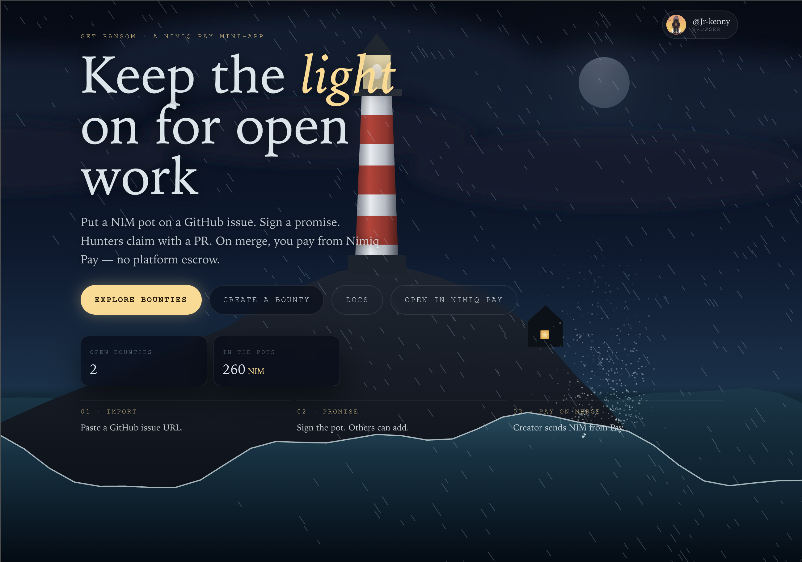
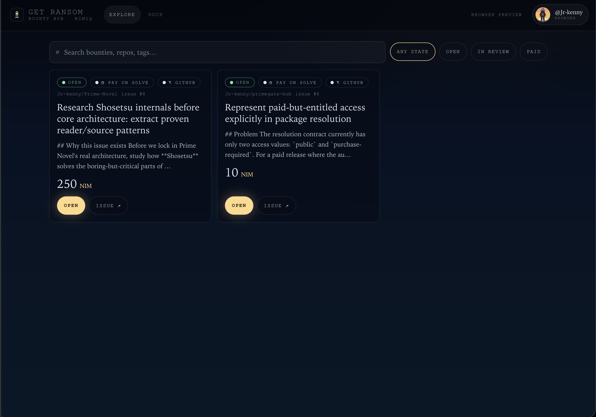
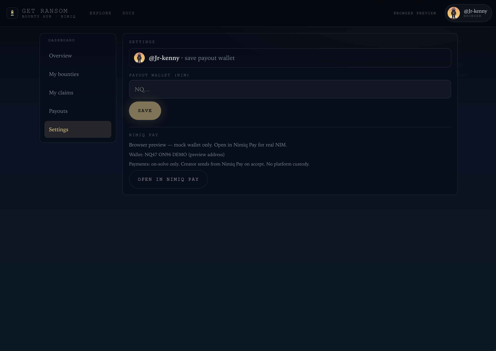

# Get  ransom

> Keep the light on for open work — NIM bounties on GitHub issues, paid on merge in Nimiq Pay

| Field | Value |
| --- | --- |
| Category | Earning |
| Pricing | Free |
| Team name | _Not provided — optional_ |
| Team members | _Not provided — optional_ |
| X account | Jrken_ny |
| Heard about it via | _Not provided — optional_ |
| Contact email | dalvidjr2022@gmail.com |
| GitHub login | @Jr-kenny |
| Submitted at | 2026-09-15T13:14:50.712Z |

## Links

| Link | URL |
| --- | --- |
| Repo | [https://github.com/Jr-kenny/get-ransom](<https://github.com/Jr-kenny/get-ransom>) |
| Demo | [https://get-ransom.vercel.app/](<https://get-ransom.vercel.app/>) |
| Video | [https://www.youtube.com/watch?v=fRUwdMS5S-c](<https://www.youtube.com/watch?v=fRUwdMS5S-c>) |
| Skool post | _Not provided — optional_ |
| Social post | _Not provided — optional_ |

## Description

Get Ransom puts NIM bounties on GitHub issues. Import an issue, sign a promise for the pot, claim with a PR. On merge, the creator pays you from Nimiq Pay. No platform escrow.

## Builder story

What inspired me to build Get Ransom was my own experience as a developer participating in bounties, contests, and hackathons.

I have earned money through these platforms, but I started noticing that actually getting paid can become a completely different problem from earning the money in the first place. A recent experience with GetBounty and Bounty Hub made that especially clear to me. I went through the process of completing work, getting rewarded, and then dealing with the payment side of things. Once the reward had to move into local fiat, there was suddenly a lot of friction: payment processing, bank requirements, account limitations, back-and-forth with financial institutions, and figuring out how to actually get the money into a form I could use.

What frustrated me was the contrast with how I normally receive crypto payments. When a bounty is paid directly in cryptocurrency, I can receive it in my wallet and decide what to do with it myself. There is no waiting for a bank to process it, no worrying about whether a particular bank supports the payment route, and no complicated chain of intermediaries between the person paying me and me actually receiving my money.

That experience made me think about the bigger problem. There are thousands of developers, researchers, contributors, and bounty hunters earning money online, especially through crypto-native platforms, but getting that money into their hands can still be unnecessarily complicated.

So I wanted to build Get Ransom around that problem: making the process of receiving and accessing earned money simpler, more direct, and more aligned with how internet-native workers actually operate.

The idea did not come from looking for a problem to build a product around. I was already the person experiencing the problem. Get Ransom is my attempt to build the payment experience I wished I had while doing the work and trying to get paid for it.

## Thumbnail

## Screenshots

---

_Generated from the submission form. `submission.yaml` in this folder is the machine-readable source of truth._
