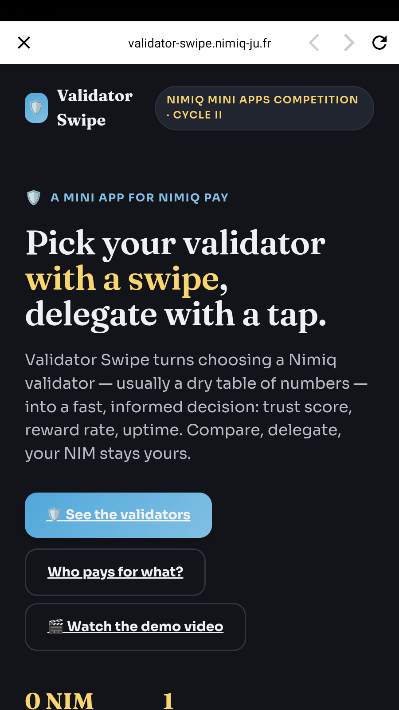
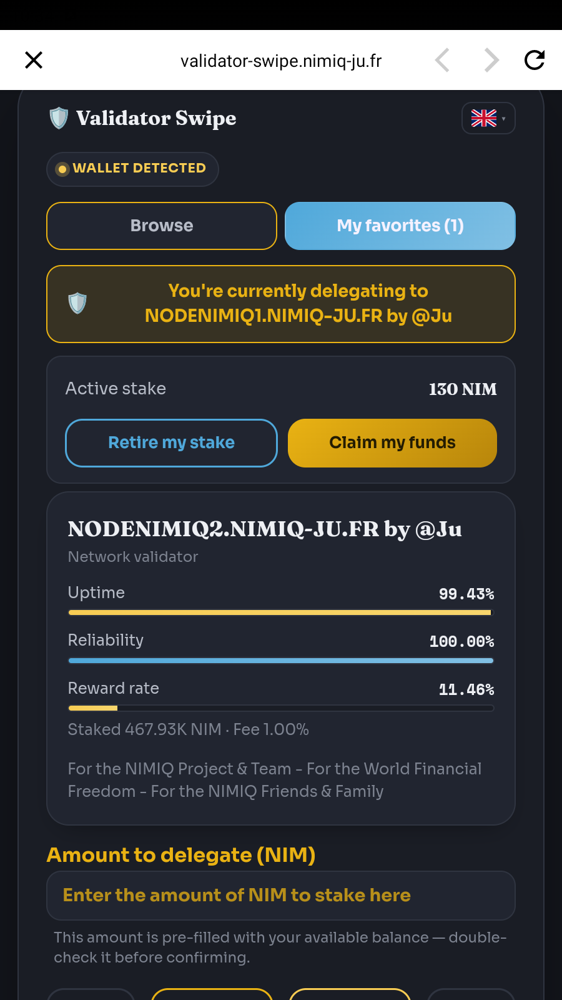
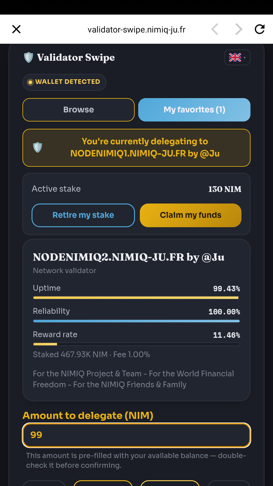

# Validator Swipe

> Pick your Nimiq validator with a swipe, delegate with a tap.

| Field | Value |
| --- | --- |
| Category | On-chain services |
| Pricing | Free |
| Team name | Ju |
| Team members | Claude |
| X account | Julien59247787 |
| Heard about it via | Nimiq Community, Discord, Telegram... |
| Contact email | ju@nimiq-ju.fr |
| GitHub login | @Julien59247787 |
| Submitted at | 2026-09-18T20:41:35.780Z |

## Links

| Link | URL |
| --- | --- |
| Repo | [https://github.com/Julien59247787/nimiq-app-validatorswipe](<https://github.com/Julien59247787/nimiq-app-validatorswipe>) |
| Demo | [https://validator-swipe.nimiq-ju.fr](<https://validator-swipe.nimiq-ju.fr>) |
| Video | [https://www.loom.com/share/8fd6134c0dff4960820c72df784846a7](<https://www.loom.com/share/8fd6134c0dff4960820c72df784846a7>) |
| Skool post | [https://www.skool.com/miniappscompetition/validator-swipe-cycle-ii-submission?p=bb5bbe6e](<https://www.skool.com/miniappscompetition/validator-swipe-cycle-ii-submission?p=bb5bbe6e>) |
| Social post | [https://x.com/julien59247787/status/2101039364952281381?s=20](<https://x.com/julien59247787/status/2101039364952281381?s=20>) |

## Description

Validator Swipe turns choosing a Nimiq validator — usually a dry stats table — into a fast, informed decision. Compare ~40 real validators by uptime, reliability and reward rate, set favorites aside, then delegate for real in one tap. Built for anyone who wants to stake NIM witho

## Builder story

We kept staring at the same problem: picking a Nimiq validator meant scrolling a dry table of stats most people never look at twice. So we rebuilt the decision as a swipe — compare uptime, reliability and reward rate at a glance, set a few favorites aside, then delegate for real in one tap. It works inside Nimiq Pay and via Nimiq Hub from any browser, in 11 languages, with zero custody the whole way through.

## Thumbnail

## Screenshots

---

_Generated from the submission form. `submission.yaml` in this folder is the machine-readable source of truth._
