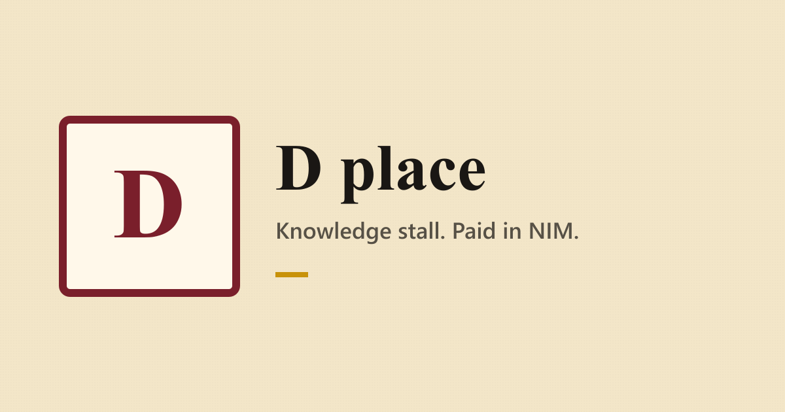
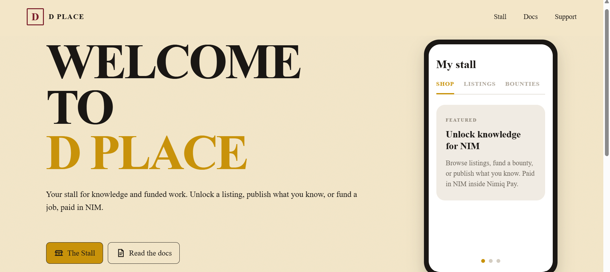
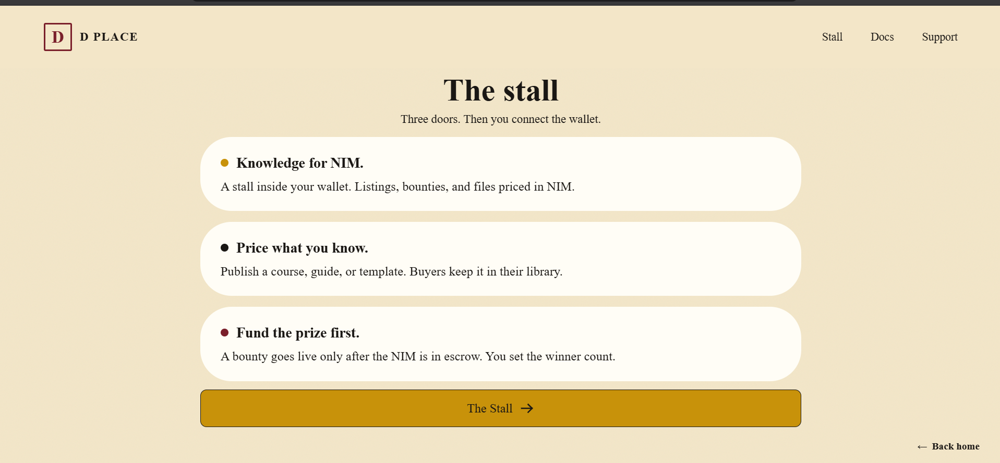
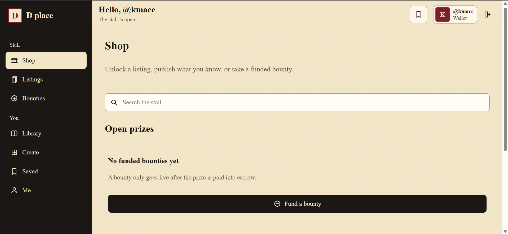
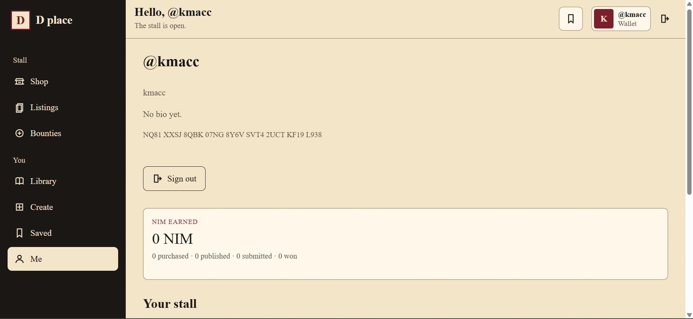

# D place

> Teach, learn and earn

| Field | Value |
| --- | --- |
| Category | Education |
| Pricing | Free |
| Team name | _Not provided — optional_ |
| Team members | _Not provided — optional_ |
| X account | mackmv_ |
| Heard about it via | _Not provided — optional_ |
| Contact email | kcfreshkl@gmail.com |
| GitHub login | @KAMEVETRICS |
| Submitted at | 2026-09-18T23:53:07.741Z |

## Links

| Link | URL |
| --- | --- |
| Repo | [https://github.com/KAMEVETRICS/d-place](<https://github.com/KAMEVETRICS/d-place>) |
| Demo | [https://deplace.space](<https://deplace.space>) |
| Video | [https://youtu.be/i2Vj2xQUyd8](<https://youtu.be/i2Vj2xQUyd8>) |
| Skool post | _Not provided — optional_ |
| Social post | _Not provided — optional_ |

## Description

D place is a stall for knowledge, paid in NIM. You list a course, guide, or template. A buyer pays the listed NIM from their wallet.

## Builder story

_Not provided — optional_

## Thumbnail

## Screenshots

---

_Generated from the submission form. `submission.yaml` in this folder is the machine-readable source of truth._
