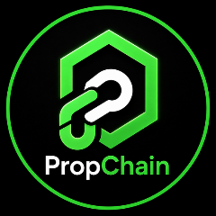
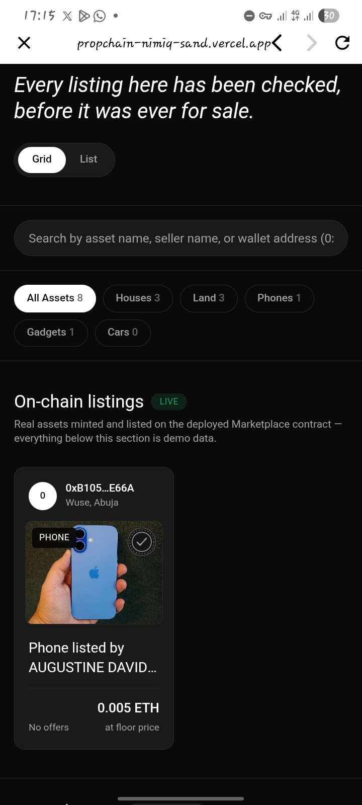
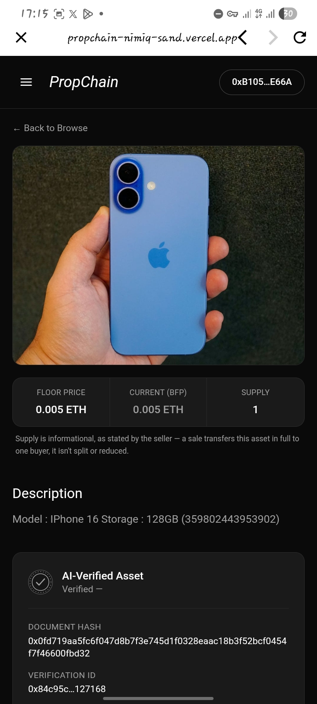
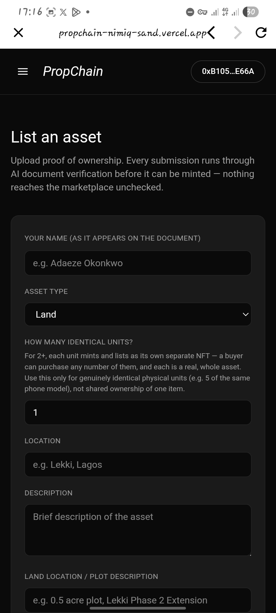
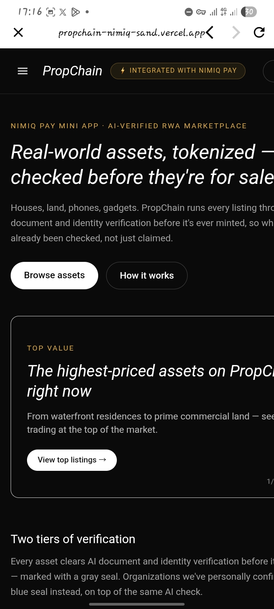
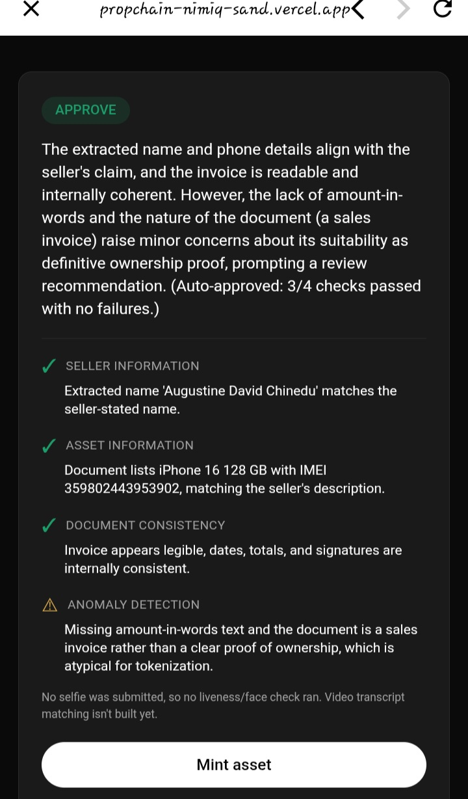

# PropChain

> Turn real-world assets into verified, tradeable NFTs right inside Nimiq Pay.

| Field | Value |
| --- | --- |
| Category | Marketplaces |
| Pricing | Free |
| Team name | Kasa |
| Team members | Augustine Derek |
| X account | Jasonfx90 |
| Heard about it via | X |
| Contact email | ohiogodisgood@gmail.com |
| GitHub login | @Kasiobi1 |
| Submitted at | 2026-09-18T16:18:31.170Z |

## Links

| Link | URL |
| --- | --- |
| Repo | [https://github.com/Kasiobi1/propchain-nimiq](<https://github.com/Kasiobi1/propchain-nimiq>) |
| Demo | [https://propchain-nimiq-sand.vercel.app/](<https://propchain-nimiq-sand.vercel.app/>) |
| Video | [https://youtu.be/dayllYJOXsI?si=gSuya8FsOALsgNlb](<https://youtu.be/dayllYJOXsI?si=gSuya8FsOALsgNlb>) |
| Skool post | _Not provided — optional_ |
| Social post | [https://x.com/Jasonfx90/status/2100978172095340637](<https://x.com/Jasonfx90/status/2100978172095340637>) |

## Description

PropChain lets people tokenize real-world assets — houses, land, phones, cars as NFTs, with every listing verified by AI against uploaded proof of ownership before it can be minted. 
Built for sellers and buyers who want a trustworthy way to trade real assets, with wallet, payme

## Builder story

_Not provided — optional_

## Thumbnail

## Screenshots

---

_Generated from the submission form. `submission.yaml` in this folder is the machine-readable source of truth._
