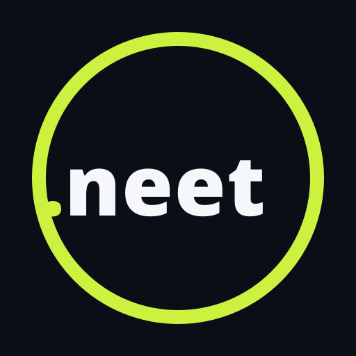
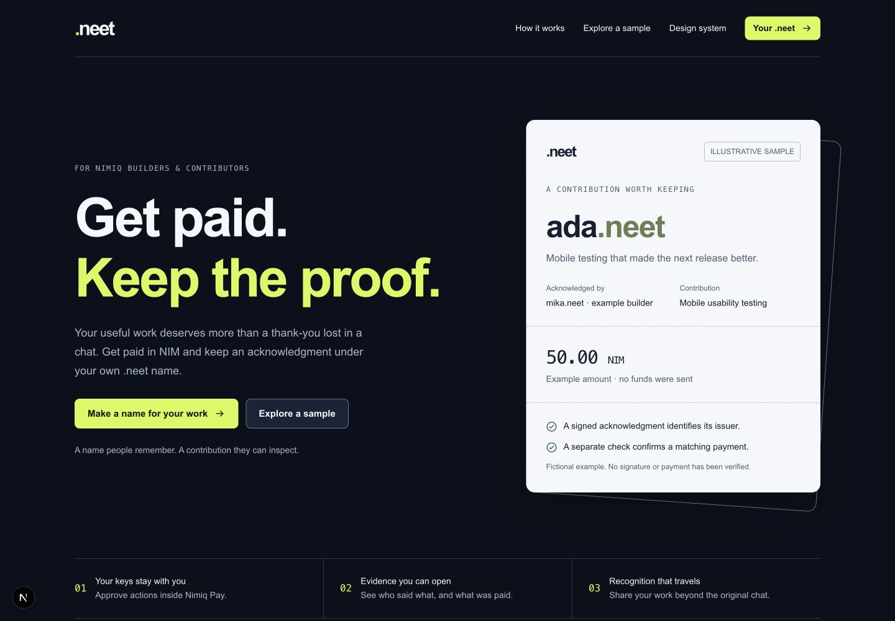
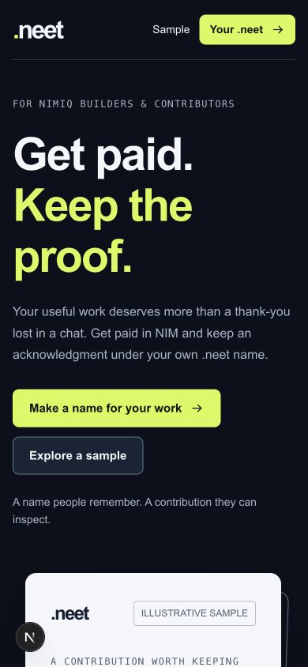
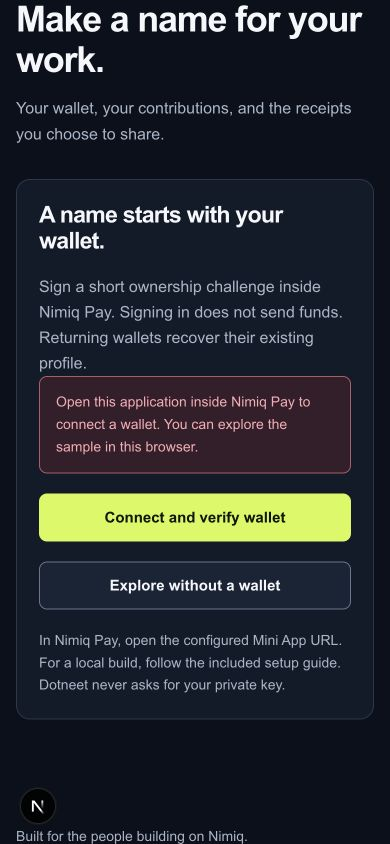
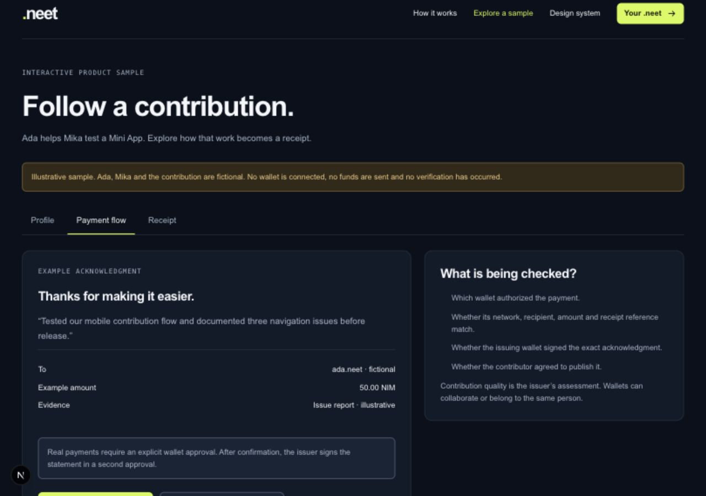

# Dotneet

> Dotneet — say thanks for good work with NIM and on-chain proof, under your own .neet name.

| Field | Value |
| --- | --- |
| Category | Marketplaces |
| Pricing | Freemium |
| Team name | _Not provided — optional_ |
| Team members | _Not provided — optional_ |
| X account | Mofe_bnks |
| Heard about it via | X |
| Contact email | bankoleadedotun16@gmail.com |
| GitHub login | @Mofe-Bankole |
| Submitted at | 2026-09-18T21:19:44.888Z |

## Links

| Link | URL |
| --- | --- |
| Repo | [https://github.com/Mofe-Bankole/neet](<https://github.com/Mofe-Bankole/neet>) |
| Demo | [https://dotneet.vercel.app/](<https://dotneet.vercel.app/>) |
| Video | [https://drive.google.com/drive/folders/1FDm6SPa8ujEySK0gjrU8dteQjAR9tpbb?usp=drive_link](<https://drive.google.com/drive/folders/1FDm6SPa8ujEySK0gjrU8dteQjAR9tpbb?usp=drive_link>) |
| Skool post | _Not provided — optional_ |
| Social post | _Not provided — optional_ |

## Description

Dotneet gives Nimiq builders and contributors a way to get paid for their work and keep the proof. You claim a memorable .neet name with a wallet you control, then a builder pays you in NIM and signs a description of your help — creating a verifiable acknowledgment. Each receipt

## Builder story

Inside Nimiq's community — Mini Apps testers, translators, designers, and helpful builders — the best work often ends as a thank-you lost in a chat. I kept watching contributors do real, valuable work with nothing durable to show for it. The problem isn't that people aren't grateful; it's that gratitude evaporates. No link, no record, no way to prove later that the work happened.
I wanted to build something that turns "thanks" into something a contributor can hold onto: a name they own, a payment that actually happened, and a record they control.
What problem does it solve?
1. Lost credit for real work. Contributors get a wallet-bound .neet name that becomes a home for their contributions — a portable profile they can share when the next opportunity comes.
2. Unverifiable claims. No trust scores or badges (which can be gamed). Instead: every acknowledgment is backed by a real NIM payment and a wallet signature. A server-side check confirms the transaction actually matched the receipt — amount, recipient, and reference. You can inspect the evidence yourself.
3. No way to take your contributions with you. Contributors choose which receipts to publish and carry their record outside the original chat. It's portable proof of work.
4. Privacy and self-custody. Keys stay in Nimiq Pay. Dotneet never sees a private key — everything runs inside the mini-app experience.
Why Nimiq? NIM payments are accessible, micro-payments are cheap, and the Mini App SDK makes wallet-bound acknowledgments possible inside one self-contained Nimiq Pay experience. Dotneet shows how on-chain payments can back off-chain records of trust — credible, private, and genuinely useful.

## Thumbnail

## Screenshots

---

_Generated from the submission form. `submission.yaml` in this folder is the machine-readable source of truth._
