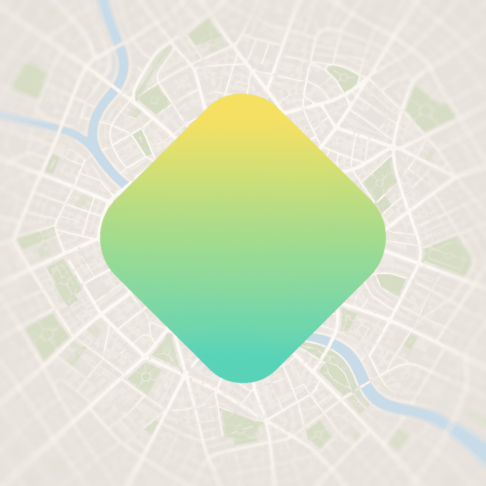
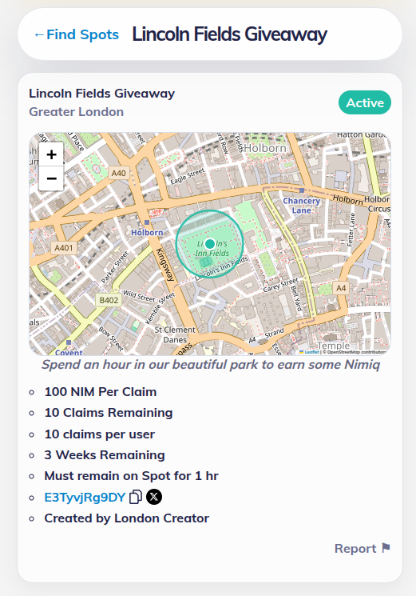
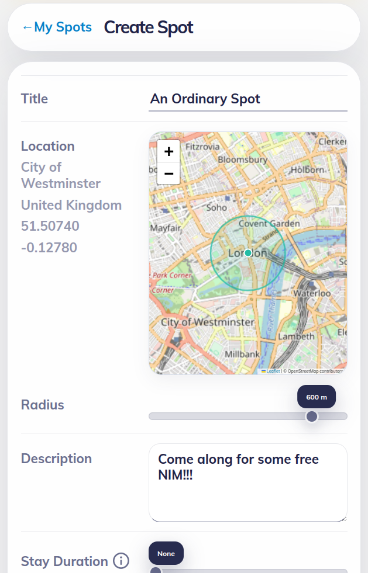

# NimHunt

> Create Spots. Explore Locations. Receive NIM Rewards.

| Field | Value |
| --- | --- |
| Category | Earning |
| Pricing | Free |
| Team name | _Not provided — optional_ |
| Team members | _Not provided — optional_ |
| X account | NIM_Hunt |
| Contact email | dneiper@protonmail.com |
| GitHub login | @NIMHunt |
| Submitted at | 2026-09-01T09:23:28.884Z |

## Links

| Link | URL |
| --- | --- |
| Repo | [https://github.com/NIMHunt/nim-hunt](<https://github.com/NIMHunt/nim-hunt>) |
| Demo | [https://nimhunt.app](<https://nimhunt.app>) |
| Video | [https://youtu.be/RAYx0I1MAMY](<https://youtu.be/RAYx0I1MAMY>) |

## Description

NimHunt is a geofaucet and prizedraw mini-app for Nimiq Pay. Users create real-world 'spots' to promote places, events or activities, rewarding visitors with free NIM for showing up.

## Builder story

Second time’s the charm! I’m giving this idea another go because I still think it’s a great use case for Nimiq. Now new and improved!

Long, long ago, many of my friends fell in love with another geofaucet app, WeNano. None of them were interested in crypto beforehand, but the app gave them a fun reason to start using it.

Nimiq is one of the most user-friendly cryptocurrencies out there, so I wanted to create something that could achieve the same effect.

## Thumbnail

## Screenshots

---

_Generated from the submission form. `submission.yaml` in this folder is the machine-readable source of truth._
