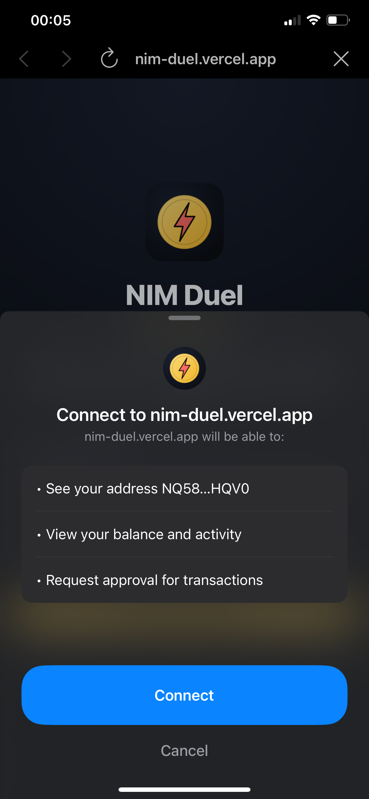
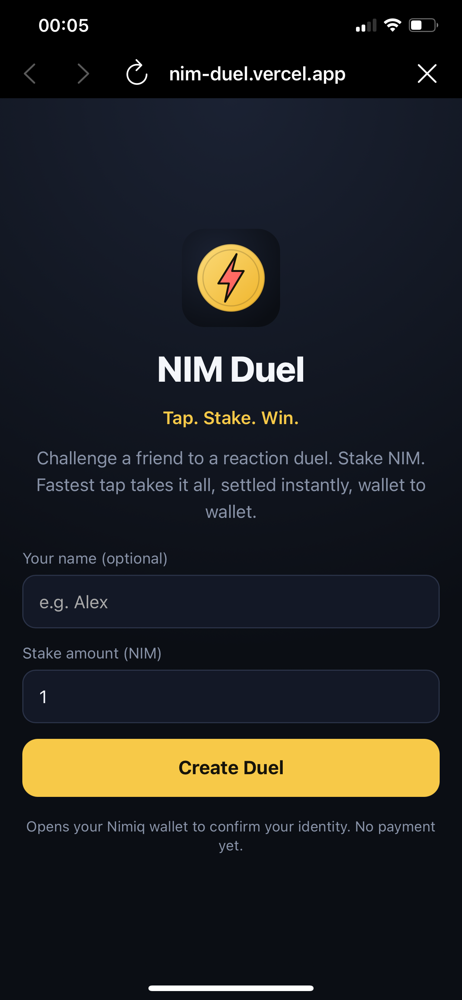

# NimDuel

> Tap. Stake. Win.

| Field | Value |
| --- | --- |
| Category | Games |
| Pricing | Paid |
| Team name | _Not provided — optional_ |
| Team members | _Not provided — optional_ |
| X account | EmmanuelAje7 |
| Heard about it via | Nimiq community |
| Contact email | ajeemmanuel221@gmail.com |
| GitHub login | @Nailer |
| Submitted at | 2026-09-18T23:59:23.313Z |

## Links

| Link | URL |
| --- | --- |
| Repo | [https://github.com/Nailer/nim-duel](<https://github.com/Nailer/nim-duel>) |
| Demo | [https://nim-duel.vercel.app](<https://nim-duel.vercel.app>) |
| Video | [https://youtube.com/shorts/HfulPYkb5Z4](<https://youtube.com/shorts/HfulPYkb5Z4>) |
| Skool post | [https://www.skool.com/miniappscompetition/nimduel-most-interactive-game-on-nimiq-with-just-a-tap?p=b7825235](<https://www.skool.com/miniappscompetition/nimduel-most-interactive-game-on-nimiq-with-just-a-tap?p=b7825235>) |
| Social post | [https://x.com/emmanuelaje7/status/2101092413888667712?s=46](<https://x.com/emmanuelaje7/status/2101092413888667712?s=46>) |

## Description

NIM Duel is a real-time reaction game where two players stake NIM and the fastest tap wins the pot — settled instantly, wallet to wallet, no escrow, no house. Connect your wallet, set a stake, share the link. Both players tap when they see GO; the loser's wallet automatically pay

## Builder story

A lot of games on Nimiq are very stressful to play and every humans wants ease in games. We built tap, the most interactive game with less activities

## Thumbnail

## Screenshots

---

_Generated from the submission form. `submission.yaml` in this folder is the machine-readable source of truth._
