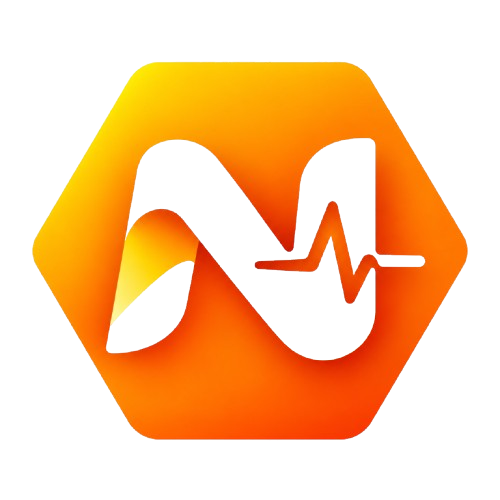
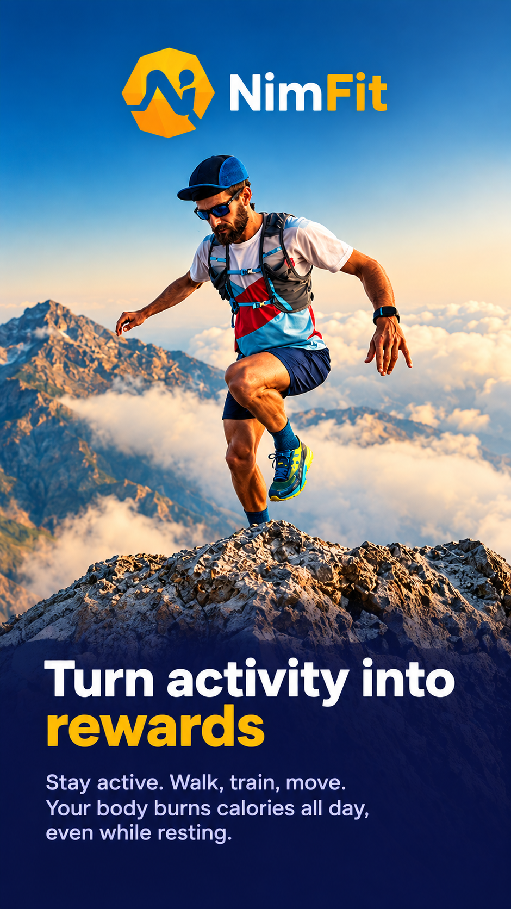
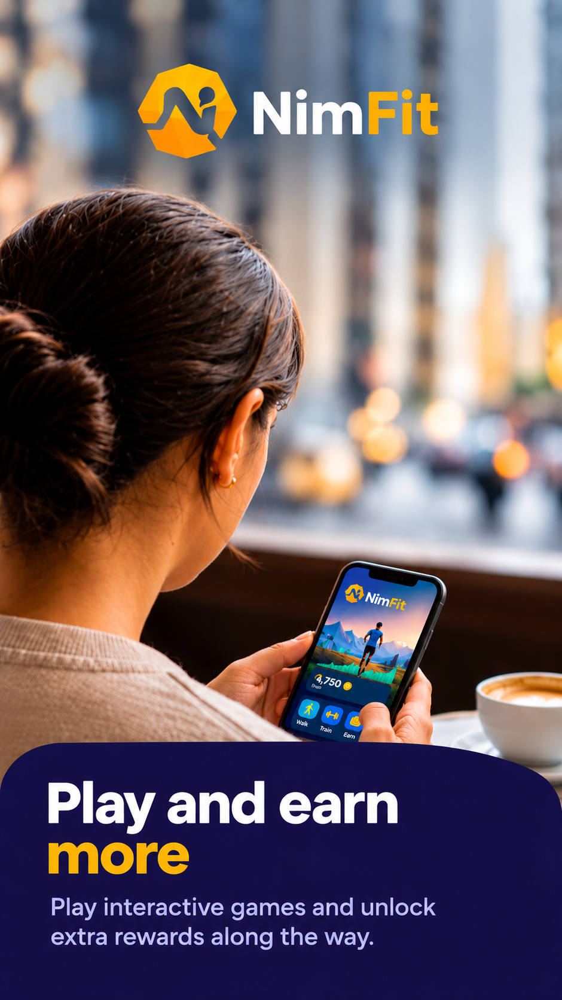
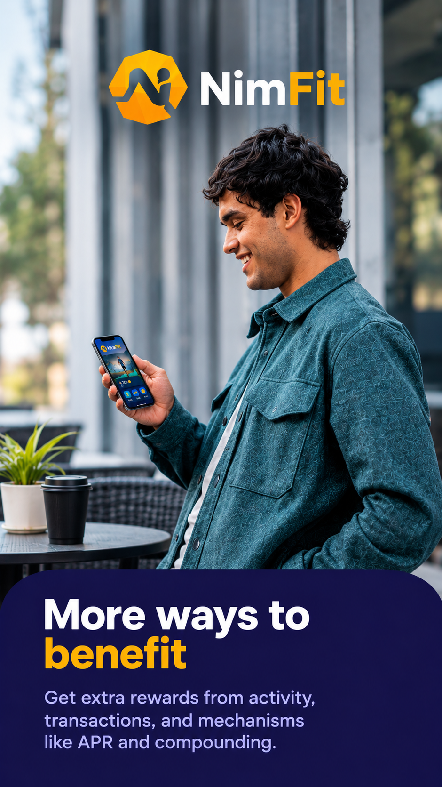

# NimFit

> Health, Game ,earn money

| Field | Value |
| --- | --- |
| Category | Health & fitness |
| Pricing | Freemium |
| Team name | Nims Team |
| Team members | 6 |
| X account | nimsfit |
| Heard about it via | _Not provided — optional_ |
| Contact email | rk3928743@gmail.com |
| GitHub login | @NimFit1211 |
| Submitted at | 2026-09-18T23:36:18.809Z |

## Links

| Link | URL |
| --- | --- |
| Repo | [https://github.com/Danyx11/NIM-Ball](<https://github.com/Danyx11/NIM-Ball>) |
| Demo | [https://www.nimicurl.com/](<https://www.nimicurl.com/>) |
| Video | [https://youtu.be/mKrE_h-mQ9s?si=3KJZxNAKRQM6gDSz](<https://youtu.be/mKrE_h-mQ9s?si=3KJZxNAKRQM6gDSz>) |
| Skool post | _Not provided — optional_ |
| Social post | _Not provided — optional_ |

## Description

NimFit - A fitness and rewards platform that helps users stay active, complete challenges, and earn rewards.

## Builder story

_Not provided — optional_

## Thumbnail

## Screenshots

---

_Generated from the submission form. `submission.yaml` in this folder is the machine-readable source of truth._
