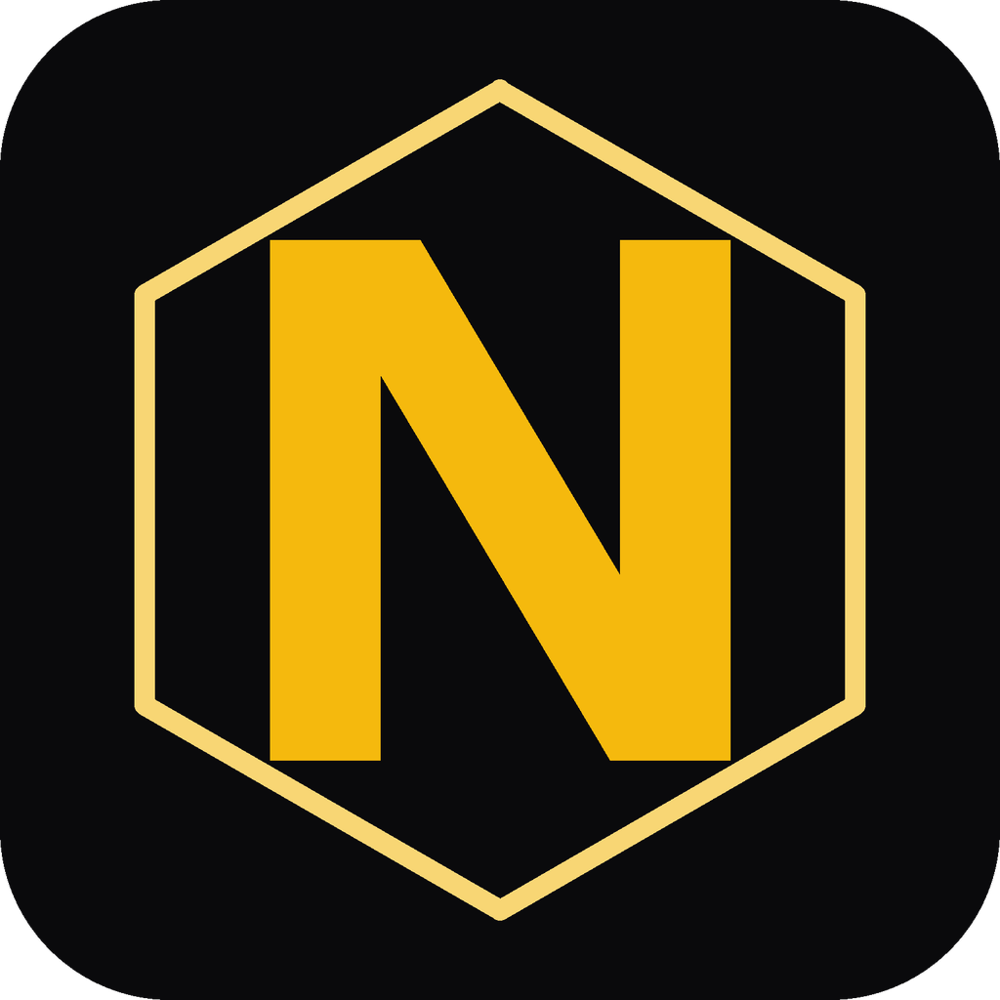
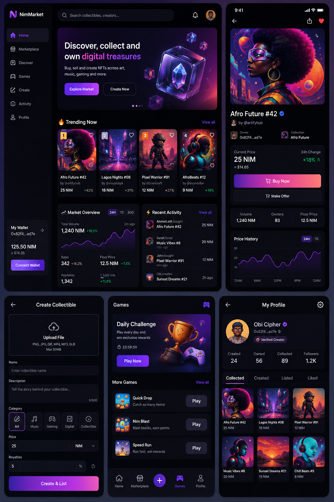
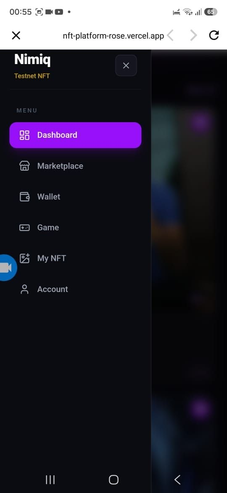
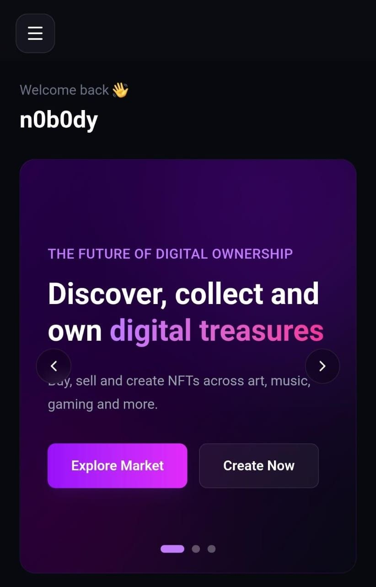
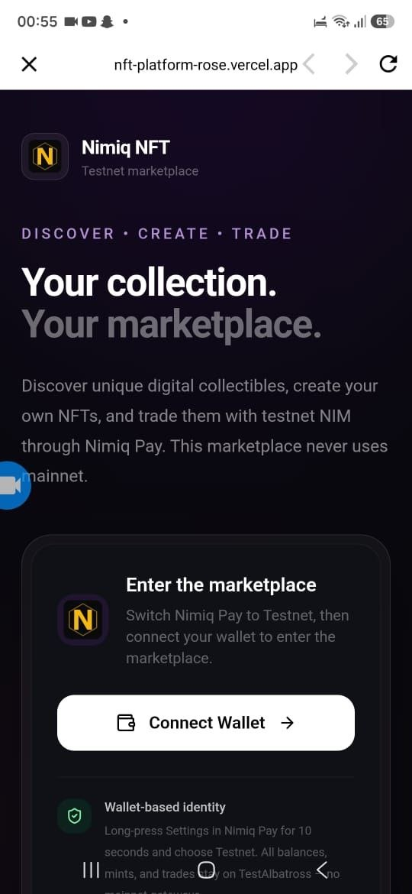
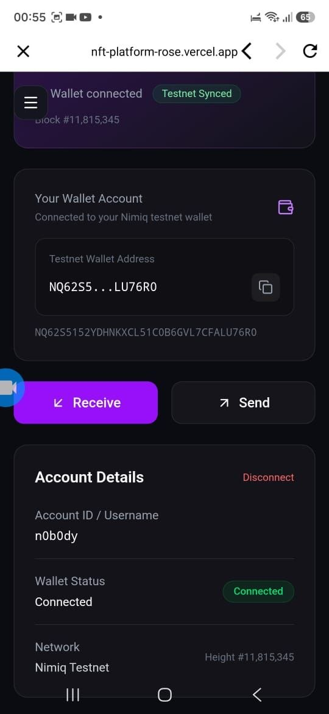
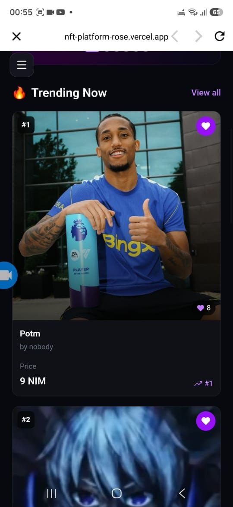

# Nimiq-Nft-Marketplace

> NFTs, Trading & Rewards — Powered by Nimiq.

| Field | Value |
| --- | --- |
| Category | Marketplaces |
| Pricing | Freemium |
| Team name | _Not provided — optional_ |
| Team members | _Not provided — optional_ |
| X account | web_dev983 |
| Heard about it via | from a friend |
| Contact email | aceai2007@gmail.com |
| GitHub login | @Nobody-983 |
| Submitted at | 2026-09-18T23:58:07.589Z |

## Links

| Link | URL |
| --- | --- |
| Repo | [https://github.com/Nobody-983/nft-platform.git](<https://github.com/Nobody-983/nft-platform.git>) |
| Demo | [https://nft-platform-rose.vercel.app/](<https://nft-platform-rose.vercel.app/>) |
| Video | [https://youtube.com/shorts/pO21u1ceTIg?si=ylbzEEFtUMnDi0Z0](<https://youtube.com/shorts/pO21u1ceTIg?si=ylbzEEFtUMnDi0Z0>) |
| Skool post | _Not provided — optional_ |
| Social post | [https://x.com/web_dev983/status/2101063412495368447?s=20](<https://x.com/web_dev983/status/2101063412495368447?s=20>) |

## Description

A gamified NFT marketplace where you can create, collect, trade, and earn rewards — powered by Nimiq.

## Builder story

I built Nimiq NFT to explore how NFTs can become more than just digital collectibles. The idea was to create a simple, wallet-native experience where users can create, discover, and trade NFTs while also having a reason to keep coming back.

I combined an NFT marketplace with Nimiq Pay payments and a gamified rewards system, allowing users to play, earn rewards, and use their Nimiq within the platform.

As a developer learning and building with Nimiq, this project gave me the opportunity to work hands-on with wallet authentication, NIM transactions, NFT ownership, marketplace logic, and on-chain interactions while focusing on creating an experience that is actually fun to use.

## Thumbnail

## Screenshots

---

_Generated from the submission form. `submission.yaml` in this folder is the machine-readable source of truth._
