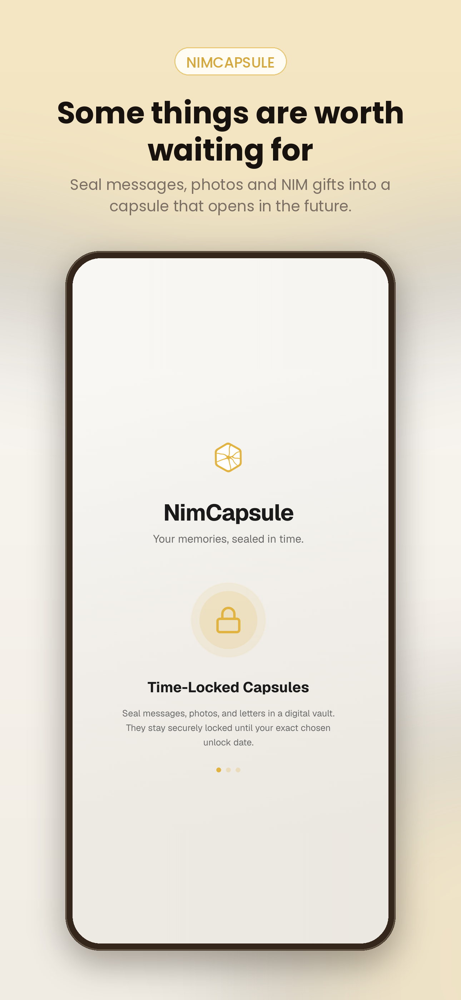
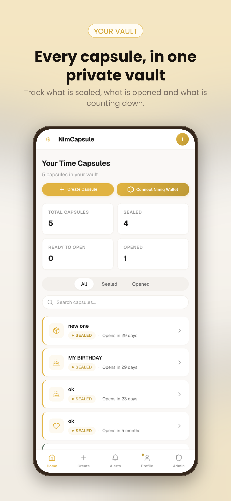
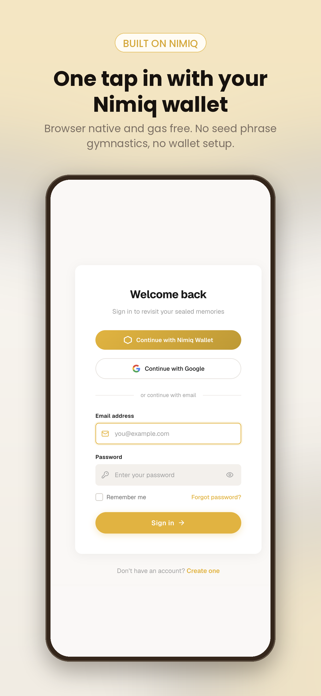

# Nimcapsule

> Lock a moment, Unlock a Gift

| Field | Value |
| --- | --- |
| Category | Social |
| Pricing | Free |
| Team name | ACE TEAM |
| Team members | CYBERZIK, CTHUMBS OLOBA, JAMES, EDWARD |
| X account | https://x.com/NimCapsule |
| Heard about it via | Nimiq Community |
| Contact email | isaacchukwuka67@gmail.com |
| GitHub login | @OSAMOR19 |
| Submitted at | 2026-09-18T09:44:18.273Z |

## Links

| Link | URL |
| --- | --- |
| Repo | [https://github.com/OSAMOR19/memoryvault.git](<https://github.com/OSAMOR19/memoryvault.git>) |
| Demo | [https://nimcapsule.xyz](<https://nimcapsule.xyz>) |
| Video | [https://x.com/NimCapsule/status/2100837660193411555?s=20](<https://x.com/NimCapsule/status/2100837660193411555?s=20>) |
| Skool post | [https://www.skool.com/miniappscompetition/update-on-nim-capsule-v2?p=c7b53c7f](<https://www.skool.com/miniappscompetition/update-on-nim-capsule-v2?p=c7b53c7f>) |
| Social post | [https://x.com/NimCapsule/status/2093000394657931593?s=20](<https://x.com/NimCapsule/status/2093000394657931593?s=20>) |

## Description

NimCapsule is a digital time capsule app built on Nimiq that lets you seal a message, photos, and a letter into a secure vault locked until a future date of your choice. Send it to someone you care about, they can't open it a second before the moment arrives.

## Builder story

A voice note recorded months in advance by someone who knew they might not be around. The phone died before it was ever heard. That moment never arrived.

That stayed with us. And one question wouldn't leave, what if a message could be sealed today and guaranteed to arrive exactly when it should? Not stored in a phone that breaks. Not lost in a folder no one checks. Locked, waiting, and delivered on time.

We live in an age of instant everything. But the moments that actually hit, a letter written months ago, a photo from a night you almost forgot, a gift that arrives when someone needs it most, those are never instant. We wanted to bring that intention back.

Then we asked one more question. What if a capsule could carry real value too? A letter from your parents on your 18th birthday is powerful. A crypto gift they locked away years ago alongside it, that's someone investing in your future, literally.

Nimiq made that possible. Lightweight, seamless, built for human first experiences. No complicated setups. No gas fees. Just seal it and let time do the rest.

We're not building for likes. We're building for the moments that actually matter.

## Thumbnail

## Screenshots

---

_Generated from the submission form. `submission.yaml` in this folder is the machine-readable source of truth._
