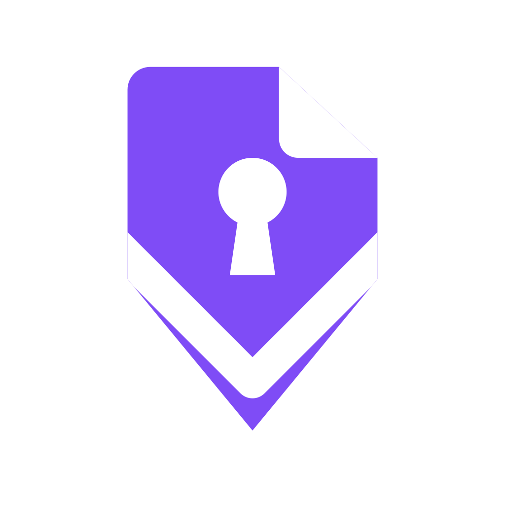
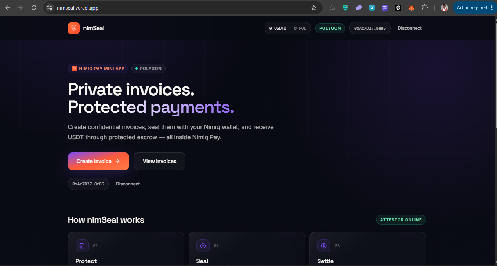
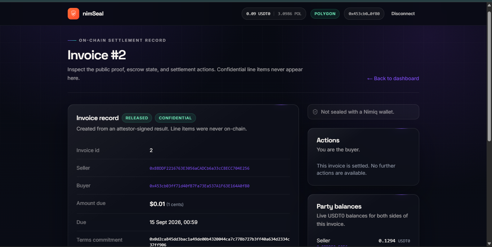
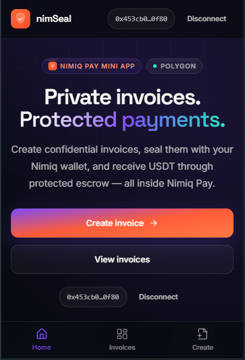
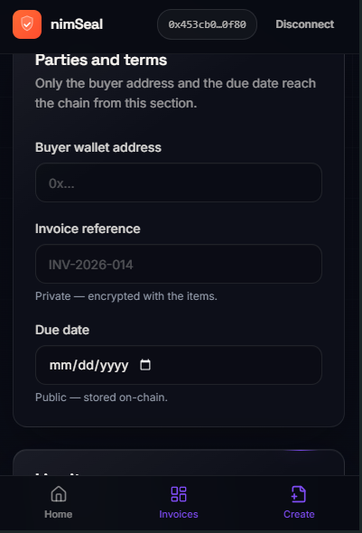

# NimSeal

> Confidential invoices and protected payments, inside Nimiq Pay.

| Field | Value |
| --- | --- |
| Category | Shopping & deals |
| Pricing | Free |
| Team name | Nimseal |
| Team members | _Not provided — optional_ |
| X account | okoye_emma_obi |
| Heard about it via | _Not provided — optional_ |
| Contact email | okoyeemmanuelobiajulu@gmail.com |
| GitHub login | @Obiajulu-gif |
| Submitted at | 2026-09-09T18:02:24.580Z |

## Links

| Link | URL |
| --- | --- |
| Repo | [https://github.com/Obiajulu-gif/nimseal](<https://github.com/Obiajulu-gif/nimseal>) |
| Demo | [https://nimseal.vercel.app](<https://nimseal.vercel.app>) |
| Video | [https://youtu.be/blK4gK4tsWo](<https://youtu.be/blK4gK4tsWo>) |
| Skool post | _Not provided — optional_ |
| Social post | [https://x.com/okoye_emma_obi/status/2097747260897382844?s=20](<https://x.com/okoye_emma_obi/status/2097747260897382844?s=20>) |

## Description

nimSeal is a Nimiq Pay Mini App for confidential invoicing. Sellers create invoices whose line items stay private, seal them with their Nimiq wallet so buyers can verify the origin client‑side, and get paid in USDT through a protected escrow on Polygon — no extension, no seed phr

## Builder story

nimSeal grew out of a simple frustration: getting paid in crypto meant either exposing an entire invoice on a public ledger or accepting a bare transfer with no protection. I rebuilt an earlier confidential‑escrow experiment as a Nimiq Pay Mini App — keeping terms encrypted off‑chain, adding a Nimiq‑wallet seal that buyers verify client‑side, and settling in USDT through an on‑chain escrow. Mobile‑first, no extension, no seed phrase.

## Thumbnail

## Screenshots

---

_Generated from the submission form. `submission.yaml` in this folder is the machine-readable source of truth._
