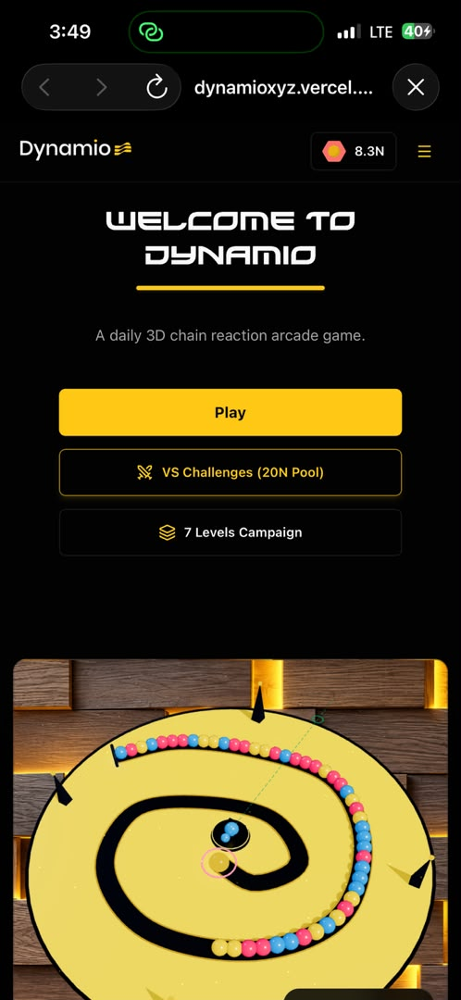
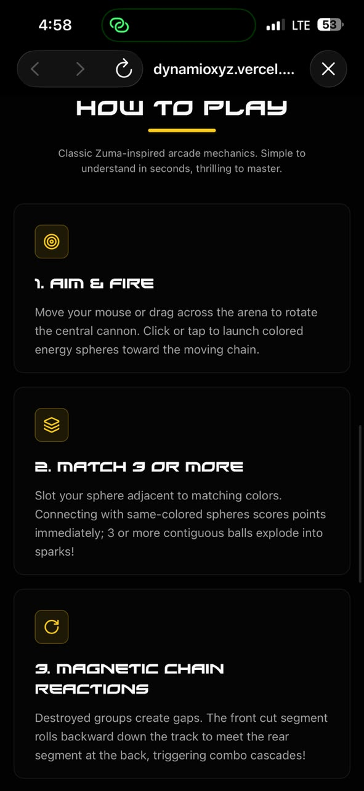
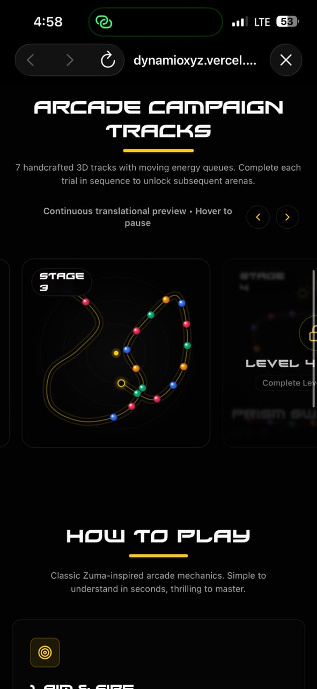
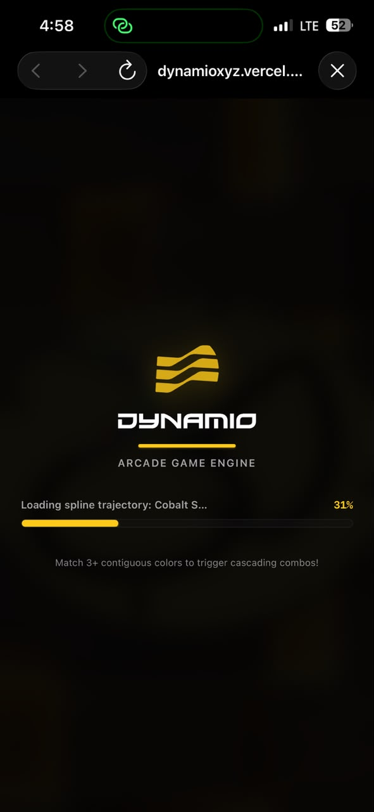
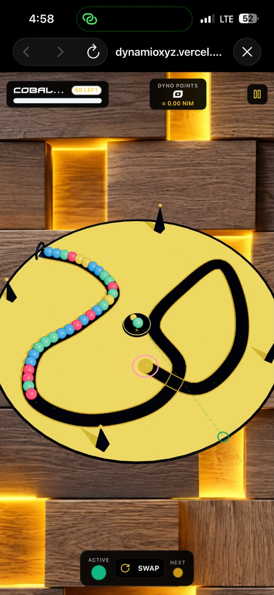

# Dynamio

> Power in Motion

| Field | Value |
| --- | --- |
| Category | Games |
| Pricing | Freemium |
| Team name | _Not provided — optional_ |
| Team members | _Not provided — optional_ |
| X account | Inertiastudiong |
| Heard about it via | I saw it on X |
| Contact email | inertia.stdio@gmail.com |
| GitHub login | @Olamidepy |
| Submitted at | 2026-09-15T18:18:12.117Z |

## Links

| Link | URL |
| --- | --- |
| Repo | [https://github.com/Olamidepy/dynamio](<https://github.com/Olamidepy/dynamio>) |
| Demo | [https://dynamioxyz.vercel.app/](<https://dynamioxyz.vercel.app/>) |
| Video | [https://youtube.com/shorts/dsuq64uvT-A](<https://youtube.com/shorts/dsuq64uvT-A>) |
| Skool post | [https://www.skool.com/miniappscompetition/dynamio?p=3c9fc903](<https://www.skool.com/miniappscompetition/dynamio?p=3c9fc903>) |
| Social post | [https://x.com/inertiastudiong/status/2099923045833986101?s=46](<https://x.com/inertiastudiong/status/2099923045833986101?s=46>) |

## Description

Dynamio is a fast paced 3D arcade game for players who enjoy precision, timing, and chain reaction gameplay. Defend the central vortex by matching incoming chains, mastering handcrafted stages, and taking on daily challenges, all within Nimiq Pay.

## Builder story

Growing up, I watched kids play **Zuma’s Revenge** almost every day, but I could not afford to play it myself. I remember wondering what it would feel like to have a game like that on my phone, something I could access and enjoy on my own.

That memory inspired **Dynamio**. I wanted to recreate the excitement of chain reaction gameplay in a modern 3D experience while giving players a game that feels accessible, rewarding, and built for today’s devices. Dynamio is my way of turning a childhood experience of watching from the sidelines into something I could finally build and share.

## Thumbnail

## Screenshots

---

_Generated from the submission form. `submission.yaml` in this folder is the machine-readable source of truth._
