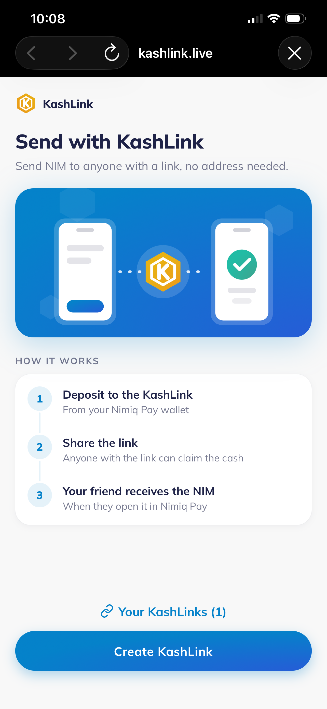
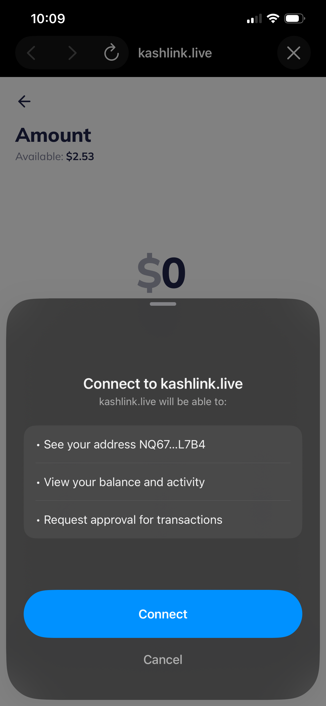
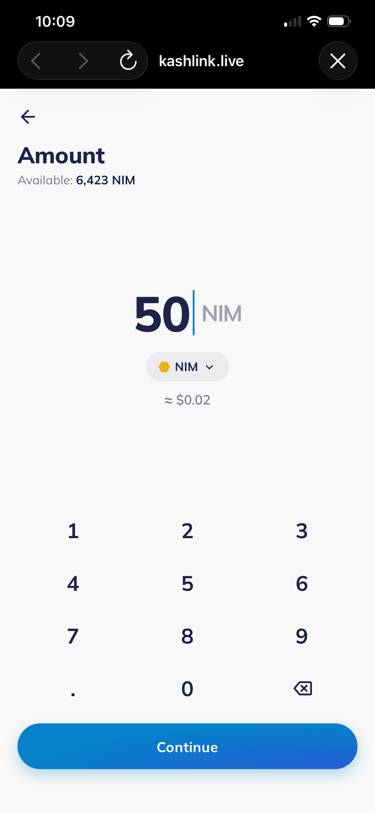
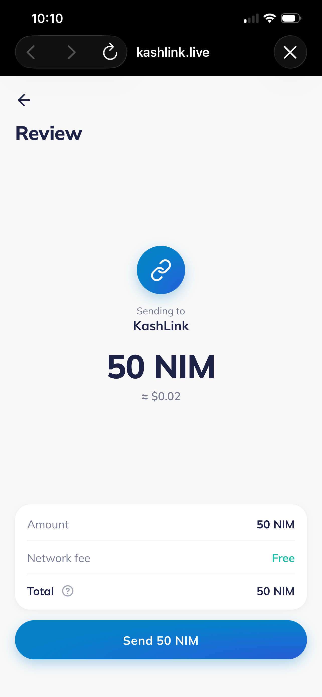
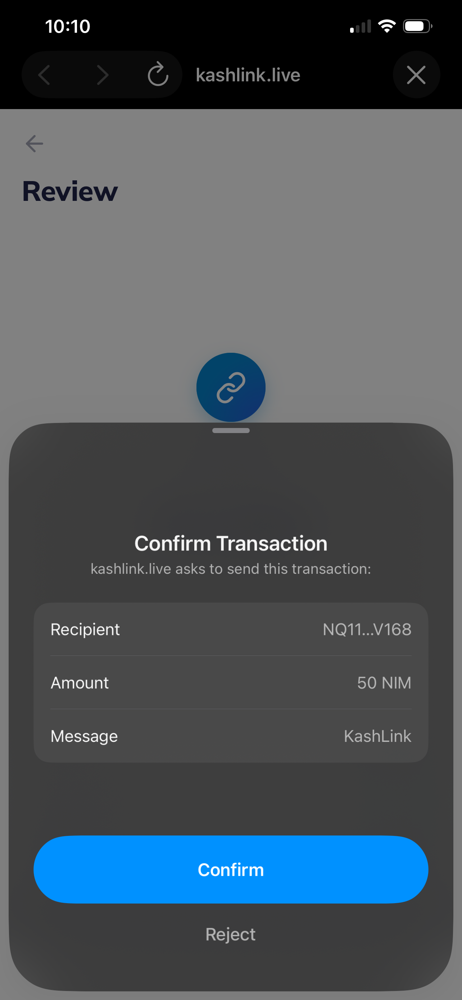

# KashLink

> Send NIM to anyone with a link — no wallet address needed.

| Field | Value |
| --- | --- |
| Category | Social |
| Pricing | Free |
| Team name | KashLink |
| Team members | Samuel Chisom |
| X account | otaikisadiq |
| Heard about it via | Twitter |
| Contact email | otaikisadiq2804@gmail.com |
| GitHub login | @Otaiki1 |
| Submitted at | 2026-09-12T09:13:24.928Z |

## Links

| Link | URL |
| --- | --- |
| Repo | [https://github.com/crackedstudio/kashlink](<https://github.com/crackedstudio/kashlink>) |
| Demo | [https://kashlink.live](<https://kashlink.live>) |
| Video | [https://youtu.be/zPt4rpi2HR4](<https://youtu.be/zPt4rpi2HR4>) |
| Skool post | [https://www.skool.com/miniappscompetition/kashlink](<https://www.skool.com/miniappscompetition/kashlink>) |
| Social post | [https://x.com/otaikisadiq/status/2098547456254333228?s=20](<https://x.com/otaikisadiq/status/2098547456254333228?s=20>) |

## Description

KashLink is a Cash Link mini app for Nimiq Pay. Pick an amount, approve once, and get a link you can share on WhatsApp, Telegram, SMS or anywhere. Whoever opens it taps Claim and the NIM lands in their wallet — zero fees, no sign-up. Unclaimed? Revert it back to your wallet easy.

## Builder story

Every time I tried to send crypto to a friend, the conversation started the same way: "what's your wallet address?" Then a long string gets pasted around, someone copies it wrong, or the friend doesn't have a wallet yet and the whole thing dies there.

The fix is obvious once you see it: send a link instead of an address, and let whoever opens it claim the money. I wanted that for NIM inside Nimiq Pay, and Nimiq is a natural fit for it: transactions are free, so the link never needs gas, and the browser-native light client means the recipient's phone can sign and broadcast the sweep itself with no backend in between.

KashLink generates a throwaway key pair, puts the private key in the link's URL fragment (which is never sent to any server), and funds it with a single Nimiq Pay approval. The claim screen sweeps the balance to the recipient's wallet; Revert sweeps it back to yours. Links use the same encoding as the Nimiq Hub, so even someone without Nimiq Pay can claim.

The goal is simple: make sending NIM as easy as sending a meme. Build a link, drop it in a chat, done.

## Thumbnail

## Screenshots

---

_Generated from the submission form. `submission.yaml` in this folder is the machine-readable source of truth._
