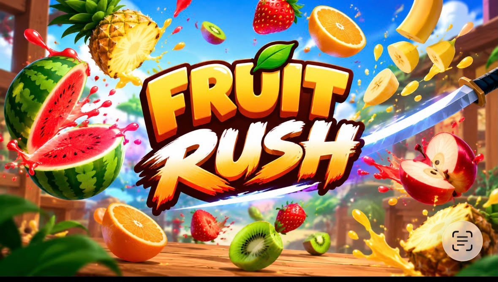
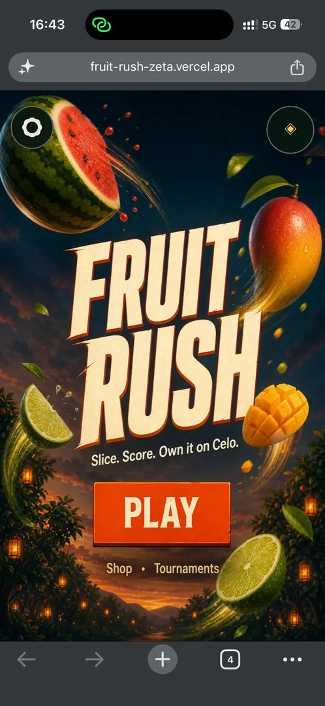
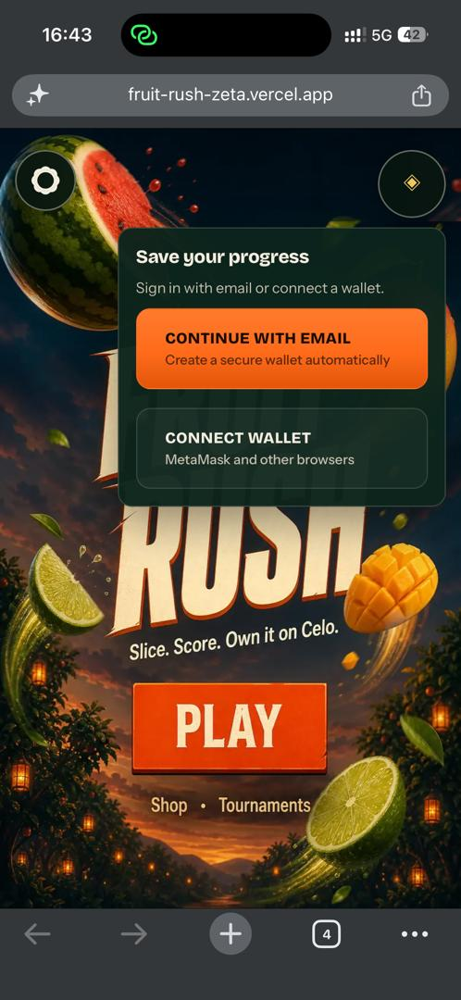
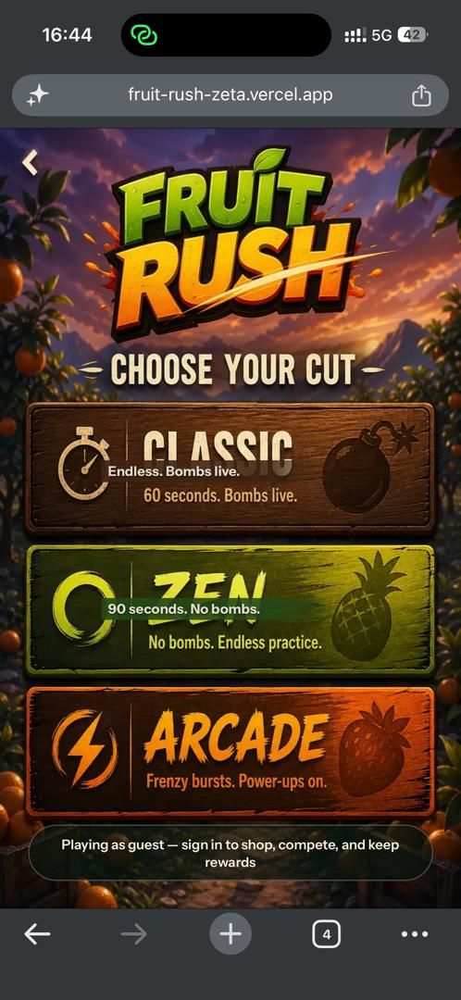
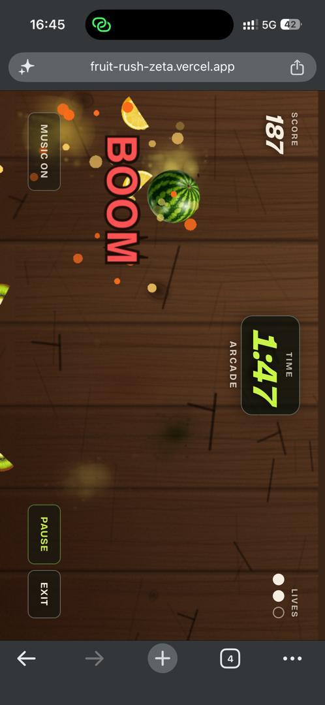
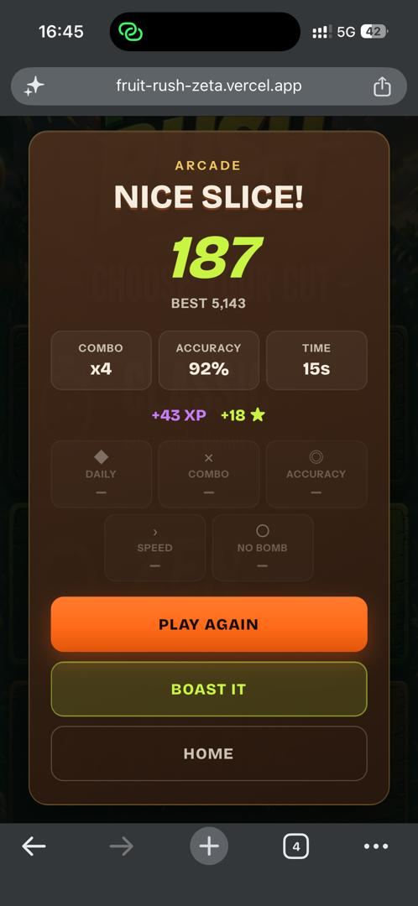

# FruitRush

> Fruit Rush — Slice Fast. Score Big. 🍉⚡

| Field | Value |
| --- | --- |
| Category | Games |
| Pricing | Free |
| Team name | _Not provided — optional_ |
| Team members | _Not provided — optional_ |
| X account | _Not provided — optional_ |
| Heard about it via | Nimiq Community |
| Contact email | samuelotowo@gmail.com |
| GitHub login | @OtowoSamuel |
| Submitted at | 2026-09-18T15:48:20.982Z |

## Links

| Link | URL |
| --- | --- |
| Repo | [https://github.com/OtowoSamuel/fruit-rush](<https://github.com/OtowoSamuel/fruit-rush>) |
| Demo | [https://fruit-rush-zeta.vercel.app/](<https://fruit-rush-zeta.vercel.app/>) |
| Video | [https://www.loom.com/share/9bf155320f41469da4d12057cecc8d5e](<https://www.loom.com/share/9bf155320f41469da4d12057cecc8d5e>) |
| Skool post | _Not provided — optional_ |
| Social post | _Not provided — optional_ |

## Description

Fruit Rush is a fast-paced arcade game where players slice falling fruits, rack up points, and test their speed and reflexes.

## Builder story

I wanted to build a fun, fast-paced game that is easy to pick up but challenging to master. Fruit Rush was inspired by classic fruit-slicing games, with a modern, colorful experience focused on quick reflexes, satisfying combos, and high scores. I built it to create a simple game that anyone can enjoy for a few minutes while still giving players a reason to keep coming back and beat their best score.

## Thumbnail

## Screenshots

---

_Generated from the submission form. `submission.yaml` in this folder is the machine-readable source of truth._
