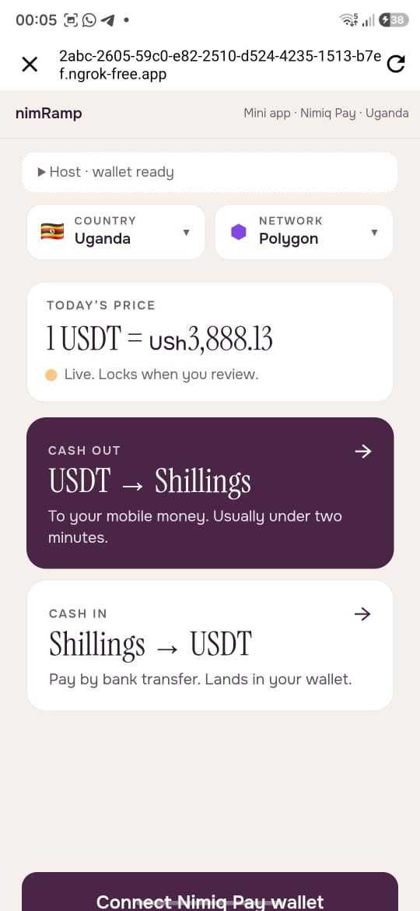
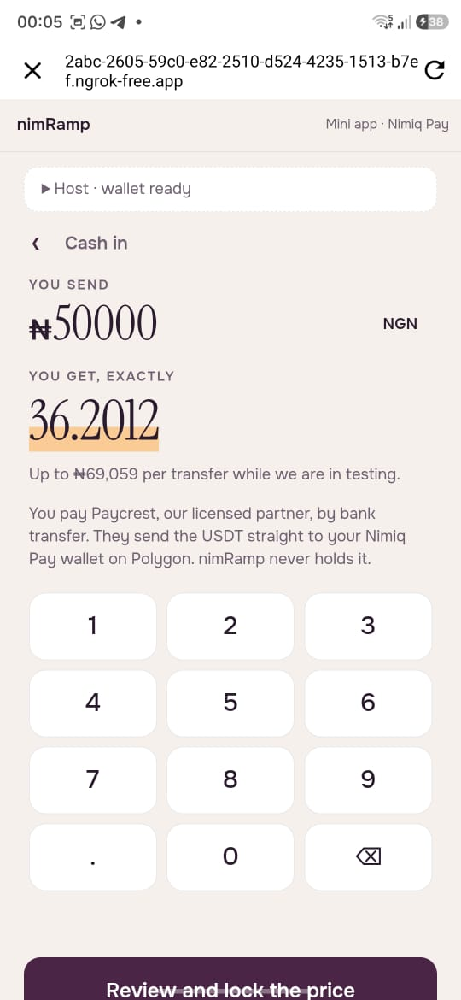
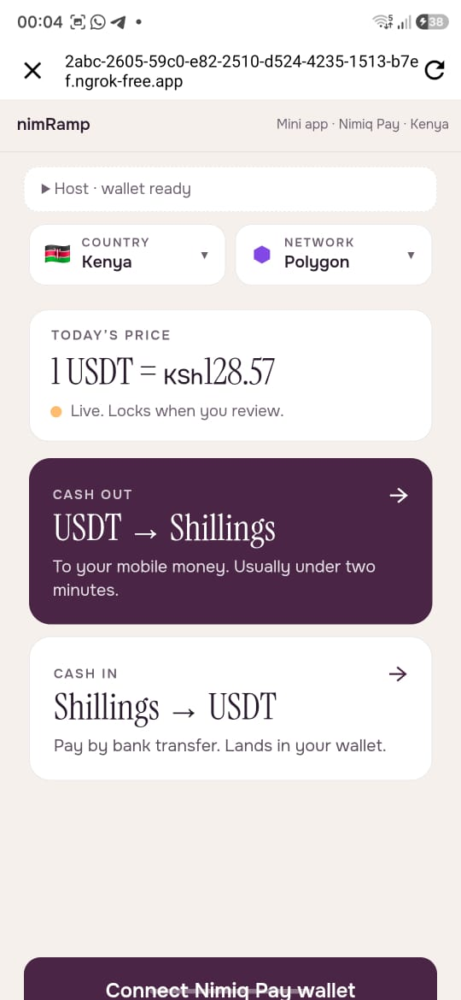
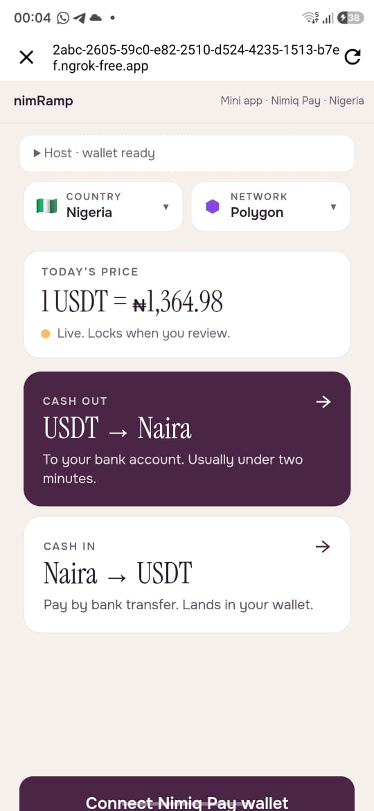
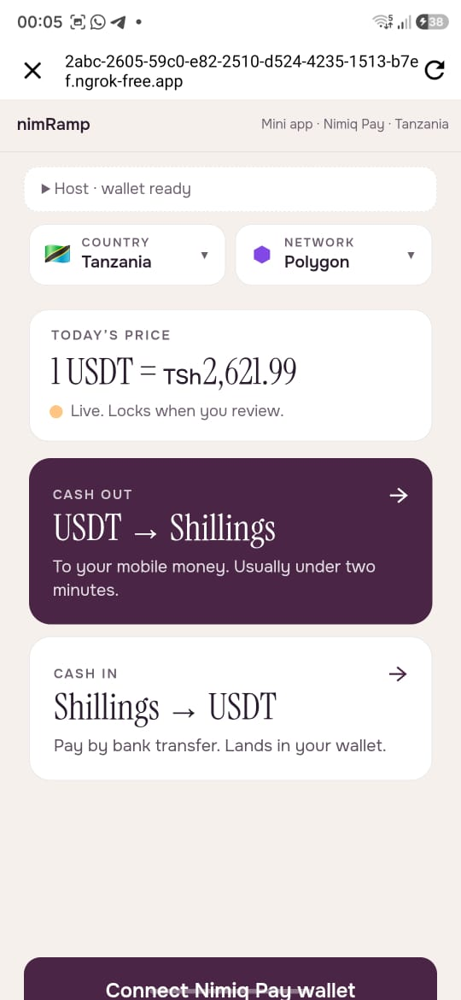

# NimRamp

> The app that moves money

| Field | Value |
| --- | --- |
| Category | Earning |
| Pricing | Free |
| Team name | NimRamp |
| Team members | Favour Smart |
| X account | SuperDevFavour |
| Heard about it via | WhatsApp Community |
| Contact email | faniogor@gmail.com |
| GitHub login | @PhantomOz |
| Submitted at | 2026-09-18T23:15:12.767Z |

## Links

| Link | URL |
| --- | --- |
| Repo | [https://github.com/PhantomOz/nim-ramp](<https://github.com/PhantomOz/nim-ramp>) |
| Demo | [https://nimramp.xyz](<https://nimramp.xyz>) |
| Video | [https://youtu.be/5QNxZRyw7Oc](<https://youtu.be/5QNxZRyw7Oc>) |
| Skool post | _Not provided — optional_ |
| Social post | _Not provided — optional_ |

## Description

A two-way stablecoin ramp that runs inside Nimiq Pay, moving value between local currency and USDT or USDC in four African markets, across every chain the wallet carries.

## Builder story

_Not provided — optional_

## Thumbnail

## Screenshots

---

_Generated from the submission form. `submission.yaml` in this folder is the machine-readable source of truth._
