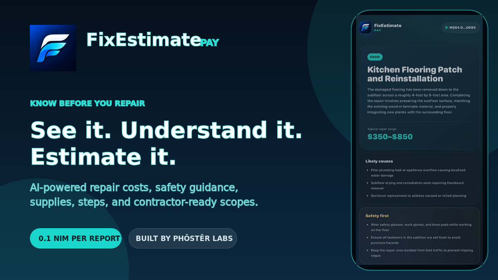
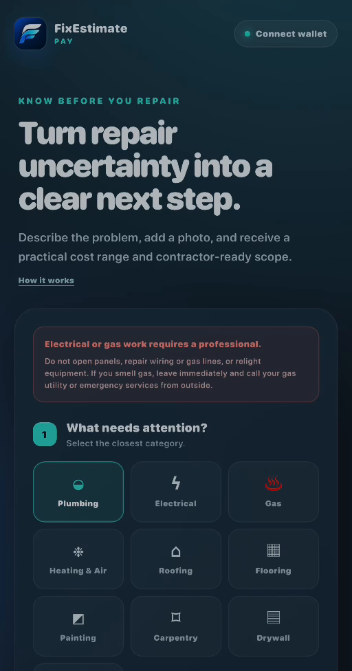
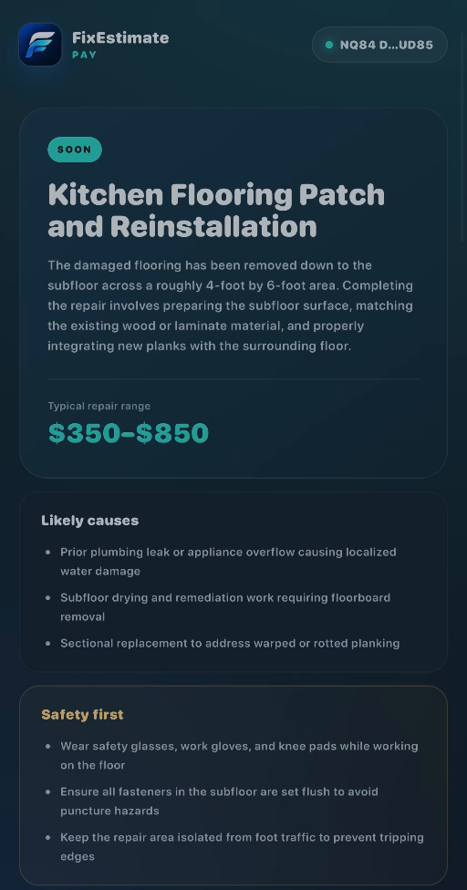
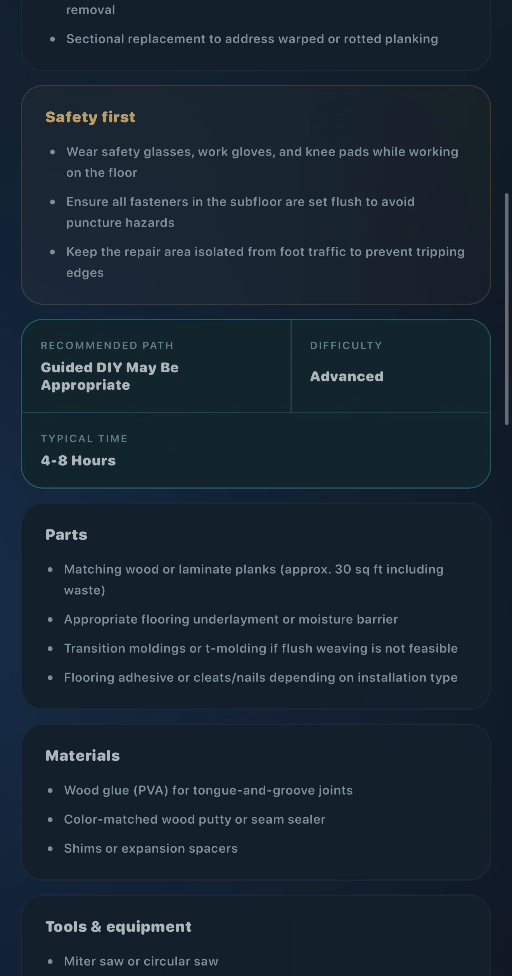
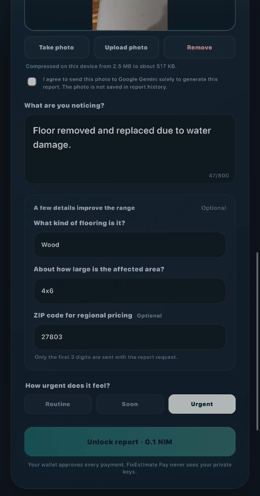

# FixEstimate

> See it. Understand it. Estimate it.

| Field | Value |
| --- | --- |
| Category | Productivity |
| Pricing | Paid |
| Team name | Phōstēr Labs |
| Team members | Joseph Cook |
| X account | PhosterLabs |
| Heard about it via | Facebook |
| Contact email | jacook@phosterlabs.com |
| GitHub login | @PhosterLabs |
| Submitted at | 2026-09-12T18:02:42.136Z |

## Links

| Link | URL |
| --- | --- |
| Repo | [https://github.com/PhosterLabs/fixestimate-pay](<https://github.com/PhosterLabs/fixestimate-pay>) |
| Demo | [https://fixestimatepay.phosterlabs.com/](<https://fixestimatepay.phosterlabs.com/>) |
| Video | [https://youtube.com/shorts/AXFKGsAuhW0?is=pjzrg4A6R-pUIwlE](<https://youtube.com/shorts/AXFKGsAuhW0?is=pjzrg4A6R-pUIwlE>) |
| Skool post | [https://www.skool.com/miniappscompetition/fixestimate-pay-testers-wanted?p=877e0b0a](<https://www.skool.com/miniappscompetition/fixestimate-pay-testers-wanted?p=877e0b0a>) |
| Social post | [https://x.com/phosterlabs/status/2098834383553626536?s=46](<https://x.com/phosterlabs/status/2098834383553626536?s=46>) |

## Description

FixEstimate Pay helps homeowners turn an unfamiliar home repair into a clear next step. Choose from ten repair categories, answer targeted follow-up questions, and optionally add a photo that is automatically compressed on-device.

## Builder story

FixEstimate Pay grew out of a problem I kept seeing while building the larger FixEstimate AI product: when something breaks at home, people need a clear next step immediately. They do not necessarily want another account or subscription. They want to know whether the situation is dangerous, what the repair may cost, what supplies could be involved, and whether they should attempt it or call a professional.

Nimiq Pay made a focused pay-per-report experience possible. The most important engineering challenge was making the wallet integration a real part of the product instead of a decorative connection. Each report receives a unique request reference, the user approves a clearly disclosed 0.1 NIM transaction in Nimiq Pay, and the backend verifies the sender, recipient, value, embedded reference and network confirmation before the AI report is generated. If confirmation is delayed, the user can retry the same report without paying again.

Safety and privacy shaped the build just as much as the payment flow. Electrical and gas requests are always professional-only. Other serious hazards trigger conservative stop conditions. Optional photos are compressed on-device, only a three-digit ZIP prefix is used for regional pricing, and private keys never leave Nimiq Pay.

I built FixEstimate Pay as a standalone, mobile-first, open-source Phōstēr Labs app using React, TypeScript, Firebase, Gemini and the Nimiq Pay Mini Apps Framework. My goal was not a crypto demo, but a practical tool where NIM unlocks immediate everyday value.

## Thumbnail

## Screenshots

---

_Generated from the submission form. `submission.yaml` in this folder is the machine-readable source of truth._
