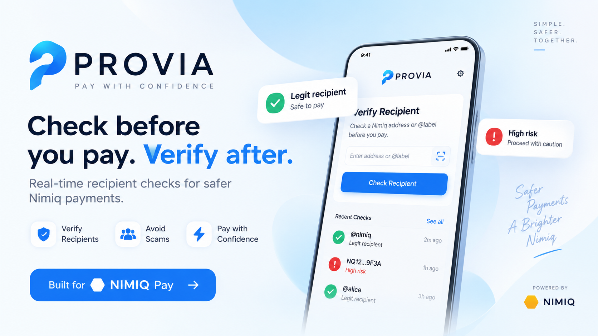
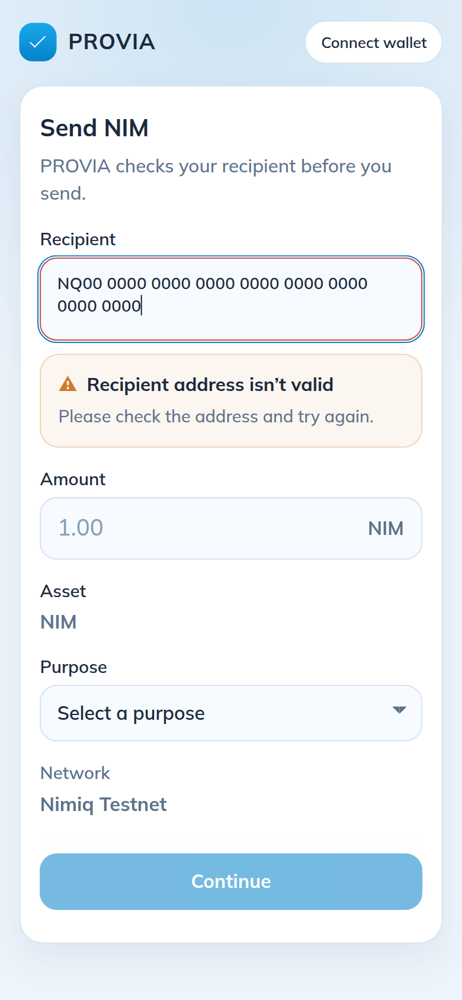
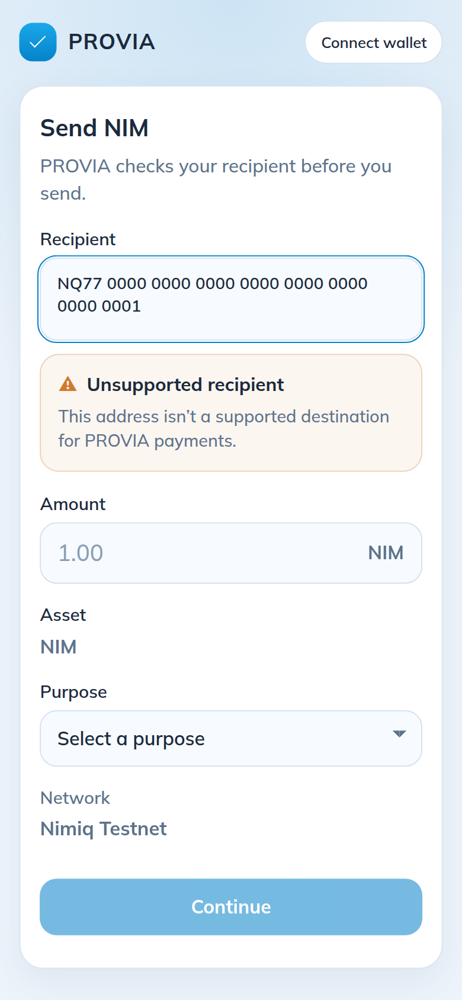
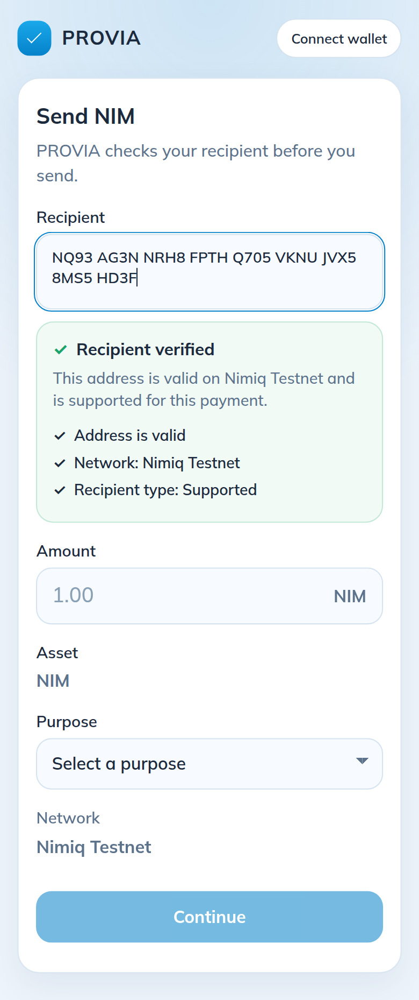
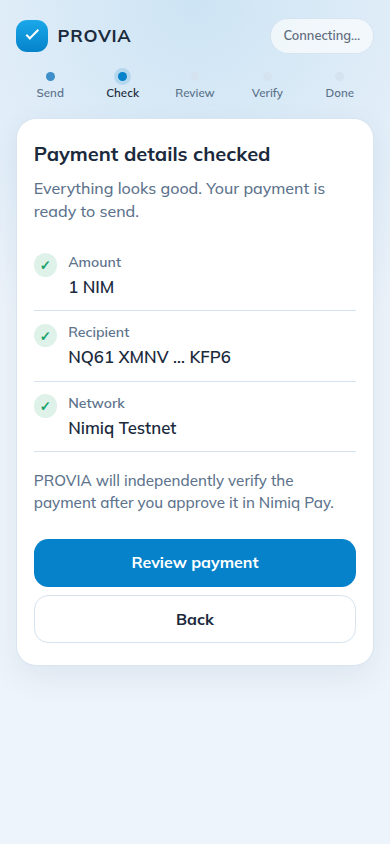

# PROVIA

> Check before you pay. Verify after you pay

| Field | Value |
| --- | --- |
| Category | Productivity |
| Pricing | Free |
| Team name | _Not provided — optional_ |
| Team members | _Not provided — optional_ |
| X account | PinnacleCrypt |
| Heard about it via | Nimiq X |
| Contact email | pinnaclecrypt@gmail.com |
| GitHub login | @PinnacleCryptNG |
| Submitted at | 2026-09-14T06:30:49.421Z |

## Links

| Link | URL |
| --- | --- |
| Repo | [https://github.com/PinnacleCryptNG/provia](<https://github.com/PinnacleCryptNG/provia>) |
| Demo | [https://provia-cyan.vercel.app/](<https://provia-cyan.vercel.app/>) |
| Video | [https://youtube.com/shorts/CRawximbQRc?si=ZnmCyvdEfuuFPHQM](<https://youtube.com/shorts/CRawximbQRc?si=ZnmCyvdEfuuFPHQM>) |
| Skool post | [https://www.skool.com/miniappscompetition/provia-is-going-live-soon?p=ba042766](<https://www.skool.com/miniappscompetition/provia-is-going-live-soon?p=ba042766>) |
| Social post | [https://x.com/PinnacleCrypt/status/2099385060994523179](<https://x.com/PinnacleCrypt/status/2099385060994523179>) |

## Description

PROVIA helps NIM users verify that payments reach the intended recipient with the correct amount and network. 

It is built for anyone who wants stronger payment assurance when sending or receiving NIM.

## Builder story

I built PROVIA to solve a simple problem: a payment being sent shouldn't automatically mean it's correct.

PROVIA adds an independent verification layer to Nimiq Pay

Checking the intended payment before it is sent and verifying the actual transaction on-chain afterward.

## Thumbnail

## Screenshots

---

_Generated from the submission form. `submission.yaml` in this folder is the machine-readable source of truth._
