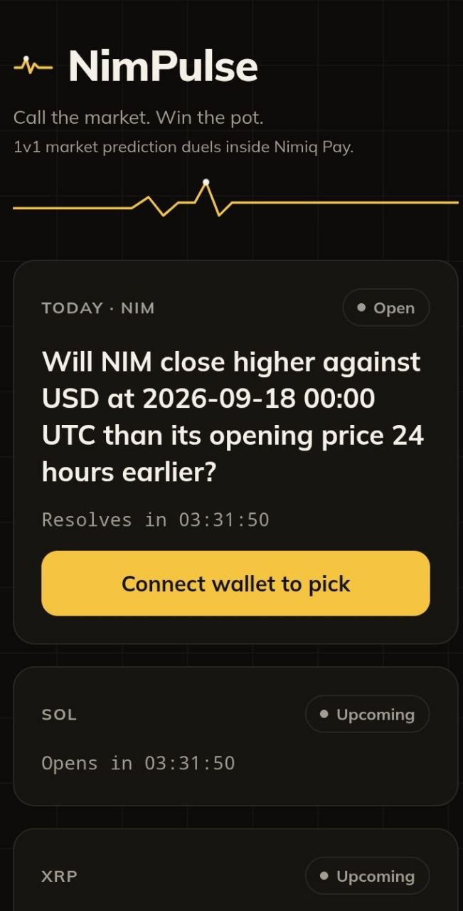
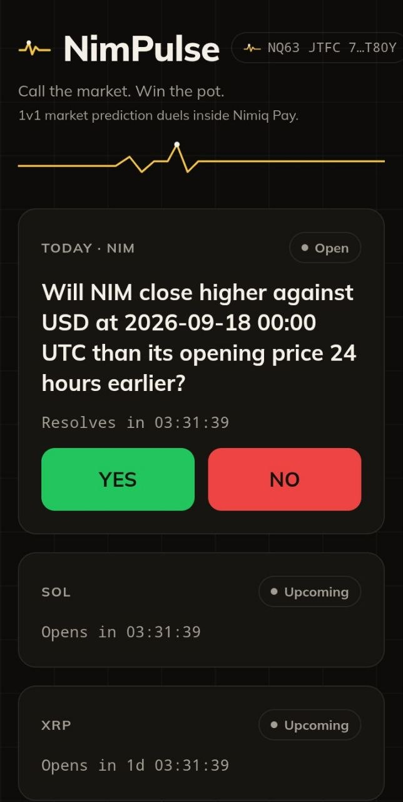
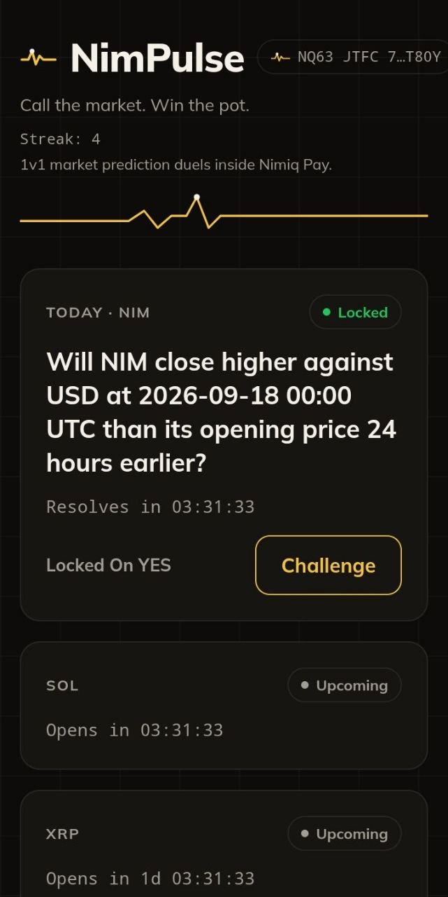
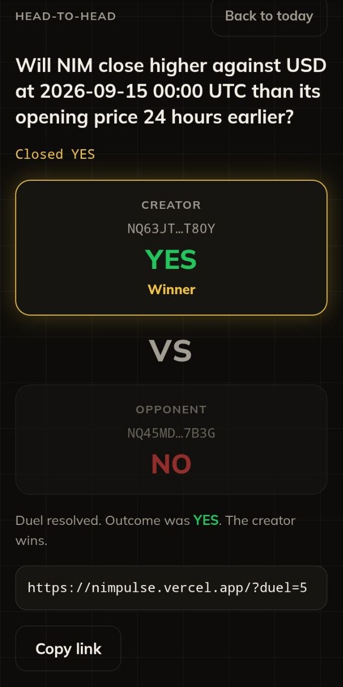
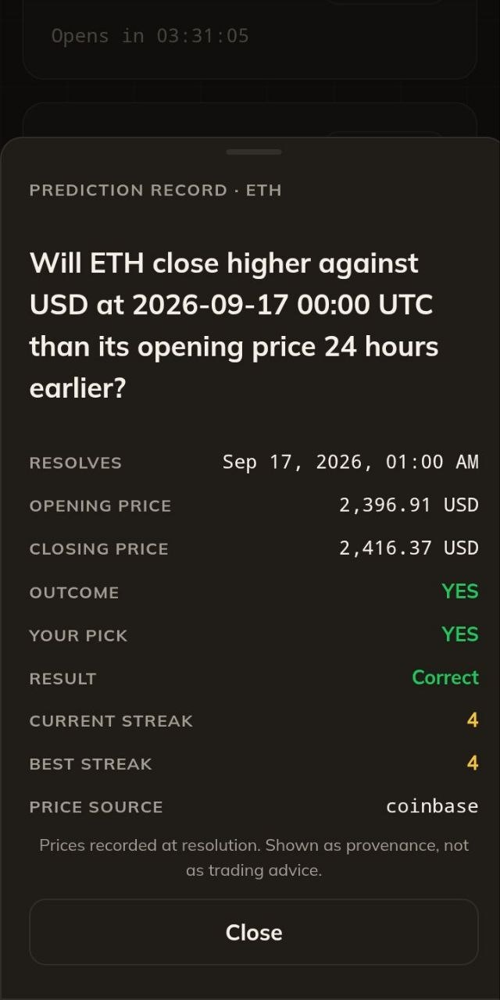

# NimPulse

> Call the market. Take the duel.

| Field | Value |
| --- | --- |
| Category | Games |
| Pricing | Free |
| Team name | _Not provided — optional_ |
| Team members | _Not provided — optional_ |
| X account | Pizzy_lee__ |
| Heard about it via | X |
| Contact email | pizzylillee@gmail.com |
| GitHub login | @Pizzylee001 |
| Submitted at | 2026-09-17T22:05:42.637Z |

## Links

| Link | URL |
| --- | --- |
| Repo | [https://github.com/Pizzylee001/nimpulse](<https://github.com/Pizzylee001/nimpulse>) |
| Demo | [https://nimpulse.vercel.app](<https://nimpulse.vercel.app>) |
| Video | [https://youtube.com/shorts/OzP9MPn3bu8](<https://youtube.com/shorts/OzP9MPn3bu8>) |
| Skool post | [https://www.skool.com/miniappscompetition/nimpulse-1v1-prediction-duels-inside-nimiq-pay-cycle-ii-entry?p=49fc1e9e](<https://www.skool.com/miniappscompetition/nimpulse-1v1-prediction-duels-inside-nimiq-pay-cycle-ii-entry?p=49fc1e9e>) |
| Social post | [https://x.com/Pizzy_lee__/status/2100706262942146661](<https://x.com/Pizzy_lee__/status/2100706262942146661>) |

## Description

NimPulse turns daily market calls into 1v1 duels inside Nimiq Pay. Pick YES or NO on today's crypto question with your signed wallet proof, send the link to a friend, and let real open and close prices settle it.

## Builder story

I build on Nimiq because the wallet flow makes a small app feel like a game instead of a bank. NimPulse started as a question between friends: will BTC close higher today? Making that a 1v1 duel with real wallet signatures felt like the right use of Nimiq Pay. 

The pick is probably yours, the opponent's is probably theirs, and the market settles it. The hard part was making resolution honest: both prices for a question come from the same source, ties count as NO, and if every price source fails the question retries instead of guessing. Next I want the duel to carry a real NIM stake, winner
takes the pot. The data model is already shaped for it.

## Thumbnail

## Screenshots

---

_Generated from the submission form. `submission.yaml` in this folder is the machine-readable source of truth._
