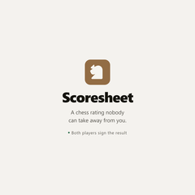
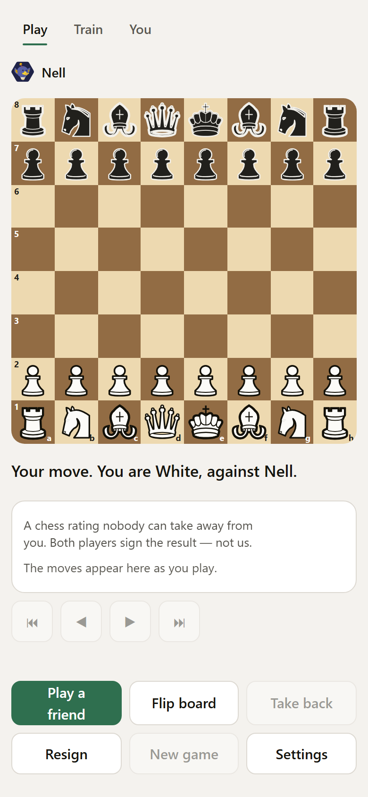
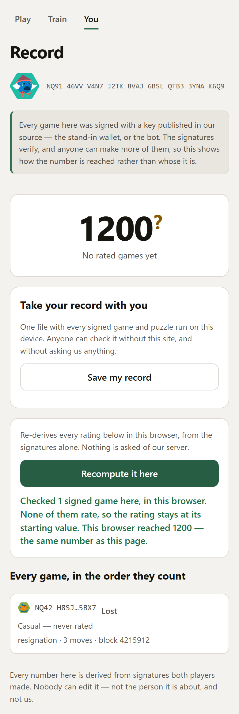
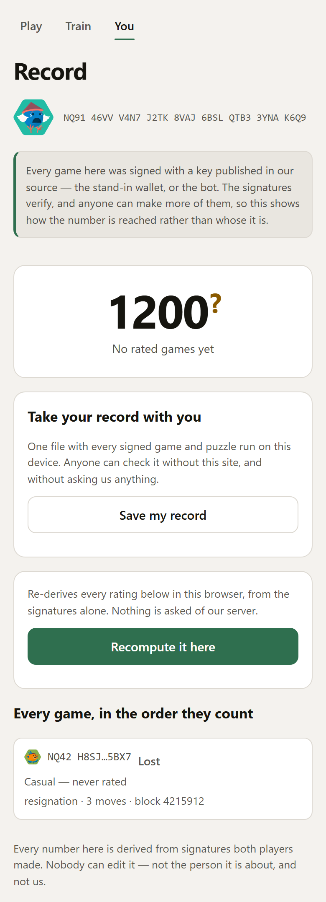
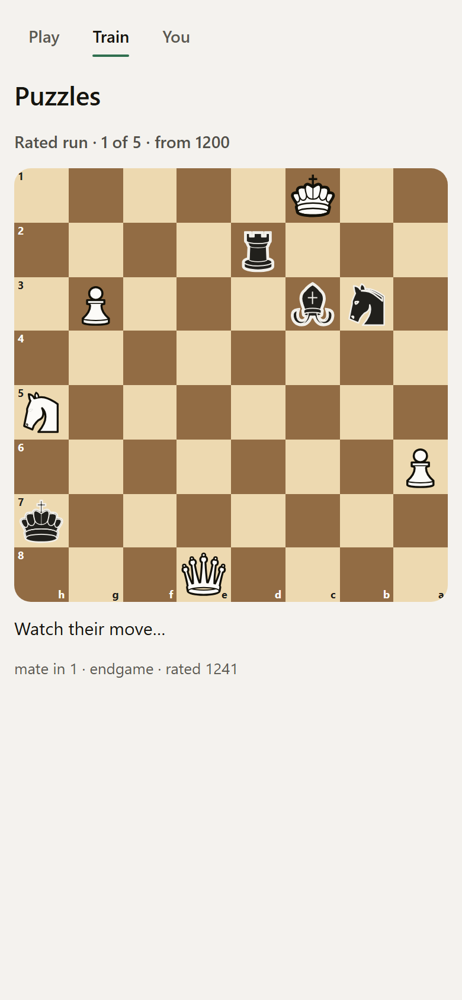
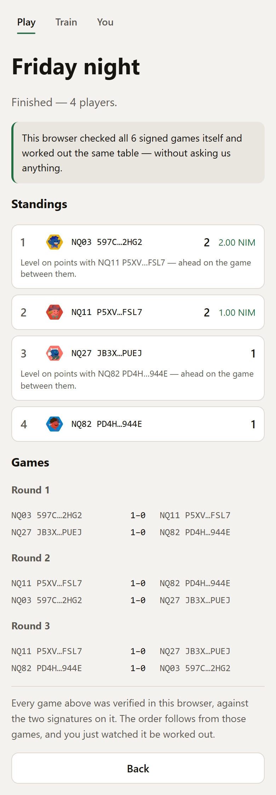

# Scoresheet

> Chess.com owns your rating. Here you and your opponent sign for it.

| Field | Value |
| --- | --- |
| Category | Games |
| Pricing | Free |
| Team name | _Not provided — optional_ |
| Team members | _Not provided — optional_ |
| X account | Prateekhh |
| Heard about it via | Twitter |
| Contact email | prtk8899@gmail.com |
| GitHub login | @Pratiikpy |
| Submitted at | 2026-09-15T11:45:10.586Z |

## Links

| Link | URL |
| --- | --- |
| Repo | [https://github.com/Pratiikpy/scoresheet](<https://github.com/Pratiikpy/scoresheet>) |
| Demo | [https://chess-liard-sigma.vercel.app](<https://chess-liard-sigma.vercel.app>) |
| Video | [https://youtu.be/sgAf3S4brus](<https://youtu.be/sgAf3S4brus>) |
| Skool post | [https://www.skool.com/miniappscompetition/why-chess-in-nimiq-pay?p=b5be4707](<https://www.skool.com/miniappscompetition/why-chess-in-nimiq-pay?p=b5be4707>) |
| Social post | [https://x.com/prateekhh/status/2099823825823412436](<https://x.com/prateekhh/status/2099823825823412436>) |

## Description

Play chess in Nimiq Pay: both players sign the result with their own wallet, and the rating is derived from those two signatures rather than stored on our server — so anyone can recompute it in their own browser, and nobody can revoke it. For everyone who has lost a rating to a closed account, a deleted profile, or a site that shut down.

## Builder story

Must Visit : https://comfortable-goal-205.notion.site/Scoresheet-Nimiq-Mini-Apps-Cycle-2-3db9c0ce787681d698d2f2aeac873450?source=copy_link

I kept losing ratings. Not games — ratings. An account closed, a platform shut down, a number that was mine right up until it wasn't, because it never lived anywhere I controlled.

So before writing a line of code I read. 𝗙𝗼𝗿𝘁𝘆-𝗻𝗶𝗻𝗲 𝗿𝗲𝘀𝗲𝗮𝗿𝗰𝗵 𝗻𝗼𝘁𝗲𝘀: Lichess and Chess.com as products, lila as an architecture, Stockfish and NNUE, puzzle selection, fair play, FIDE Swiss pairing, portable identity, and what a chess rating actually is. Every note answered the 𝘀𝗮𝗺𝗲 𝗻𝗶𝗻𝗲 𝗾𝘂𝗲𝘀𝘁𝗶𝗼𝗻𝘀 and every claim carried a source URL or was marked NOT VERIFIED. One of those nine — what can we uniquely do because of Nimiq — is what turned this from a chess app that happens to have a wallet into the thing it became: 𝘁𝗵𝗲 𝘀𝗶𝗴𝗻𝗮𝘁𝘂𝗿𝗲 𝗶𝘀 𝘁𝗵𝗲 𝗿𝗮𝘁𝗶𝗻𝗴.

Then I built it. Our own board, our own engine, our own opening book — because nearly the whole chess ecosystem is GPL or AGPL, this had to be MIT, and shipping JavaScript to a browser counts as distribution. Nothing here is a wrapper.

𝗧𝗵𝗲 𝗺𝗼𝘀𝘁 𝘂𝘀𝗲𝗳𝘂𝗹 𝗱𝗮𝘆 𝘄𝗮𝘀 𝘁𝗵𝗲 𝗼𝗻𝗲 𝘄𝗵𝗲𝗿𝗲 𝗲𝘃𝗲𝗿𝘆𝘁𝗵𝗶𝗻𝗴 𝗽𝗮𝘀𝘀𝗲𝗱 𝗮𝗻𝗱 𝘁𝗵𝗲 𝗽𝗿𝗼𝗱𝘂𝗰𝘁 𝘄𝗮𝘀 𝘀𝘁𝗶𝗹𝗹 𝗯𝗿𝗼𝗸𝗲𝗻. 590 browser checks green — and inside Nimiq Pay, Resign sat underneath Android's gesture bar on a screen that cannot be scrolled. You could start a game in the wallet and never finish one. env(safe-area-inset-bottom) reads 𝗲𝘅𝗮𝗰𝘁𝗹𝘆 𝘇𝗲𝗿𝗼 in that WebView, so no browser could ever have told me. Then, while shooting the demo film, I found a second one: in a game between two real people, 𝗻𝗲𝗶𝘁𝗵𝗲𝗿 𝗱𝗲𝘃𝗶𝗰𝗲 𝗲𝘃𝗲𝗿 𝗰𝗼𝗹𝗹𝗲𝗰𝘁𝗲𝗱 𝘁𝗵𝗲 𝗼𝗽𝗽𝗼𝗻𝗲𝗻𝘁'𝘀 𝘀𝗶𝗴𝗻𝗮𝘁𝘂𝗿𝗲 — so the one screen this entire product rests on was quietly excluding every real game. Both are fixed. Both now have tests that fail if they come back.

What I would like you to do is not believe any of this. Open a record and press 𝗥𝗲𝗰𝗼𝗺𝗽𝘂𝘁𝗲. Your browser re-derives the number from the signatures alone, with my server switched off, and prints what it reached beside what I showed you. If they ever disagree, I am wrong — and the page says so.

𝗘𝘃𝗲𝗿𝘆 𝗰𝗹𝗮𝗶𝗺 𝗮𝗯𝗼𝘃𝗲 𝗵𝗮𝘀 𝗮 𝘀𝗰𝗿𝗲𝗲𝗻𝘀𝗵𝗼𝘁 𝗮𝗻𝗱 𝗮 𝗰𝗼𝗺𝗺𝗮𝗻𝗱 𝗯𝗲𝗵𝗶𝗻𝗱 𝗶𝘁, 𝗵𝗲𝗿𝗲:

https://chess-liard-sigma.vercel.app/proof

## Thumbnail

## Screenshots

---

_Generated from the submission form. `submission.yaml` in this folder is the machine-readable source of truth._
