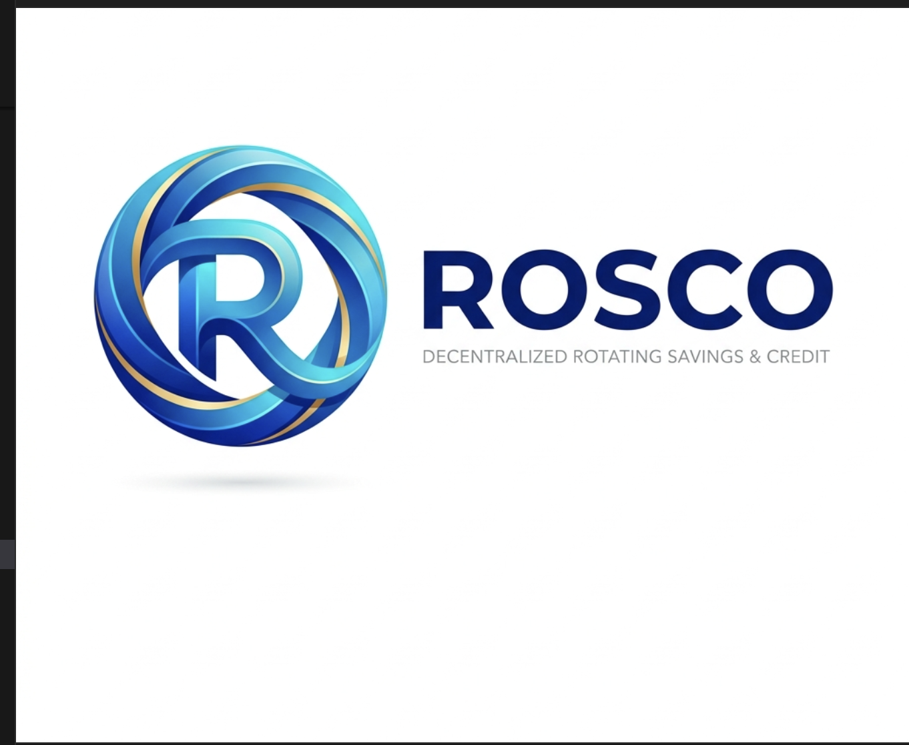
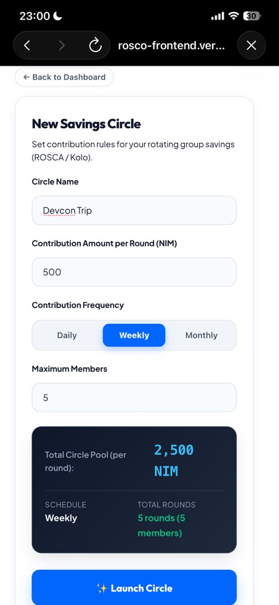
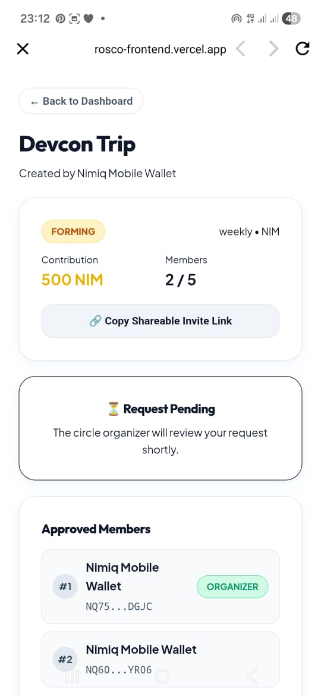
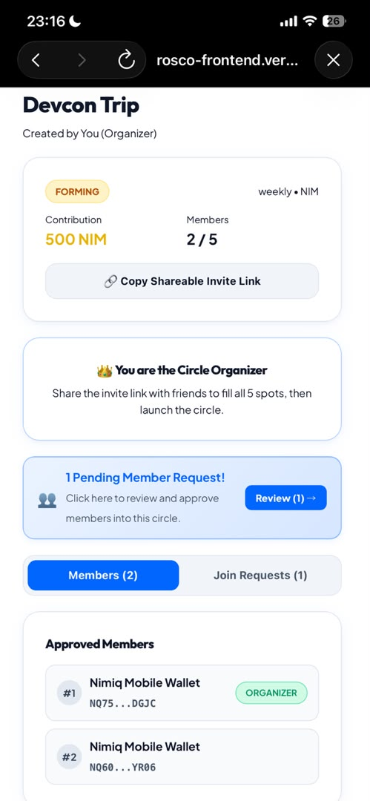
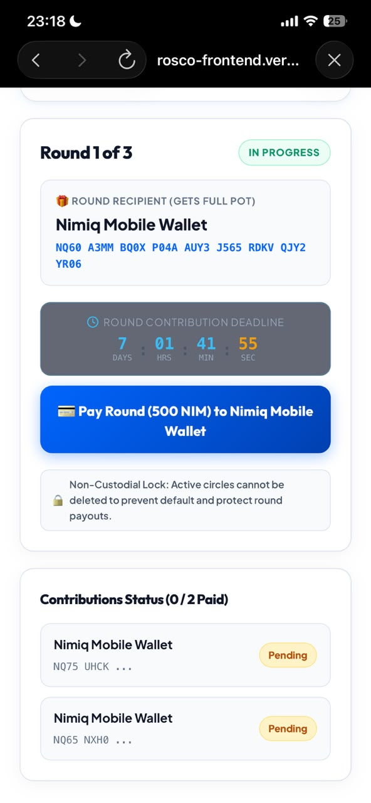
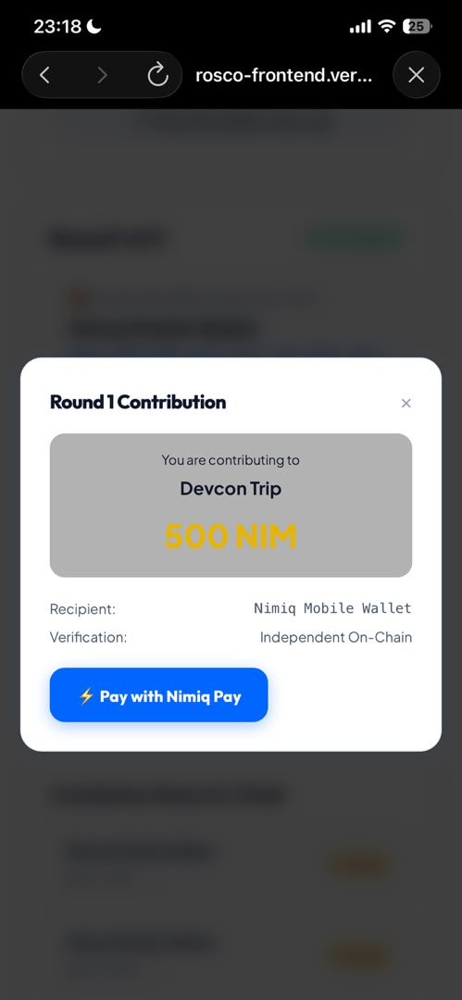

# Rosco

> Save together, Grow together

| Field | Value |
| --- | --- |
| Category | Social |
| Pricing | Free |
| Team name | Team Rosco |
| Team members | Iyanuoluwa Adewale |
| X account | omowumiRahmat |
| Heard about it via | I heard about it on X |
| Contact email | popoolarahmat96@gmail.com |
| GitHub login | @Rampop01 |
| Submitted at | 2026-09-18T22:57:18.951Z |

## Links

| Link | URL |
| --- | --- |
| Repo | [https://github.com/Rampop01/Rosco](<https://github.com/Rampop01/Rosco>) |
| Demo | [https://rosco-frontend.vercel.app/](<https://rosco-frontend.vercel.app/>) |
| Video | [https://x.com/OmowumiRahmat/status/2101024875640946770](<https://x.com/OmowumiRahmat/status/2101024875640946770>) |
| Skool post | _Not provided — optional_ |
| Social post | [https://x.com/OmowumiRahmat/status/2101024875640946770](<https://x.com/OmowumiRahmat/status/2101024875640946770>) |

## Description

Rosco is a digital savings circle that helps build financial discipline and access interest-free cash when they need it.
A group pools a set amount of money each week or month, takes turns collecting the full payout, and can also lock away personal savings toward private goals

## Builder story

Inspiration & Problem
Over 1 billion people worldwide rely on informal community rotating savings groups—known culturally as ROSCAs, Esusu (West Africa), Kolo (Nigeria), Tandas (Latin America), Chit Funds (India), Hui (East Asia), and Pardna (Caribbean). Together, they circulate over $500 Billion annually based entirely on trust.

However, traditional informal circles suffer from fatal flaws:

Default & Counterparty Risk: Members who take an early payout round can disappear or default on future payments.
Manual Administration & Fraud: Organizers must physically collect, count, track, and disburse cash, exposing groups to theft and human error.
Unfair Payout Scheduling: Turn order is often rigged or contested, creating conflict within communities.
Predatory Banking Alternative: Commercial banks charge steep account maintenance fees, enforce rigid credit checks, and provide negligible interest.
The Solution: Rosco
Rosco re-engineers traditional community savings into a transparent, decentralized, non-custodial Web3 application powered by the Nimiq blockchain.

0% Platform Fees: 100% of the pooled funds go directly to the rotating winner or saver.
Instant, Micro-Fee Settlements: Powered by Nimiq's instant proof-of-stake Albatross consensus.
Native 1-Tap Nimiq Pay: Seamless mobile checkout without exporting seed words or dealing with complex gas fees.
Smart Vault Discipline: Enforced lock timers, scheduled deposits, and automatic on-chain payouts.

Key Features
1. Rotating Savings Circles (ROSCAs / Kolo)
2. Personal Target Savings Vaults (Discipline & Solo Savings)
3. In-App Real-Time Notification Center

## Thumbnail

## Screenshots

---

_Generated from the submission form. `submission.yaml` in this folder is the machine-readable source of truth._
