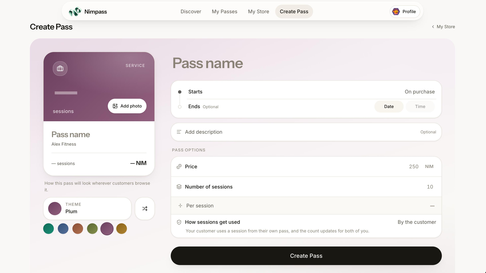
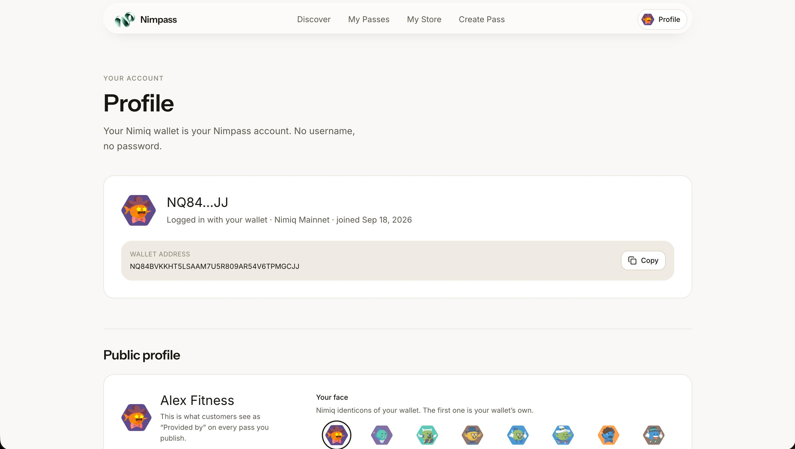
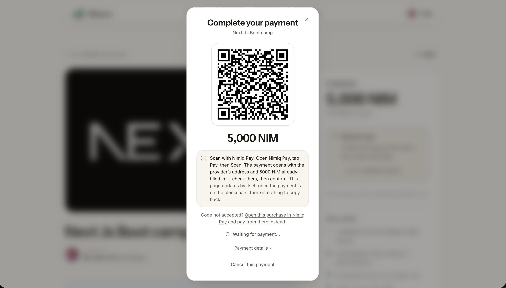

# NimPass

> Turn sessions into digital passes — NP.

| Field | Value |
| --- | --- |
| Category | Marketplaces |
| Pricing | Free |
| Team name | _Not provided — optional_ |
| Team members | _Not provided — optional_ |
| X account | https://x.com/EminKutluAi |
| Heard about it via | X |
| Contact email | emin.kltklt@gmail.com |
| GitHub login | @Root-Emin |
| Submitted at | 2026-09-18T22:12:56.134Z |

## Links

| Link | URL |
| --- | --- |
| Repo | [https://github.com/Root-Emin/NimPass](<https://github.com/Root-Emin/NimPass>) |
| Demo | [https://nimpass.vercel.app/](<https://nimpass.vercel.app/>) |
| Video | [https://youtube.com/shorts/SgTK75Fcs8A?feature=share](<https://youtube.com/shorts/SgTK75Fcs8A?feature=share>) |
| Skool post | [https://www.skool.com/miniappscompetition/meet-nimpass-session-passes-paid-in-nim-np?p=09ff9b02](<https://www.skool.com/miniappscompetition/meet-nimpass-session-passes-paid-in-nim-np?p=09ff9b02>) |
| Social post | [https://www.youtube.com/shorts/SgTK75Fcs8A](<https://www.youtube.com/shorts/SgTK75Fcs8A>) |

## Description

Nimpass helps tutors, coaches, and trainers create prepaid session passes, sell them with Nimiq, and manage everything in one place. Customers can buy passes, track their remaining sessions, and access everything directly from their account.

## Builder story

I wanted to solve a very common problem for independent service providers: selling prepaid session packages without dealing with scattered messages, manual tracking, or payment confusion. Nimpass gives tutors, coaches, and trainers a simple way to sell session passes with NIM, while giving customers a clear place to view what they bought and how many sessions they have left.

## Thumbnail

## Screenshots

---

_Generated from the submission form. `submission.yaml` in this folder is the machine-readable source of truth._
