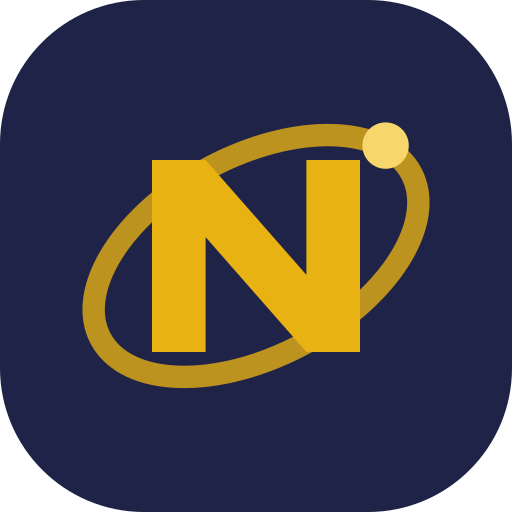
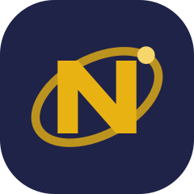
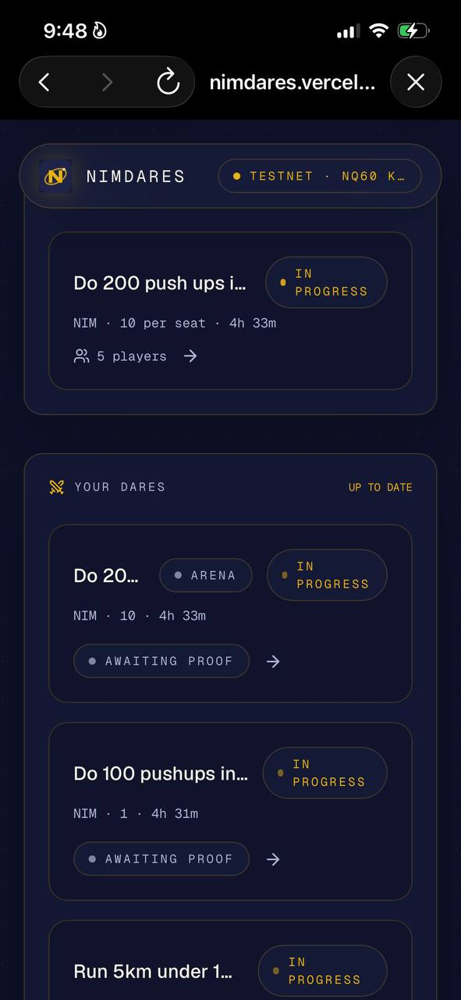
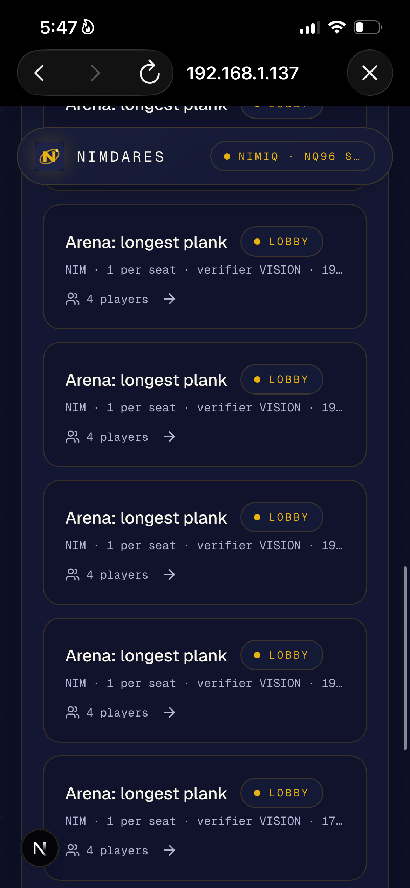
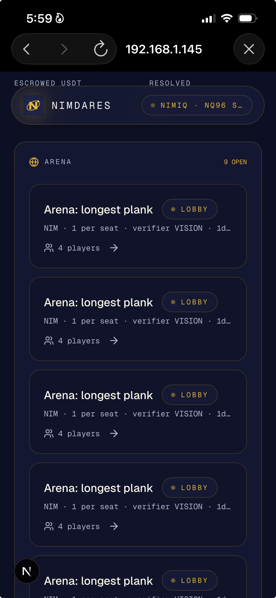

# NimDares

> Stake the promise. Prove the work. Get your NIM back

| Field | Value |
| --- | --- |
| Category | Games |
| Pricing | Free |
| Team name | Team NiDa |
| Team members | Knowledge |
| X account | Sabercodes123 |
| Heard about it via | X |
| Contact email | ayodejiakintobi1@gmail.com |
| GitHub login | @Saber1Y |
| Submitted at | 2026-09-17T16:16:18.629Z |

## Links

| Link | URL |
| --- | --- |
| Repo | [https://github.com/Saber1Y/NimDares](<https://github.com/Saber1Y/NimDares>) |
| Demo | [https://nimdares.vercel.app](<https://nimdares.vercel.app>) |
| Video | [https://youtu.be/1uijncjvNTQ](<https://youtu.be/1uijncjvNTQ>) |
| Skool post | [https://www.skool.com/miniappscompetition/nimdares?p=f2fa8c92](<https://www.skool.com/miniappscompetition/nimdares?p=f2fa8c92>) |
| Social post | [https://x.com/Sabercodes123/status/2100619807271883041?s=20](<https://x.com/Sabercodes123/status/2100619807271883041?s=20>) |

## Description

NimDares turns personal commitments into Nimiq-powered dares. Users stake NIM on measurable goals, submit screenshot or API-based proof, and receive an adjudicated refund or settlement when the dare resolves.

## Builder story

Most productivity tools track intentions but do not create consequences for abandoning them. NimDares makes a commitment tangible by putting a NIM stake behind a measurable goal.

I built it as a Nimiq Pay Mini App so wallet signing, escrow funding, proof submission, adjudication, and settlement can happen in one focused flow. The current demo runs on Nimiq TestAlbatross testnet.

## Thumbnail

## Screenshots

---

_Generated from the submission form. `submission.yaml` in this folder is the machine-readable source of truth._
