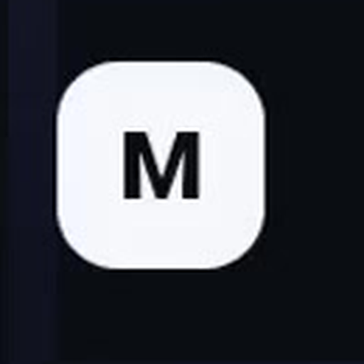
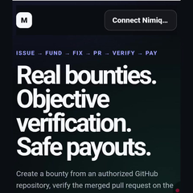
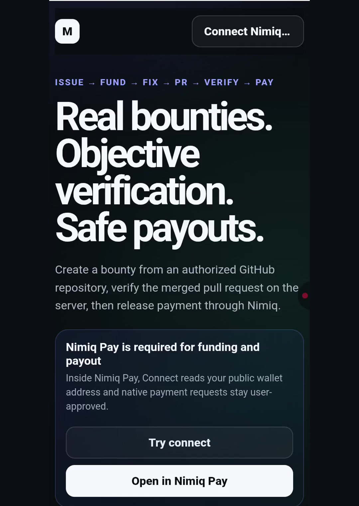
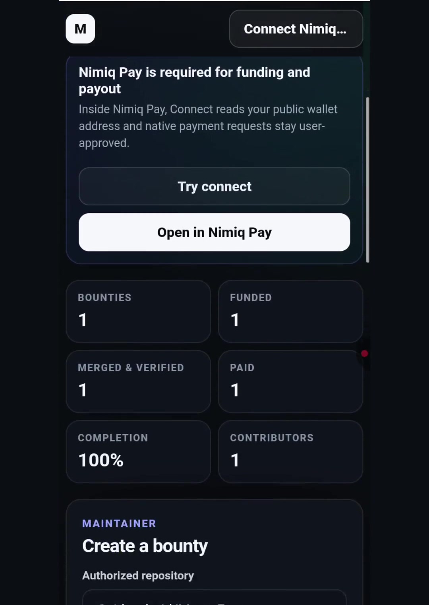
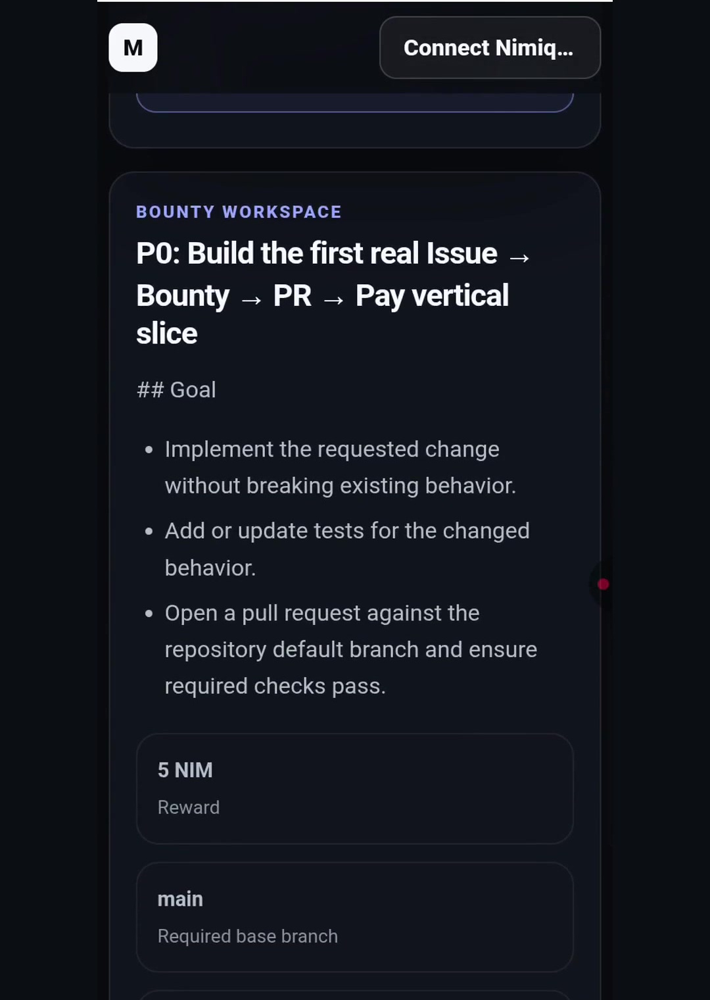
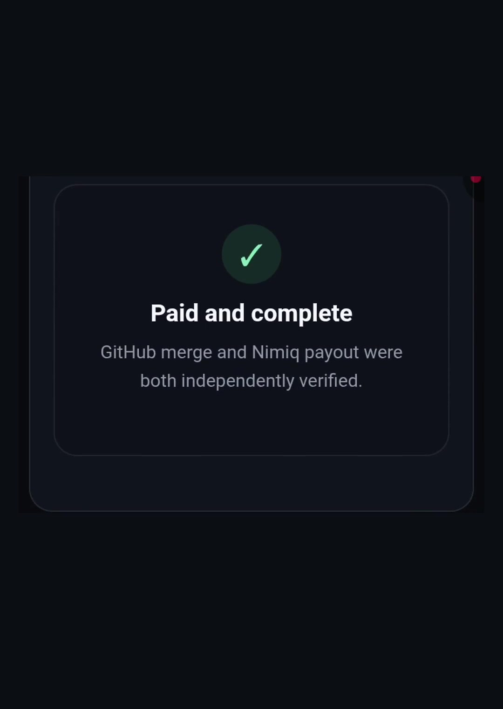
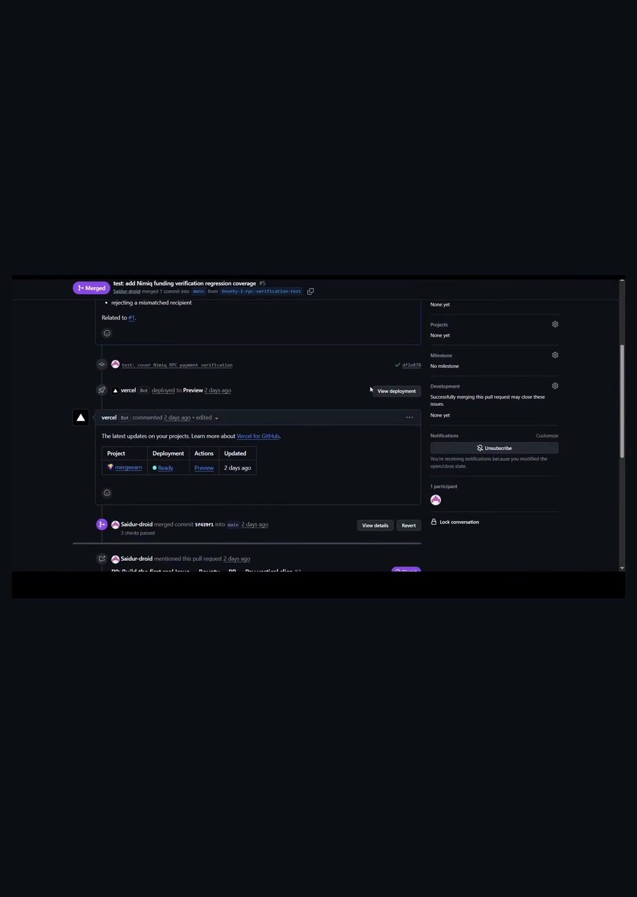

# MergeEarn

> Fund issues. Reward merges.

| Field | Value |
| --- | --- |
| Category | Earning |
| Pricing | Free |
| Team name | non |
| Team members | _Not provided — optional_ |
| X account | Rifatncr7 |
| Heard about it via | Nimiq Community |
| Contact email | rifat77info@gmail.com |
| GitHub login | @Saidur-droid |
| Submitted at | 2026-09-17T04:14:41.310Z |

## Links

| Link | URL |
| --- | --- |
| Repo | [https://github.com/Saidur-droid/MergeEarn](<https://github.com/Saidur-droid/MergeEarn>) |
| Demo | [https://mergeearn.vercel.app](<https://mergeearn.vercel.app>) |
| Video | [https://youtube.com/shorts/xf0TRhqKeUE](<https://youtube.com/shorts/xf0TRhqKeUE>) |
| Skool post | [https://www.skool.com/miniappscompetition/built-mergeearn-github-issue-bounties-paid-with-nim](<https://www.skool.com/miniappscompetition/built-mergeearn-github-issue-bounties-paid-with-nim>) |
| Social post | [https://x.com/Rifatncr7/status/2100430329886745073](<https://x.com/Rifatncr7/status/2100430329886745073>) |

## Description

MergeEarn turns real GitHub issues into funded NIM bounties and pays contributors only after the expected pull request is merged and independently verified.

## Builder story

I built MergeEarn to make open-source bounties verifiable end to end. GitHub is the source of truth for the work, while Nimiq is the source of truth for the money. Maintainers can fund real GitHub issues with NIM, contributors submit real pull requests, and payment is released only after the expected merge is verified. The goal is to remove screenshots, manual status updates, and payout spreadsheets from small open-source contributions.

## Thumbnail

## Screenshots

---

_Generated from the submission form. `submission.yaml` in this folder is the machine-readable source of truth._
