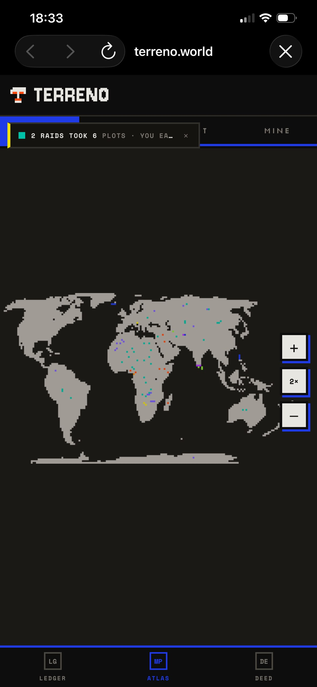
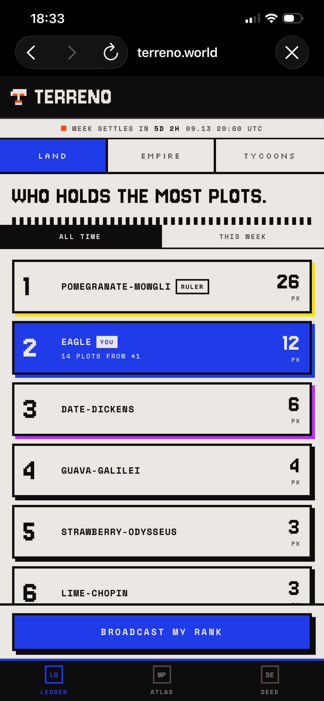
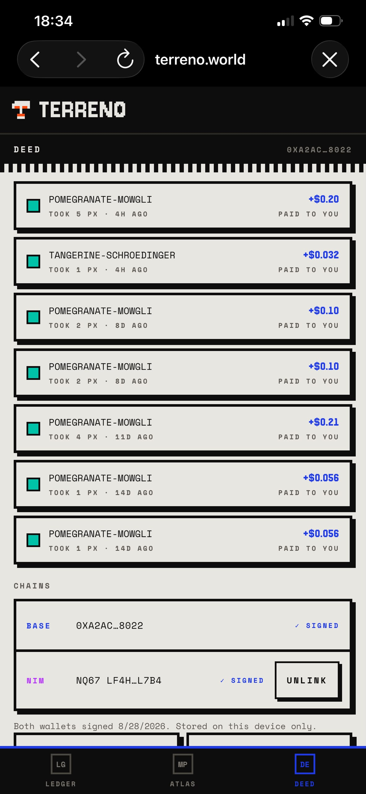

# Terreno

> OWN THE WORLD, ONE PIXEL AT A TIME.

| Field | Value |
| --- | --- |
| Category | Games |
| Pricing | Free |
| Team name | Cracked Studios |
| Team members | Otaiki Sadiq |
| X account | https://x.com/PlayTerreno |
| Heard about it via | X |
| Contact email | eagle@crackedstudios.xzy |
| GitHub login | @Samuel1-ona |
| Submitted at | 2026-09-08T20:57:31.933Z |

## Links

| Link | URL |
| --- | --- |
| Repo | [https://github.com/crackedstudio/Terreno](<https://github.com/crackedstudio/Terreno>) |
| Demo | [https://www.terreno.world/](<https://www.terreno.world/>) |
| Video | [https://youtube.com/shorts/xZGo0xl5PSU?feature=share](<https://youtube.com/shorts/xZGo0xl5PSU?feature=share>) |
| Skool post | [https://www.skool.com/miniappscompetition/terreno-community-update?p=72ac05c4](<https://www.skool.com/miniappscompetition/terreno-community-update?p=72ac05c4>) |
| Social post | [https://x.com/PlayTerreno/status/2092637139888410997?s=20](<https://x.com/PlayTerreno/status/2092637139888410997?s=20>) |

## Description

One map of the real world, cut into 5,622 plots of land. Every plot is owned by somebody, priced by the market, and permanently for sale — whether its owner likes it or not. You buy land for cents, somebody takes it from you at double the price and you get paid, and land nobody w

## Builder story

Why we built Terreno

So Terreno came out of Blokaz and Nukku. Those were games but honestly they were us figuring things out. 101,112 transactions. 24,415 players who made wallets and actually showed up. We got to watch where people quit, where they got stuck, what brought them back.

Main thing we took from it: nobody wants to be told ownership means something. They want to see it.

So that's Terreno. One map, 5,622 plots on a 170x100 grid, live on Base. Every plot has an owner, a color, and a price, and all the prices are public. You open it, and you're looking at what's actually happening: who owns what, which corners people are fighting over, which land is just sitting there because nobody wants it.

Same approach as before really. Watch what players do instead of guessing. Cut the friction that isn't fun. Keep the chain part quiet until it's the reason the thing works and not the reason people leave.

101K transactions and 24K players got us here. One world map, priced in cents, fought over in real time, that's the next thing.

## Thumbnail

## Screenshots

---

_Generated from the submission form. `submission.yaml` in this folder is the machine-readable source of truth._
