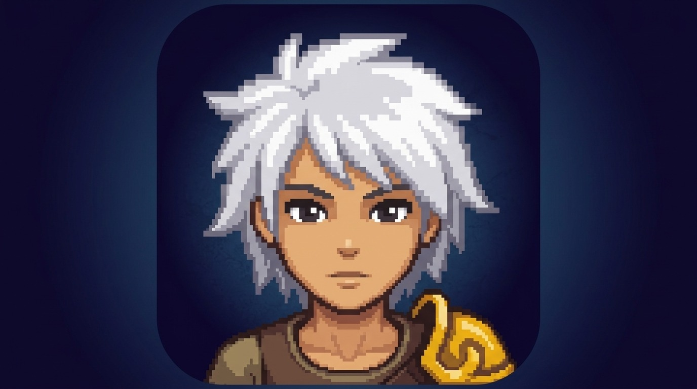
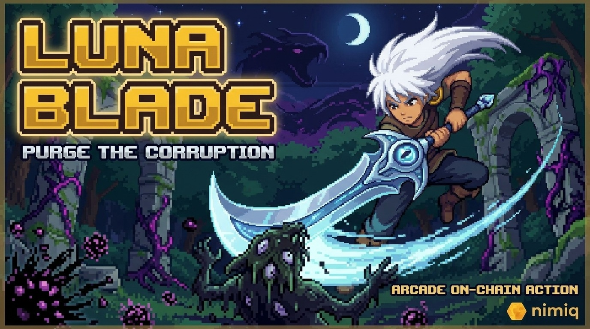
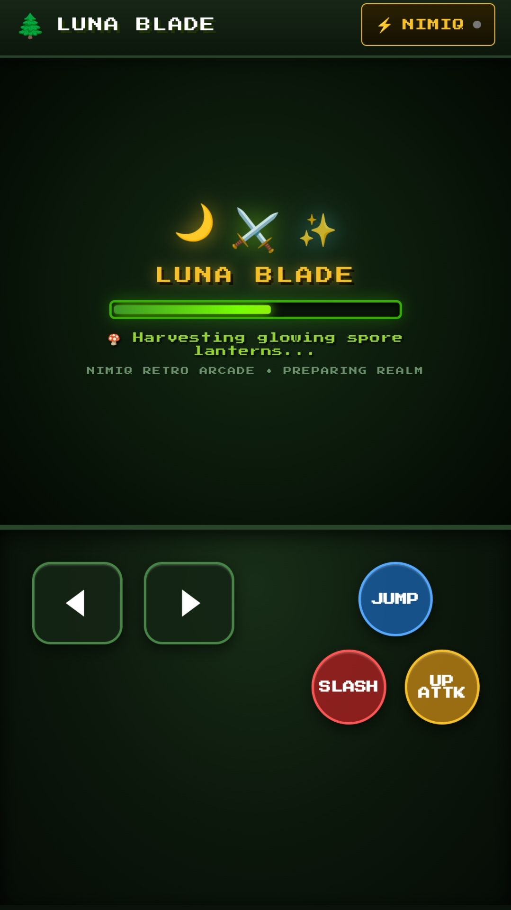
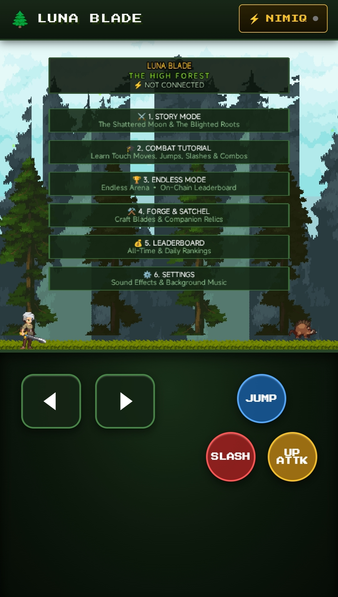
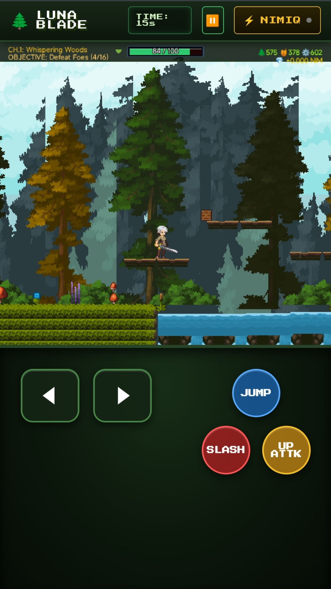
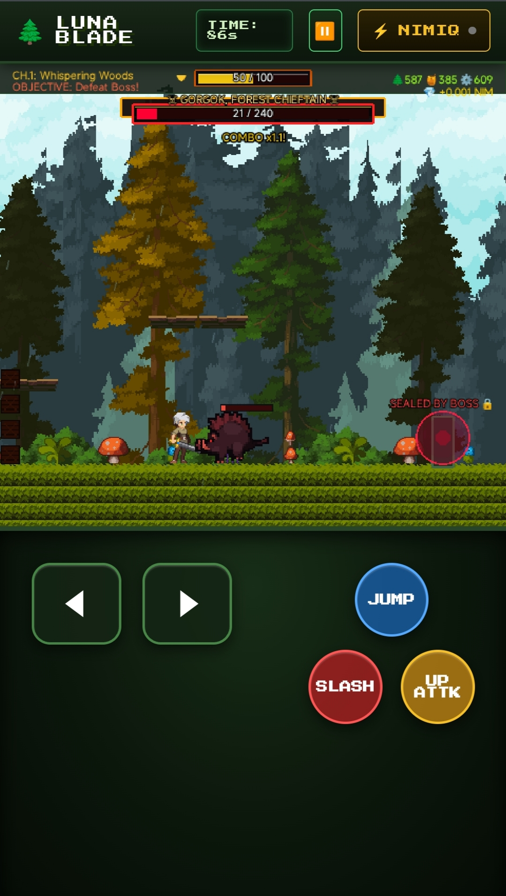
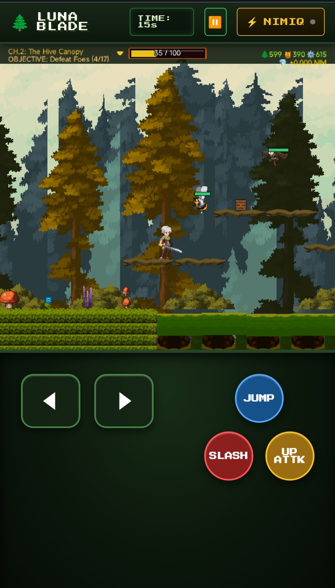

# Luna Blade

> Cleanse the Forest. Restore the cosmos

| Field | Value |
| --- | --- |
| Category | Games |
| Pricing | Free |
| Team name | _Not provided — optional_ |
| Team members | _Not provided — optional_ |
| X account | Itzobiszn |
| Heard about it via | X |
| Contact email | fredrickloveday@gmail.com |
| GitHub login | @ScriptedBro |
| Submitted at | 2026-09-18T22:56:24.133Z |

## Links

| Link | URL |
| --- | --- |
| Repo | [https://github.com/ScriptedBro/Luna-Blade](<https://github.com/ScriptedBro/Luna-Blade>) |
| Demo | [https://luna-blade.vercel.app/](<https://luna-blade.vercel.app/>) |
| Video | [https://youtube.com/shorts/yDKZ0VaBNIY?si=wTPwVVHsLoi-e7GK](<https://youtube.com/shorts/yDKZ0VaBNIY?si=wTPwVVHsLoi-e7GK>) |
| Skool post | _Not provided — optional_ |
| Social post | [https://x.com/Itzobiszn/status/2101082116318499070](<https://x.com/Itzobiszn/status/2101082116318499070>) |

## Description

Luna Blade is a fast-paced retro 2D action-platformer where players wield a lunar blade to purge ancient forest shrines consumed by dark corruption. Carve through hordes of blighted beasts, conquer chapter bosses, and survive relentless onslaughts in Endless Mode. Featuring fluid

## Builder story

I grew up on timeless 16-bit action platformers games where tight controls, fluid combat rhythm, and mastering enemy attack patterns made victory feel earned. When exploring Web3 and micro-transaction gaming, I noticed a frustrating pattern: too many games sacrificed fun for financial mechanics, bogging players down with gas fees, slow confirmations, and friction-filled wallet popups.

I built Luna Blade to prove that blockchain gaming could be different. My goal was simple: make a genuinely great, fast-paced retro arcade game first.

I wanted every jump, sword slash, wall-slide, and boss encounter to feel punchy and responsive. Leveraging Nimiq’s instant, low-friction micropayment rails allowed me to seamlessly weave crypto into the arcade experience—turning in-game achievements, boss bounties, and crystal harvests into real, instantaneous rewards without interrupting the action. Luna Blade is my love letter to classic combat platformers, built for the modern decentralized web.

## Thumbnail

## Screenshots

---

_Generated from the submission form. `submission.yaml` in this folder is the machine-readable source of truth._
