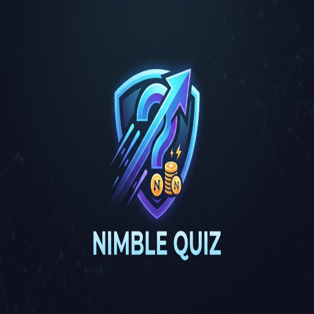
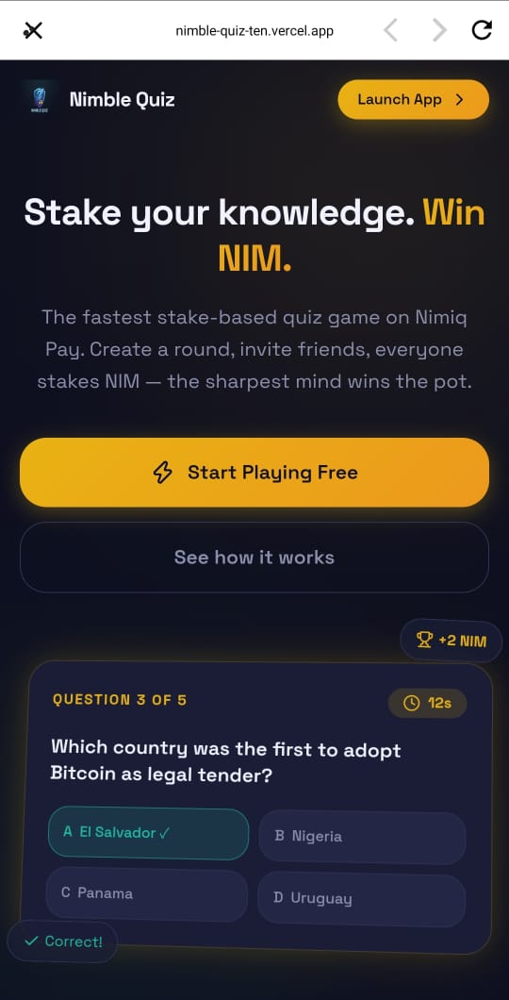
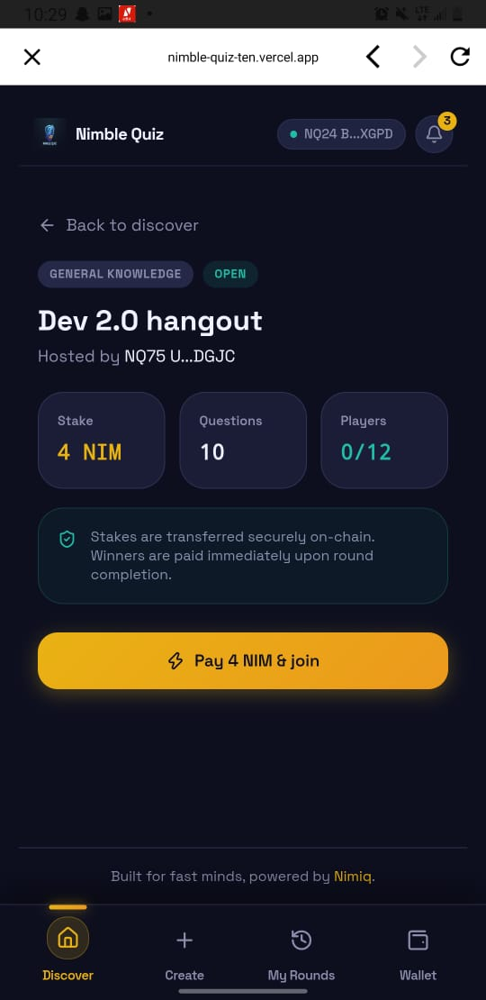
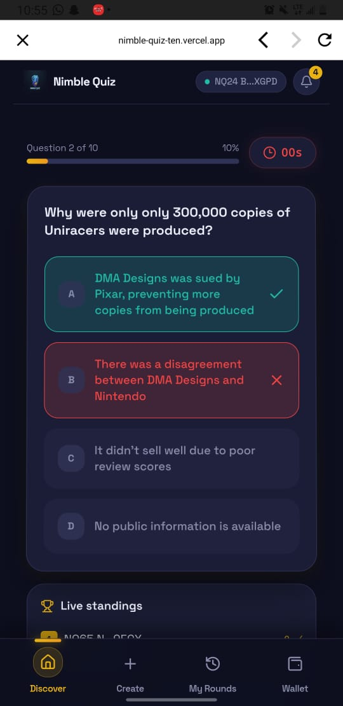
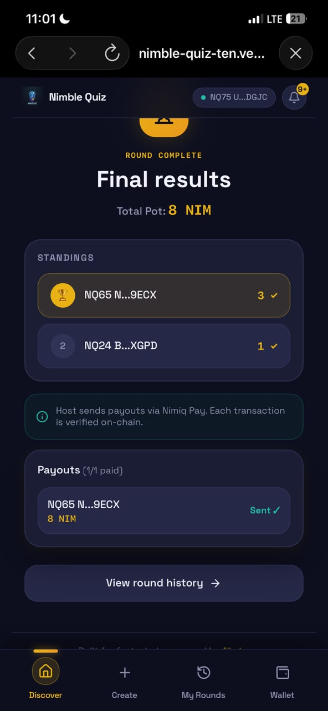

# Nimble Quiz

> Real-Time Web3 Trivia & Instant Micro-Payouts Powered by Nimiq Pay

| Field | Value |
| --- | --- |
| Category | Games |
| Pricing | Free |
| Team name | Nimble |
| Team members | Bamigboye Ayodeji Temitope, QuickNode |
| X account | 0xSkinny001 |
| Heard about it via | NImiq Community |
| Contact email | Bamigboyetemitope84@gmail.com |
| GitHub login | @Skinny001 |
| Submitted at | 2026-09-18T18:59:03.198Z |

## Links

| Link | URL |
| --- | --- |
| Repo | [https://github.com/Skinny001/Nimble-Quiz](<https://github.com/Skinny001/Nimble-Quiz>) |
| Demo | [https://nimble-quiz-ten.vercel.app/](<https://nimble-quiz-ten.vercel.app/>) |
| Video | [https://www.youtube.com/watch?v=trph45WwwQs](<https://www.youtube.com/watch?v=trph45WwwQs>) |
| Skool post | _Not provided — optional_ |
| Social post | [https://x.com/0xSkinny001/status/2100899328592130311?s=20](<https://x.com/0xSkinny001/status/2100899328592130311?s=20>) |

## Description

Nimble Quiz is a real-time Web3 trivia platform for gamers and community hosts to stake NIM, compete in synchronized quiz battles, and receive instant Nimiq Pay payouts.

## Builder story

Inspiration: I wanted to bring the high-energy fun of trivia games like Kahoot! to Web3 by using Nimiq Pay for instant, low-fee crypto micro-stakes.

Problem Solved: Web3 gaming is often ruined by wallet friction, slow payout delays, and network lag. 

Nimble Quiz eliminates seed phrases with 1-tap Nimiq Pay staking, synchronizes answer reveals to stop lag cheating, and auto-finalizes scores in under one second for instant one-click winner payouts.

## Thumbnail

## Screenshots

---

_Generated from the submission form. `submission.yaml` in this folder is the machine-readable source of truth._
