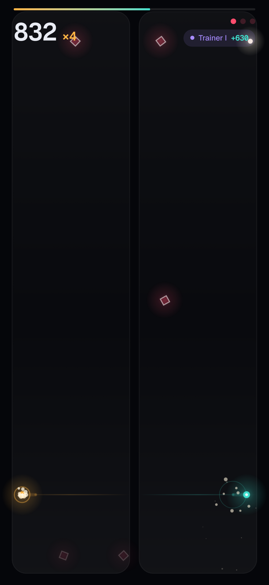
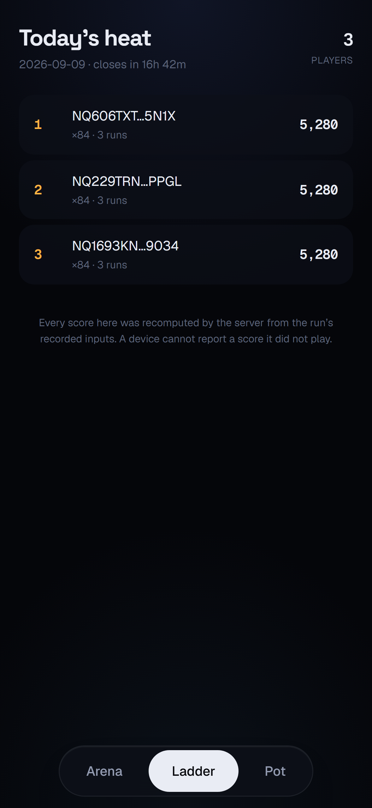
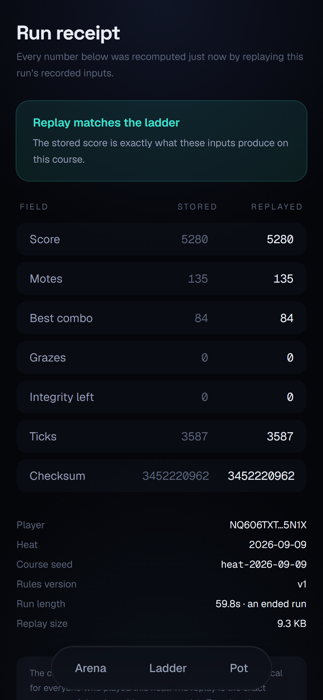
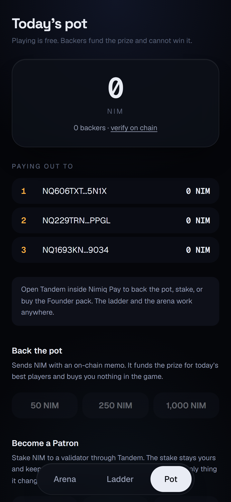

# Tandem

> One thumb. Two orbs. Sixty seconds.

| Field | Value |
| --- | --- |
| Category | Games |
| Pricing | Free |
| Team name | _Not provided — optional_ |
| Team members | _Not provided — optional_ |
| X account | Spagero71 |
| Heard about it via | x |
| Contact email | afolabispagero71@gmail.com |
| GitHub login | @Spagero763 |
| Submitted at | 2026-09-10T08:35:02.477Z |

## Links

| Link | URL |
| --- | --- |
| Repo | [https://github.com/Spagero763/tandem](<https://github.com/Spagero763/tandem>) |
| Demo | [https://tandem-six-snowy.vercel.app](<https://tandem-six-snowy.vercel.app>) |
| Video | [https://www.youtube.com/watch?v=kBOvGyk4ixE](<https://www.youtube.com/watch?v=kBOvGyk4ixE>) |
| Skool post | _Not provided — optional_ |
| Social post | [https://x.com/Spagero71/status/2097869156225782103](<https://x.com/Spagero71/status/2097869156225782103>) |

## Description

A sixty second arcade heat where one thumb drives two mirrored orbs at once, so every gap you steer into for one is a gap you steer the other out of. Everyone plays the same course each day and the server replays your inputs to settle the score, so the ladder is skill rather than

## Builder story

Every web game leaderboard I have seen works the same way: the browser posts a number and the server writes it down. That is an honour system with extra steps, and one person with the network tab open ruins it for everybody else.

So Tandem does not accept numbers. Your phone sends the inputs, one thumb position per tick, about nine kilobytes for a full heat, and the server re-runs the same simulation to work the score out itself. The client's own claim is kept for exactly one purpose: if it disagrees with the replay, the run is flagged and the replayed score is the one that counts. The simulation lives in a single module that both the browser and the server import, so there is no second implementation to drift apart.

The part I care about most is that you can check this yourself. Every run has a public receipt that re-scores it from the stored inputs on every request and shows the stored and replayed numbers side by side, with the course seed and the replay size. Tap any row on the ladder and you land on it.

The other decision worth naming is that playing is free and stays free. Backers fund the daily pot and cannot win it, staking makes you a Patron, and the Founder pack is two USDT on Polygon. Not one of them touches the ladder. A paid advantage in a scored game makes every score above yours ambiguous, and that is the one thing this design cannot afford.

## Thumbnail

## Screenshots

---

_Generated from the submission form. `submission.yaml` in this folder is the machine-readable source of truth._
