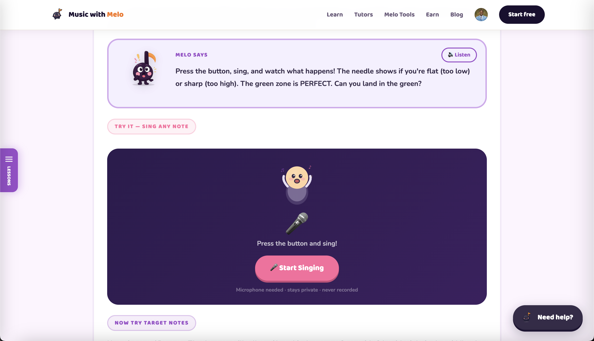
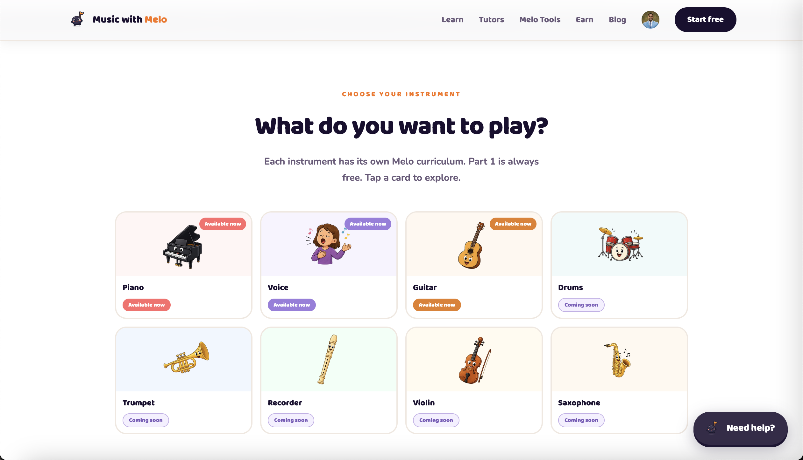
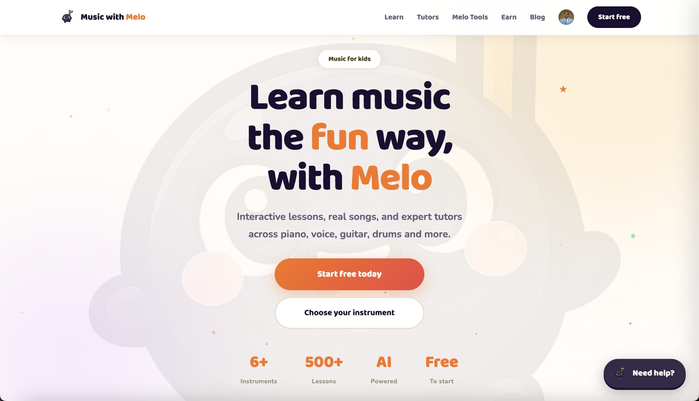

# Interactive piano lessons for children, made fun and easy to follow. Start free

> Fun and interactive piano lessons for children.

| Field | Value |
| --- | --- |
| Category | Education |
| Pricing | Freemium |
| Team name | _Not provided — optional_ |
| Team members | _Not provided — optional_ |
| X account | _Not provided — optional_ |
| Heard about it via | _Not provided — optional_ |
| Contact email | demotimothy@gmail.com |
| GitHub login | @Speakwithtim |
| Submitted at | 2026-09-17T10:12:45.724Z |

## Links

| Link | URL |
| --- | --- |
| Repo | [https://github.com/Speakwithtim/musicwithmelo](<https://github.com/Speakwithtim/musicwithmelo>) |
| Demo | [https://musicwithmelo.fun](<https://musicwithmelo.fun>) |
| Video | [https://youtu.be/t36nDFQHFMM](<https://youtu.be/t36nDFQHFMM>) |
| Skool post | _Not provided — optional_ |
| Social post | _Not provided — optional_ |

## Description

Interactive piano lessons for children, made fun and easy to follow. Start free today.

## Builder story

_Not provided — optional_

## Thumbnail

## Screenshots

---

_Generated from the submission form. `submission.yaml` in this folder is the machine-readable source of truth._
