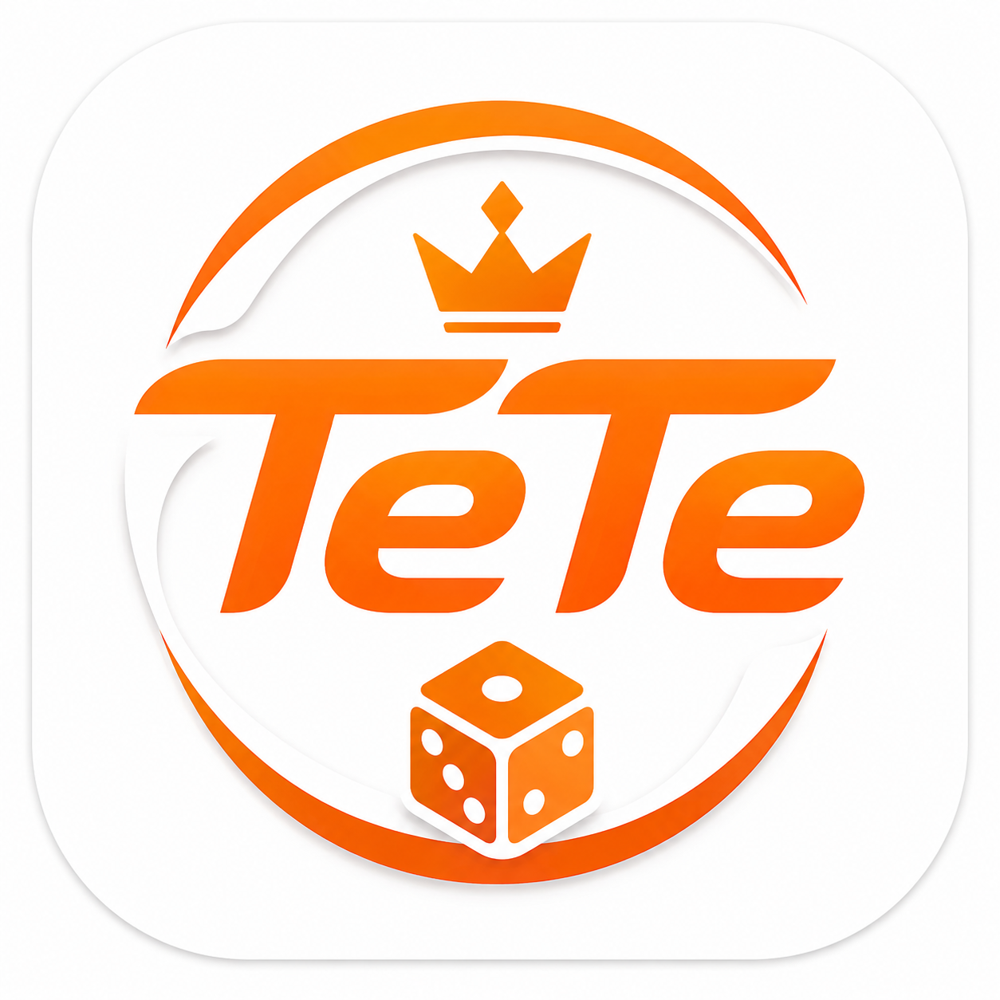
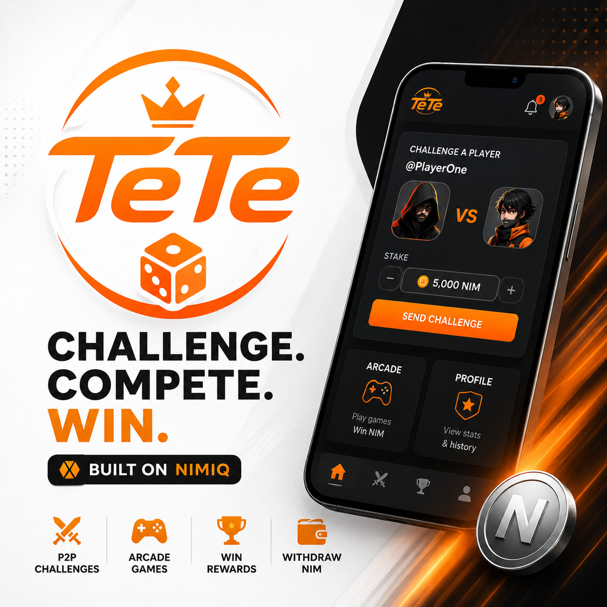
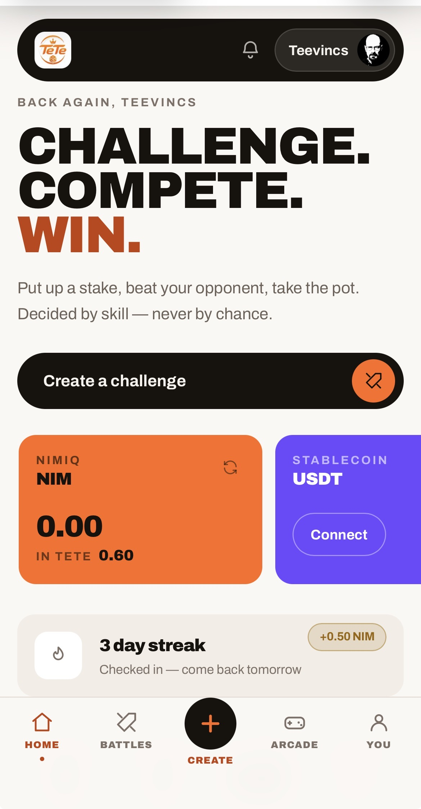
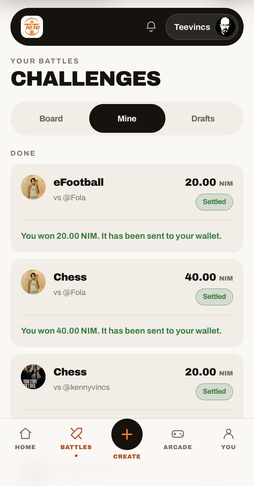
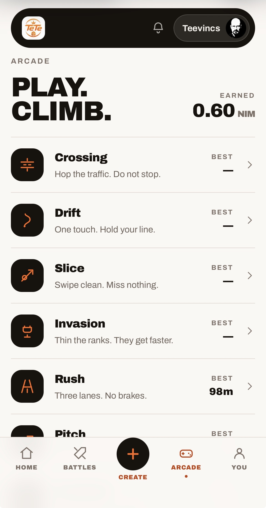
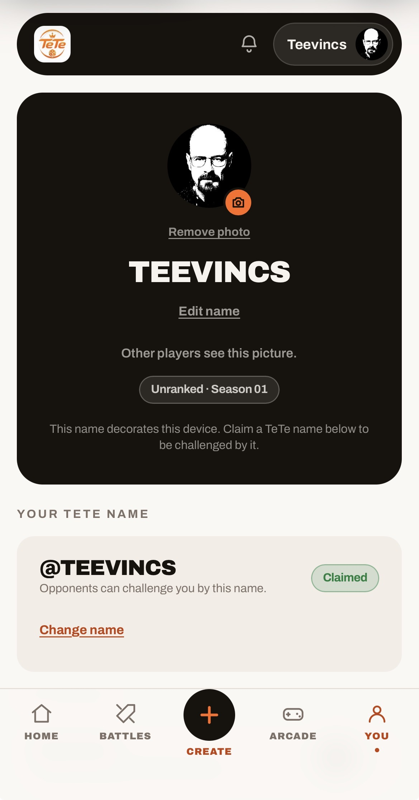
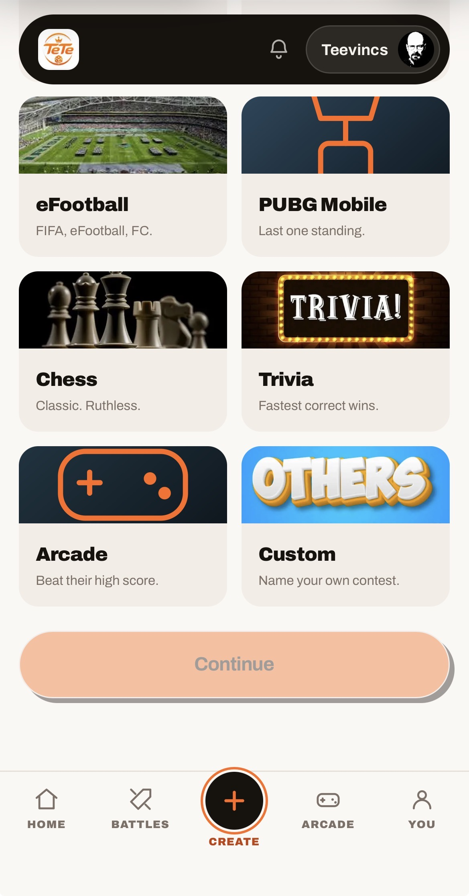

# TeTe on Nimiq

> Challenge for stakes, or just play the arcade, skill decides both.

| Field | Value |
| --- | --- |
| Category | Games |
| Pricing | Free |
| Team name | _Not provided — optional_ |
| Team members | _Not provided — optional_ |
| X account | fwteevincs |
| Heard about it via | X |
| Contact email | teevincs@gmail.com |
| GitHub login | @TeevincsCrypt |
| Submitted at | 2026-09-04T13:29:49.790Z |

## Links

| Link | URL |
| --- | --- |
| Repo | [https://github.com/TeevincsCrypt/TeTe](<https://github.com/TeevincsCrypt/TeTe>) |
| Demo | [https://www.teteonnimiq.site/](<https://www.teteonnimiq.site/>) |
| Video | [https://youtu.be/Ym72THbIxR8?si=BKO4xPKBDfC79bCa](<https://youtu.be/Ym72THbIxR8?si=BKO4xPKBDfC79bCa>) |
| Skool post | _Not provided — optional_ |
| Social post | [https://x.com/fwteevincs/status/2095819449840332912?s=46](<https://x.com/fwteevincs/status/2095819449840332912?s=46>) |

## Description

TeTe is a Nimiq Pay Mini App for peer-to-peer skill challenges: two players stake equal amounts of NIM, compete at something they’re actually good at, chess, trivia, mobile esports, or a custom contest and the winner takes the pot. 

Arcade games for earning NIM

## Builder story

_Not provided — optional_

## Thumbnail

## Screenshots

---

_Generated from the submission form. `submission.yaml` in this folder is the machine-readable source of truth._
