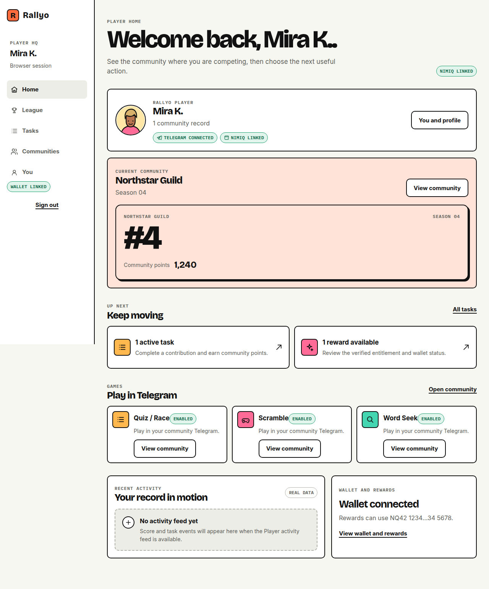
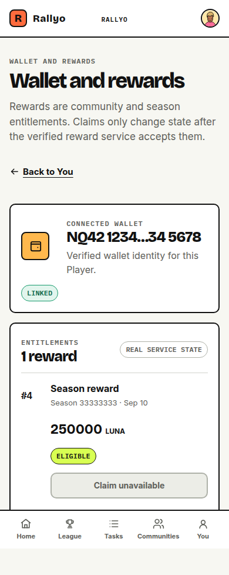
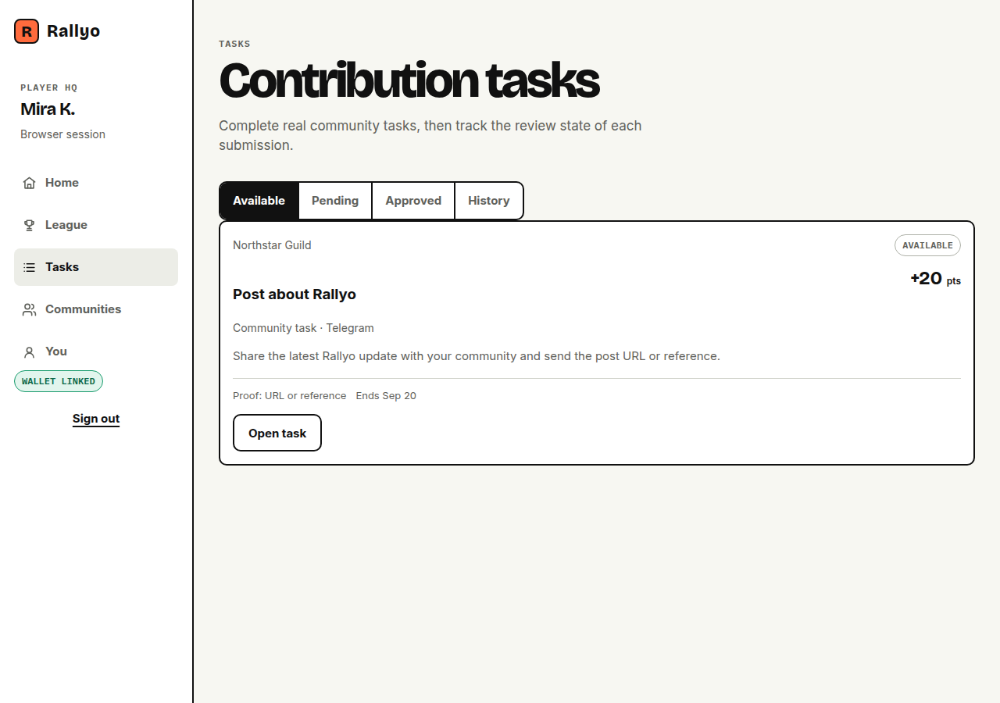
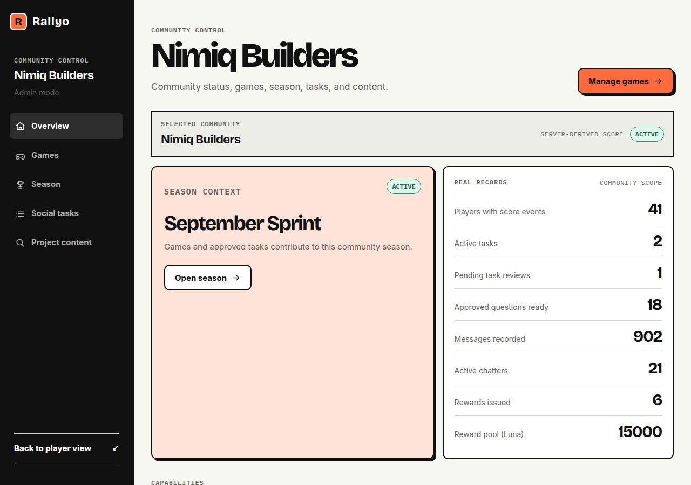

# Rallyo

> Make the community the game

| Field | Value |
| --- | --- |
| Category | Social |
| Pricing | Free |
| Team name | _Not provided — optional_ |
| Team members | _Not provided — optional_ |
| X account | Web3Kyami |
| Heard about it via | X |
| Contact email | web3kyami@gmail.com |
| GitHub login | @Web3Kyami |
| Submitted at | 2026-09-18T23:09:46.698Z |

## Links

| Link | URL |
| --- | --- |
| Repo | [https://github.com/Web3Kyami/Rallyo](<https://github.com/Web3Kyami/Rallyo>) |
| Demo | [https://rallyo.vercel.app/](<https://rallyo.vercel.app/>) |
| Video | [https://vimeo.com/1228222901](<https://vimeo.com/1228222901>) |
| Skool post | [https://www.skool.com/miniappscompetition/rallyo-is-live?p=6cc8de3a](<https://www.skool.com/miniappscompetition/rallyo-is-live?p=6cc8de3a>) |
| Social post | [https://x.com/Web3Kyami/status/2101084931807965195](<https://x.com/Web3Kyami/status/2101084931807965195>) |

## Description

Rallyo turns community activity into a live competition. Members play games built around the project itself, complete real contribution tasks, climb one shared seasonal leaderboard, and carry their identity into the Rallyo Mini App for rankings, rewards, and Nimiq wallet features

## Builder story

I’m a community mod, and I’ve seen the same pattern too many times
Pre launch and launch week is always loud, everyone is active, then a few weeks later the chat starts going quiet unless there’s another announcement, giveaway, or incentive.

So I built Rallyo around that to make the community become the game.

Projects can turn their own knowledge, terminology, updates, and community activity into Quiz/Race, Word Seek, Scramble, contribution tasks, seasons, and one shared leaderboard.

Telegram is where the action happens. The Rallyo Mini App is where your identity, communities, rank, tasks, rewards, and Nimiq wallet come together.

The idea is simple: give people a reason to come back even when there isn’t a big announcement happening.

## Thumbnail

## Screenshots

---

_Generated from the submission form. `submission.yaml` in this folder is the machine-readable source of truth._
