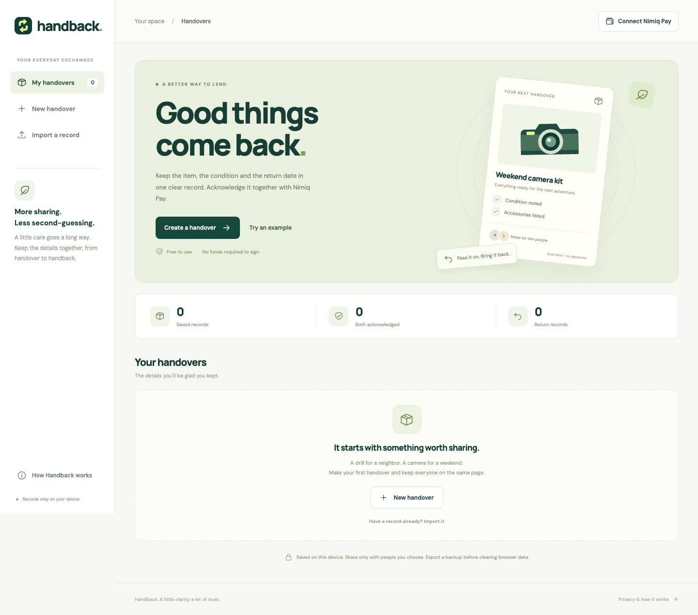
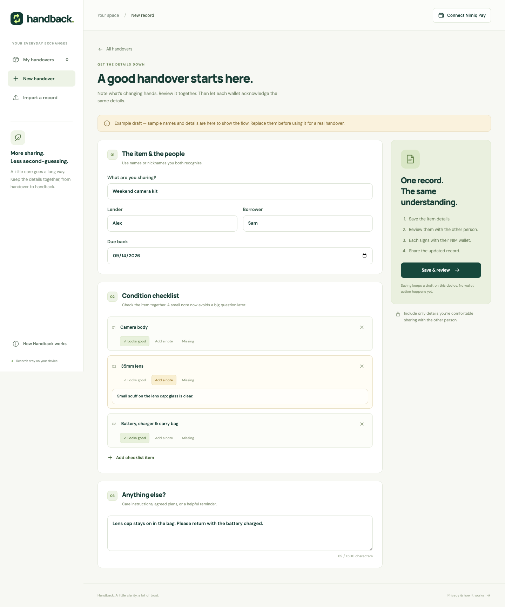
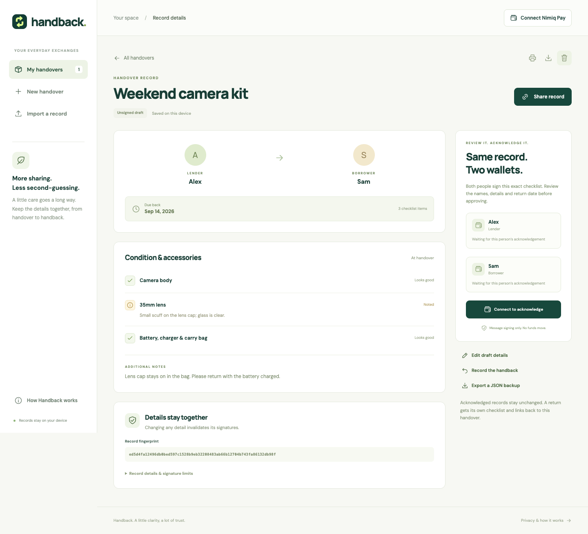
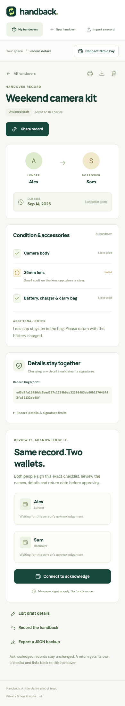
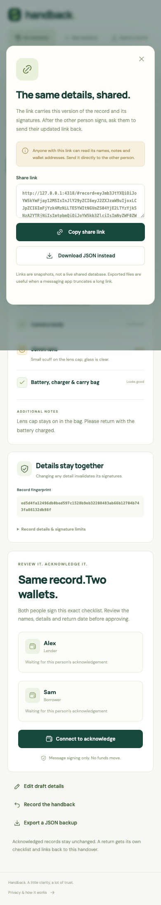

# Handback

> Lend it. Note it. Get it back.

| Field | Value |
| --- | --- |
| Category | Productivity |
| Pricing | Free |
| Team name | _Not provided — optional_ |
| Team members | _Not provided — optional_ |
| X account | _Not provided — optional_ |
| Heard about it via | _Not provided — optional_ |
| Contact email | zloevseth@gmail.com |
| GitHub login | @ZackaryLoevseth |
| Submitted at | 2026-09-07T19:11:10.349Z |

## Links

| Link | URL |
| --- | --- |
| Repo | [https://github.com/ZackaryLoevseth/handback-nimiq](<https://github.com/ZackaryLoevseth/handback-nimiq>) |
| Demo | [https://zackaryloevseth.github.io/handback-nimiq/](<https://zackaryloevseth.github.io/handback-nimiq/>) |
| Video | [https://youtu.be/MWJQUKuGZic](<https://youtu.be/MWJQUKuGZic>) |
| Skool post | _Not provided — optional_ |
| Social post | _Not provided — optional_ |

## Description

Handback records shared items, condition notes, return dates and linked returns. It uses Nimiq Pay message signing for wallet acknowledgements, with local records and portable links or JSON. Native phone signature verification remains pending.

## Builder story

Borrowing something usually begins with a friendly conversation. The uncertainty arrives later: which accessories came with it, whether that scuff was already there, and when it was coming back.

Handback brings those small details together. The idea is deliberately narrow: one item, one checklist, two people and a return date. Nimiq Pay gives each person a way to acknowledge the same record using a wallet they control, without creating another platform account or paying a transaction fee.

The implementation uses AI coding assistance. It keeps the record portable, verifies signatures locally and makes limits visible. A wallet signature is evidence of acknowledgement; it is not an inspection, an identity service or proof that an item was physically returned.

The app is designed for repeat use: share a tool, update both copies, then create a linked condition record when it comes back. Future work can be guided by real community feedback, especially phone sharing ergonomics and clearer cross-device handoffs.

Validation status: the user completed the sample Save & review workflow on a phone. Native Nimiq Pay account connection, cancellation, real message-signature approval and a displayed Verified status remain unconfirmed. The video shows the public unsigned workflow with genuine screenshots and synthetic narration. It does not prove successful native wallet integration.

## Thumbnail

## Screenshots

---

_Generated from the submission form. `submission.yaml` in this folder is the machine-readable source of truth._
