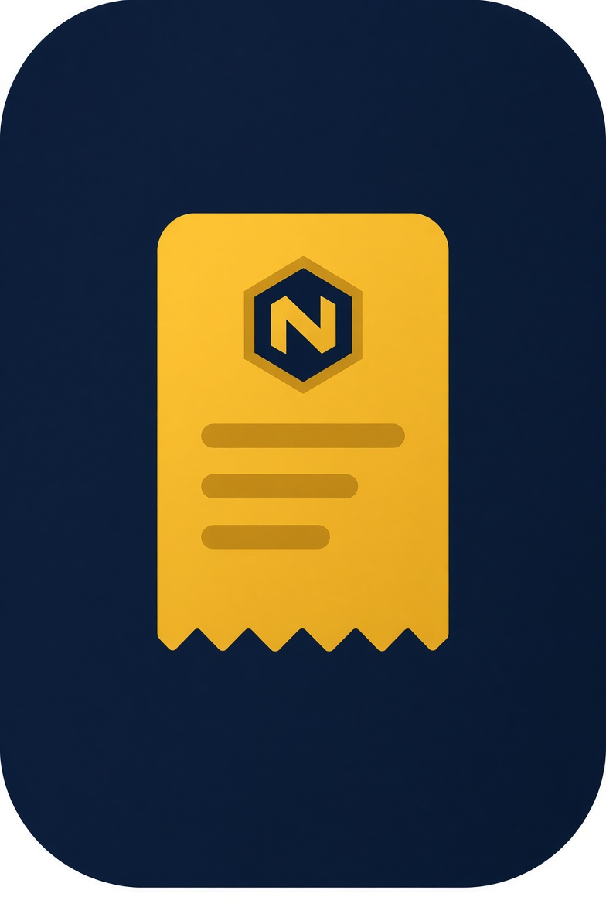
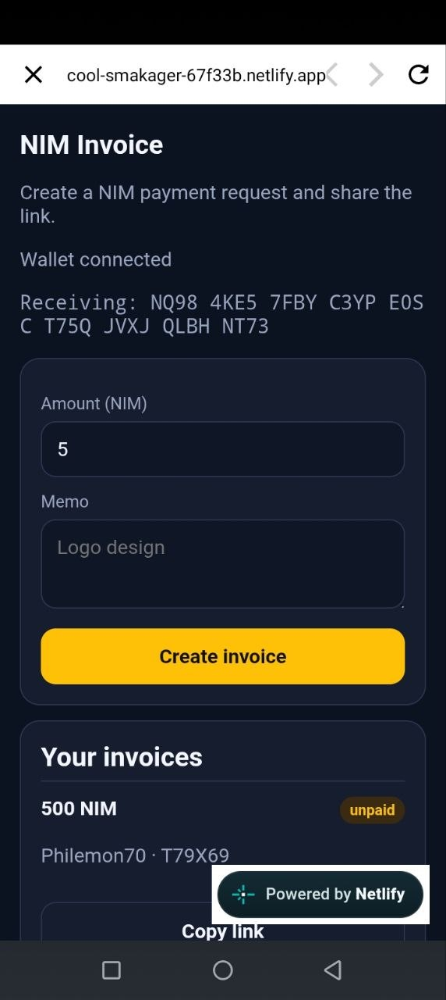
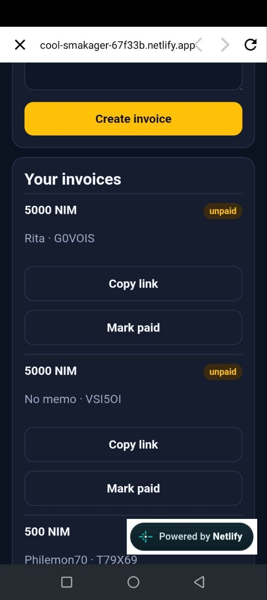
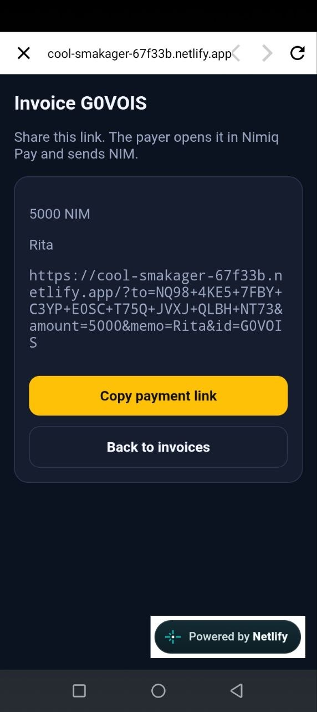
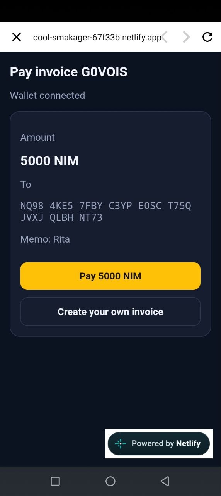

# NIM Invoice

> Create a NIM invoice and get paid with a link.

| Field | Value |
| --- | --- |
| Category | Productivity |
| Pricing | Free |
| Team name | De-Blephi |
| Team members | _Not provided — optional_ |
| X account | ByphilemonHQ |
| Heard about it via | twitter |
| Contact email | philemonalozie29@gmail.com |
| GitHub login | @aloziephilemon5-dotcom |
| Submitted at | 2026-09-03T00:56:01.947Z |

## Links

| Link | URL |
| --- | --- |
| Repo | [https://github.com/aloziephilemon5-dotcom/nim-invoice](<https://github.com/aloziephilemon5-dotcom/nim-invoice>) |
| Demo | [https://cool-smakager-67f33b.netlify.app](<https://cool-smakager-67f33b.netlify.app>) |
| Video | [https://x.com/ByphilemonHQ/status/2095224946276614377?s=20](<https://x.com/ByphilemonHQ/status/2095224946276614377?s=20>) |
| Skool post | _Not provided — optional_ |
| Social post | [https://x.com/ByphilemonHQ/status/2095224946276614377?s=20](<https://x.com/ByphilemonHQ/status/2095224946276614377?s=20>) |

## Description

NIM Invoice is for freelancers and anyone who needs to request a NIM payment. Enter an amount and memo, share the link, and the payer sends NIM in Nimiq Pay.

## Builder story

I kept seeing the same problem: someone wants to get paid in NIM, so they paste a long wallet address into chat and hope the other person sends the right amount.

That is easy to mess up. The payer has no memo, no amount, and no simple “open this and pay” step.

I built NIM Invoice for freelancers, friends, and small sellers who need a clear payment request. You enter an amount and a short memo, copy the link, and send it. The payer opens it in Nimiq Pay and sends NIM to the address on the invoice. You can mark it paid after.

I shipped a small working Mini App instead of a big unfinished one. The first version stores invoices on the device and puts the payment details in the shared link. Next I want payment confirmation and a cleaner share flow.

## Thumbnail

## Screenshots

---

_Generated from the submission form. `submission.yaml` in this folder is the machine-readable source of truth._
