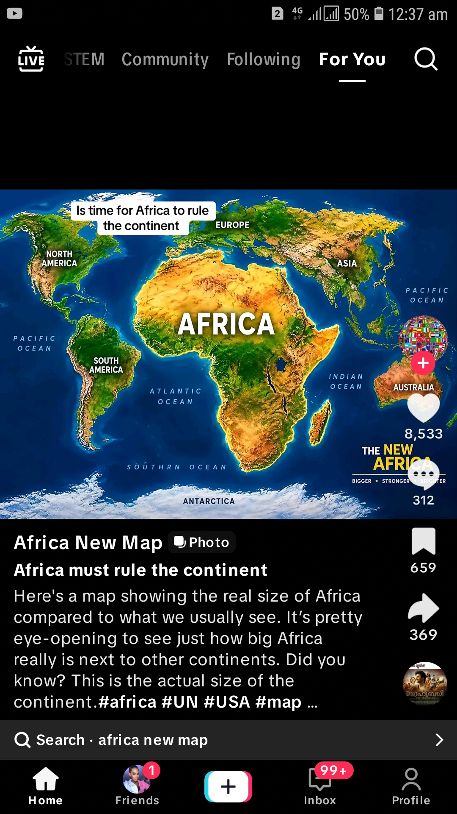
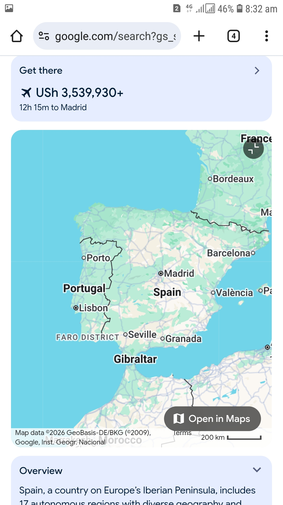

# Mini app

> ZeyiTalent

| Field | Value |
| --- | --- |
| Category | Earning |
| Pricing | Paid |
| Team name | StJb |
| Team members | StJb12 |
| X account | ZeyiJ55101 |
| Heard about it via | Nimiq community |
| Contact email | zadojayohel@gmail.com |
| GitHub login | @bapisit |
| Submitted at | 2026-09-12T15:05:08.631Z |

## Links

| Link | URL |
| --- | --- |
| Repo | [https://github.com/bapisit](<https://github.com/bapisit>) |
| Demo | [https://zadojay.wordpress.com](<https://zadojay.wordpress.com>) |
| Video | [https://www.youtube.com/@zadojay](<https://www.youtube.com/@zadojay>) |
| Skool post | [https://www.skool.com/@st-jb-4139?t=posts](<https://www.skool.com/@st-jb-4139?t=posts>) |
| Social post | [https://x.com/ZeyiJ55101/status/2098783309635412317?s=20](<https://x.com/ZeyiJ55101/status/2098783309635412317?s=20>) |

## Description

It manager artsist music Zeyi

## Builder story

I wanted to win money that's why i have applied this application

## Thumbnail

## Screenshots

---

_Generated from the submission form. `submission.yaml` in this folder is the machine-readable source of truth._
