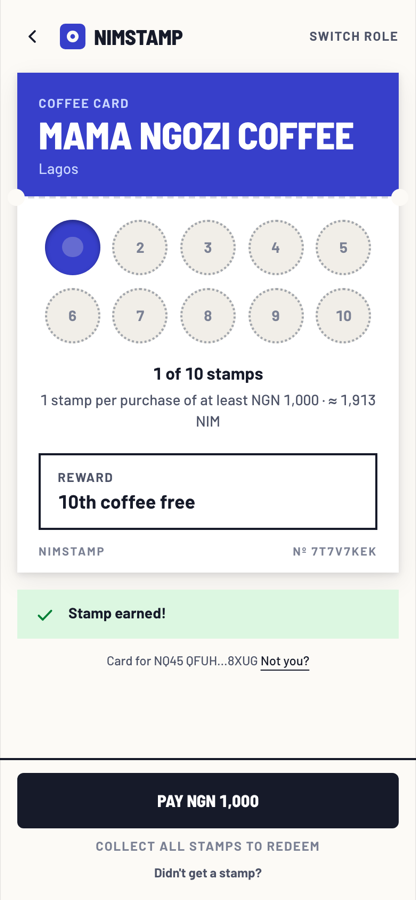
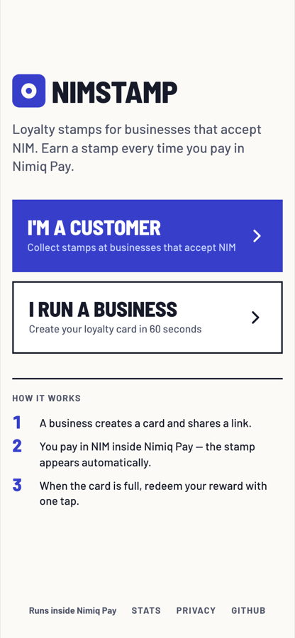
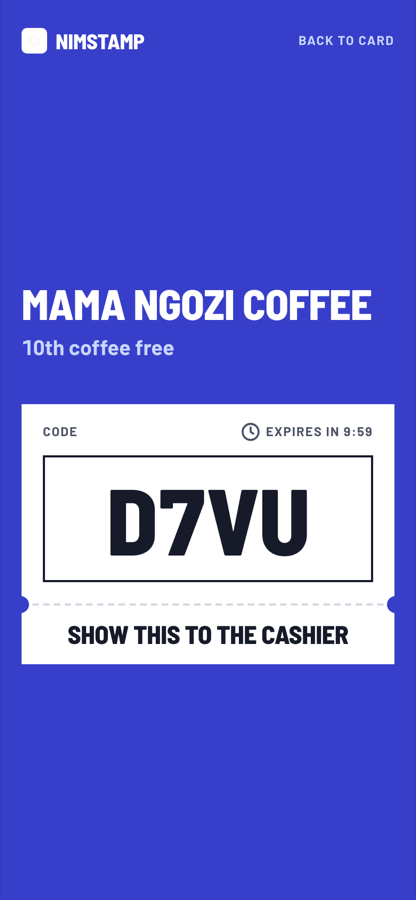
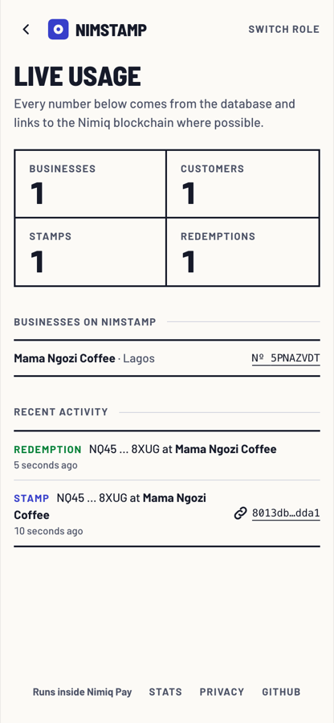

# NimStamp

> Loyalty stamp cards for any merchant, inside Nimiq Pay

| Field | Value |
| --- | --- |
| Category | Shopping & deals |
| Pricing | Free |
| Team name | _Not provided — optional_ |
| Team members | _Not provided — optional_ |
| X account | _Not provided — optional_ |
| Heard about it via | _Not provided — optional_ |
| Contact email | idolorgodswilleseteru@gmail.com |
| GitHub login | @big14way |
| Submitted at | 2026-09-15T15:20:41.637Z |

## Links

| Link | URL |
| --- | --- |
| Repo | [https://github.com/big14way/nimstamp](<https://github.com/big14way/nimstamp>) |
| Demo | [https://nimpay.app/miniapps/open/nimstamp.vercel.app](<https://nimpay.app/miniapps/open/nimstamp.vercel.app>) |
| Video | [https://youtu.be/_u_yXShSigw](<https://youtu.be/_u_yXShSigw>) |
| Skool post | [https://www.skool.com/miniappscompetition/nimstamp-loyalty-stamp-cards-for-any-merchant-inside-nimiq-pay](<https://www.skool.com/miniappscompetition/nimstamp-loyalty-stamp-cards-for-any-merchant-inside-nimiq-pay>) |
| Social post | [https://x.com/blobis_yobo/status/2099877926510670263](<https://x.com/blobis_yobo/status/2099877926510670263>) |

## Description

A self-serve loyalty stamp card inside Nimiq Pay. Merchants set up in 60 seconds; customers earn a stamp automatically every time they pay in NIM, verified on chain. For coffee shops, barbers, market stalls and anyone who takes NIM.

## Builder story

Small businesses want repeat customers, but loyalty programmes are built for chains: apps, POS integrations, printed cards that get lost. Nimiq's built-in rewards work at curated partner locations; NimStamp lets any merchant anywhere set up loyalty in 60 seconds.

NimStamp is a digital stamp card that lives inside Nimiq Pay. A merchant signs in with the wallet that receives their payments, fills one form, and gets a link and a printable QR table tent. Customers open the link, tap Pay, and earn a stamp automatically every time they pay in NIM. When the card is full they redeem with one tap and show the cashier a four-letter code.

It uses Nimiq Pay end to end: sendBasicTransactionWithData attaches a tagged memo so the server can match each payment on the Nimiq blockchain, sign() proves wallet ownership for merchant login and reward redemption, requestDeviceIdentifier limits cards per phone, and the language API switches the interface between English, Spanish, German and French. The server is the only authority: it verifies every payment and signature on chain and never holds funds.

Everything is public and verifiable. The stats page (nimstamp.vercel.app/stats) lists every business, stamp and redemption with links to nimiq.watch — 6 stamps for 1 customer at 1 business at the time of submission.

For coffee shops, barbers, market stalls and anyone else who takes NIM.

## Thumbnail

## Screenshots

---

_Generated from the submission form. `submission.yaml` in this folder is the machine-readable source of truth._
