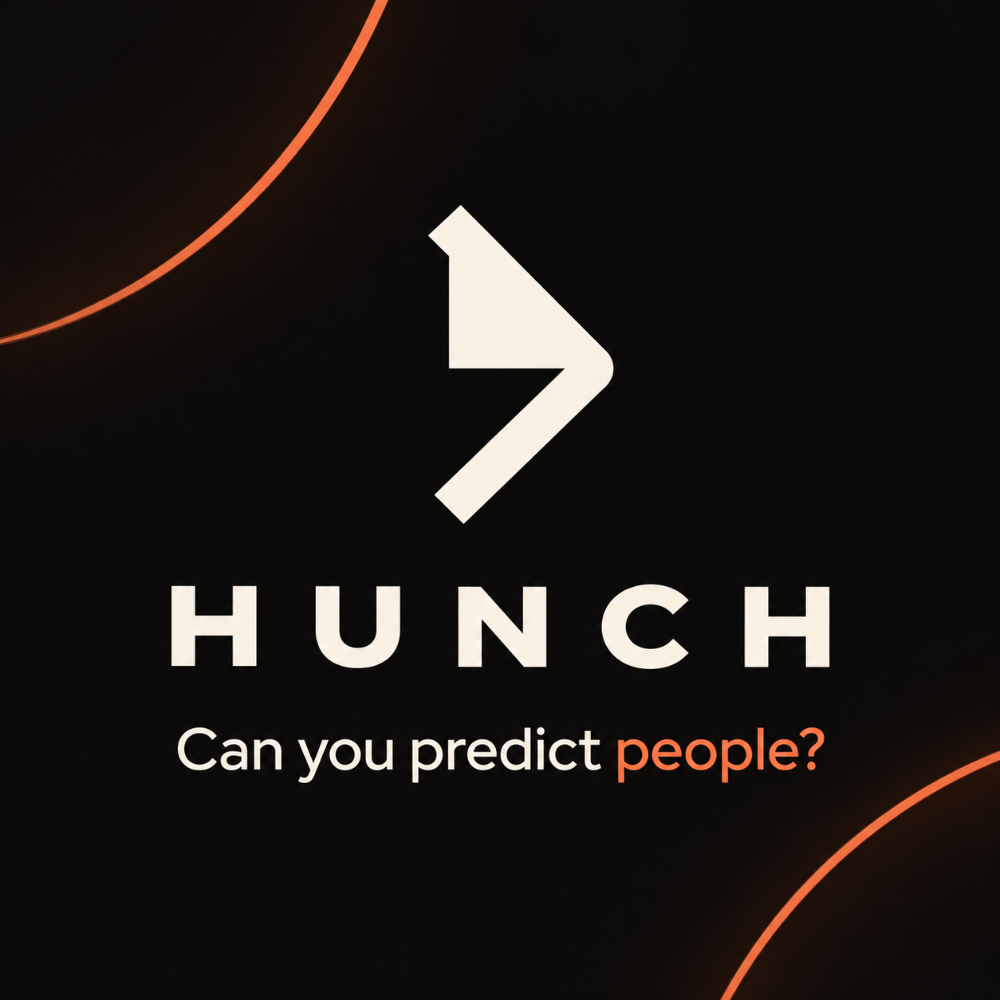
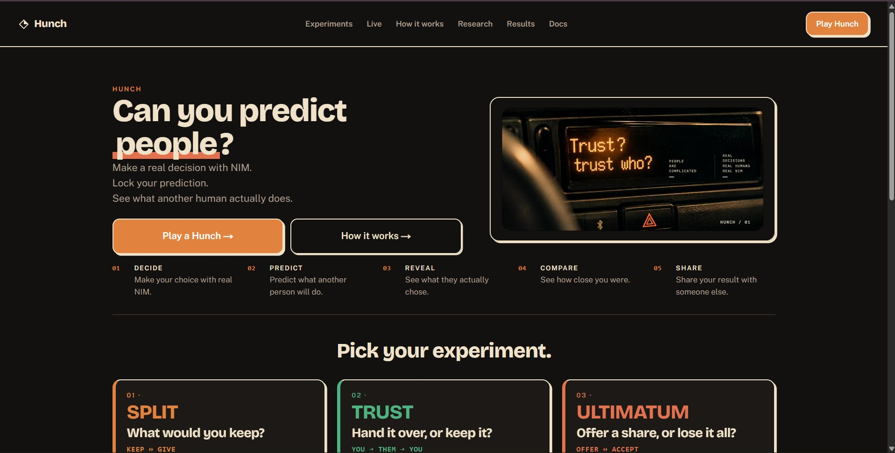
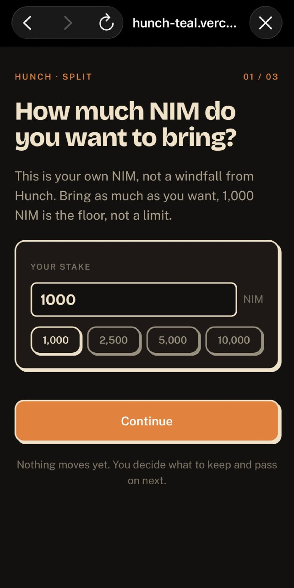
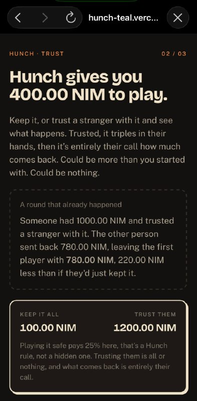
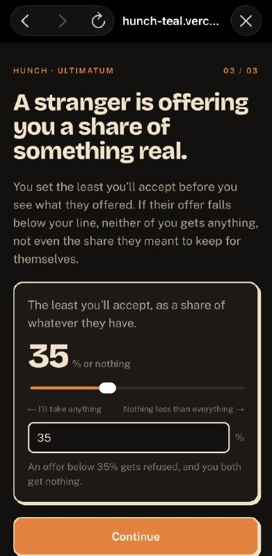
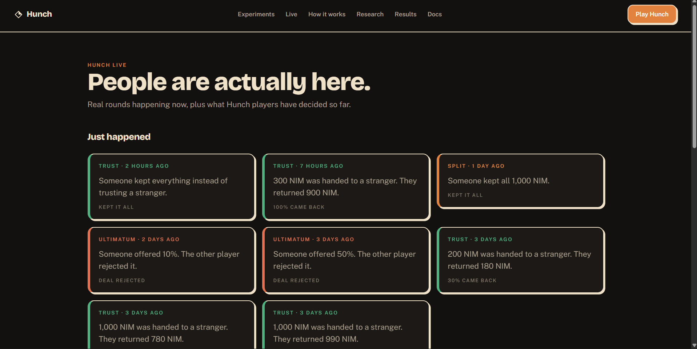

# Hunch

> Can you predict people?

| Field | Value |
| --- | --- |
| Category | Social |
| Pricing | Free |
| Team name | Bz Builds |
| Team members | _Not provided — optional_ |
| X account | bhadmee |
| Heard about it via | Nimiq Community on X |
| Contact email | bizadmie@gmail.com |
| GitHub login | @bzdmin |
| Submitted at | 2026-09-18T23:00:14.118Z |

## Links

| Link | URL |
| --- | --- |
| Repo | [https://github.com/bzdmin/hunch](<https://github.com/bzdmin/hunch>) |
| Demo | [https://hunch-teal.vercel.app/live](<https://hunch-teal.vercel.app/live>) |
| Video | [https://youtu.be/ImAEr4od6XE](<https://youtu.be/ImAEr4od6XE>) |
| Skool post | [https://www.skool.com/miniappscompetition/hunch?p=7ce71b9d](<https://www.skool.com/miniappscompetition/hunch?p=7ce71b9d>) |
| Social post | [https://x.com/bhadmee/status/2101083619074670993](<https://x.com/bhadmee/status/2101083619074670993>) |

## Description

Hunch is a Nimiq Pay Mini App for real human behavioral experiments. Make decisions with real NIM, predict what another person will do, then reveal the outcome and see how your hunch compares with real behavior.

## Builder story

We make predictions about people constantly. Would they share? Would they trust a stranger? Would they reject an offer they think is unfair? Usually, there’s no way to put those hunches to the test.

I built Hunch to turn that curiosity into a live behavioral experiment. You make a real decision with NIM, lock your prediction about what another person will do, wait for their independent decision, then reveal the outcome and compare your hunch with real behavior and published research.

I wanted Nimiq Pay to be part of the experiment itself, not just a payment button added at the end. Hunch uses wallet signatures to commit decisions, server-side locking to keep two-player choices blind, and real Nimiq transactions for settlement.

Hunch currently has three experiments: Split, where you decide how much NIM to keep or pass forward; Trust, where another person decides what comes back; and Ultimatum, where another person decides whether to accept your offer.

Throughout the build, I focused on making the experience understandable within seconds while keeping the mechanics real. No accounts, no simulated balances, no random outcomes, and no personality scores. Just a simple loop:

Decide. Predict. Wait. Reveal. Compare.

The result is Hunch, a small experiment on whether we’re actually as good at reading people as we think we are.

## Thumbnail

## Screenshots

---

_Generated from the submission form. `submission.yaml` in this folder is the machine-readable source of truth._
