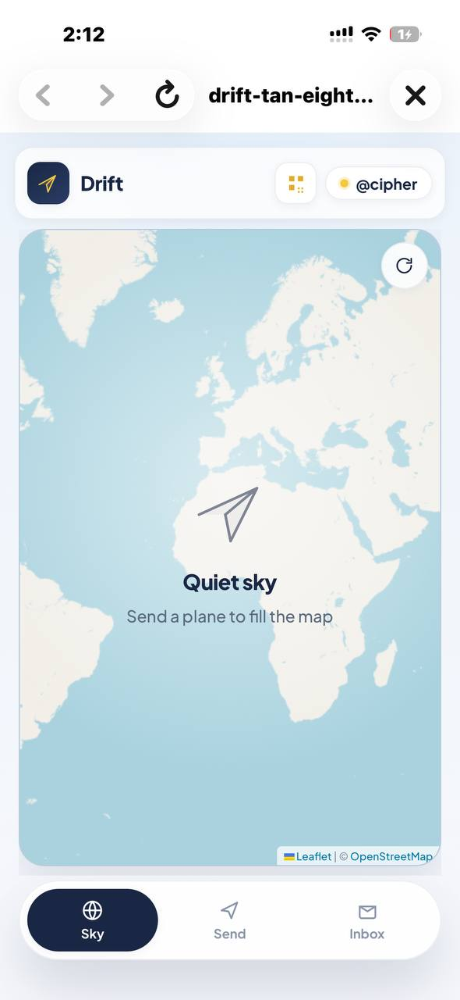
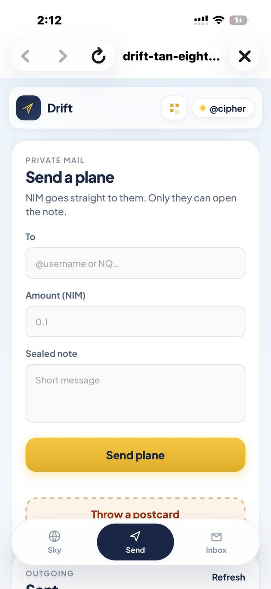
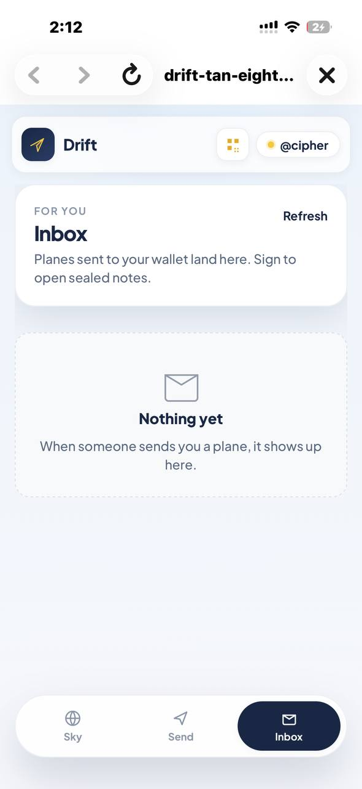
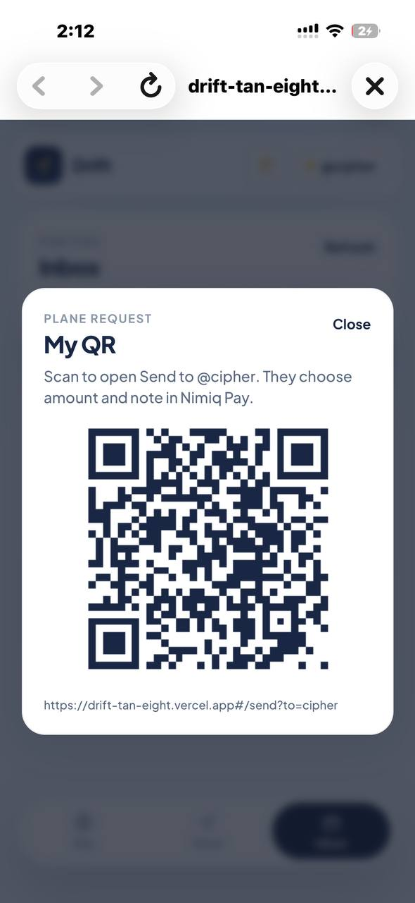

# Drift

> Paper planes with NIM, inside Nimiq Pay.

| Field | Value |
| --- | --- |
| Category | Social |
| Pricing | Free |
| Team name | _Not provided — optional_ |
| Team members | _Not provided — optional_ |
| X account | dex_cipher |
| Heard about it via | x |
| Contact email | obasanjoemmanuel9@gmail.com |
| GitHub login | @cipherEncrypt |
| Submitted at | 2026-09-17T01:27:56.841Z |

## Links

| Link | URL |
| --- | --- |
| Repo | [https://github.com/cipherEncrypt/Drift](<https://github.com/cipherEncrypt/Drift>) |
| Demo | [https://drift-tan-eight.vercel.app](<https://drift-tan-eight.vercel.app>) |
| Video | [https://youtube.com/shorts/DcHicJdyjqc?feature=share](<https://youtube.com/shorts/DcHicJdyjqc?feature=share>) |
| Skool post | _Not provided — optional_ |
| Social post | [https://x.com/dex_cipher/status/2100395622973030866?s=20](<https://x.com/dex_cipher/status/2100395622973030866?s=20>) |

## Description

send NIM as a sealed paper plane to an @username
Only that wallet can open the note. Friends can cheer or speed the flight. They cannot read the letter.

## Builder story

I wanted sending NIM to feel like sending a letter, not pasting a long address. Drift is a plane on a map with a sealed note. Only the recipient can open it. Usernames and a public sky make it easy to try with someone else in Nimiq Pay.

## Thumbnail

## Screenshots

---

_Generated from the submission form. `submission.yaml` in this folder is the machine-readable source of truth._
