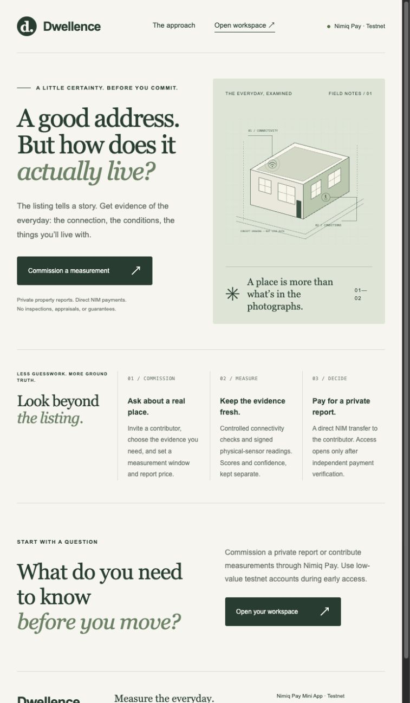
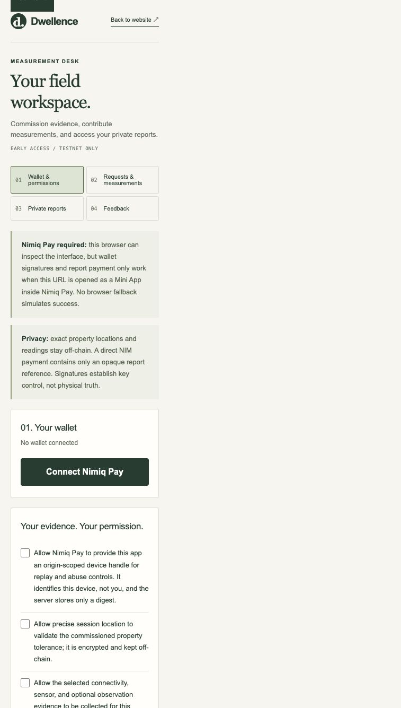
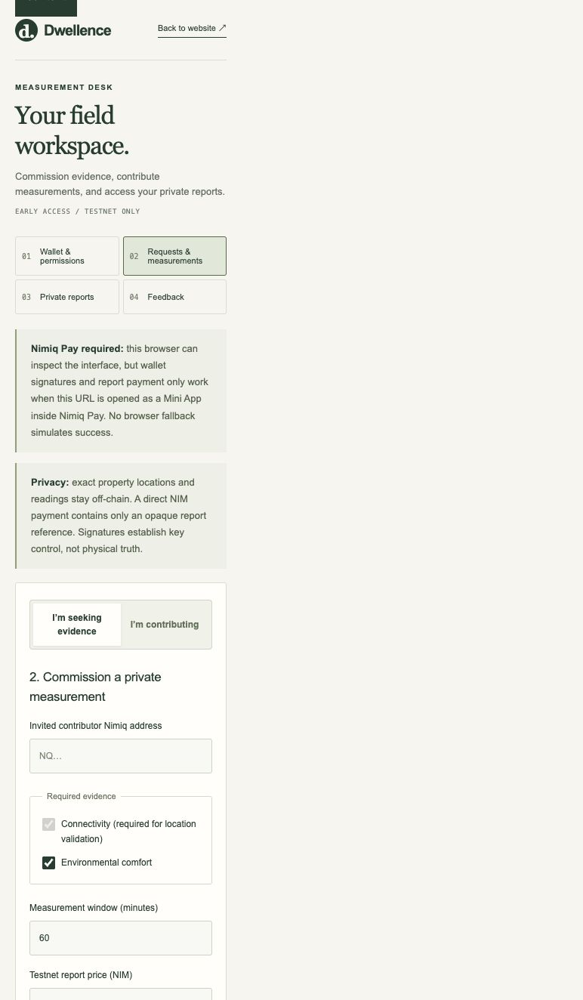
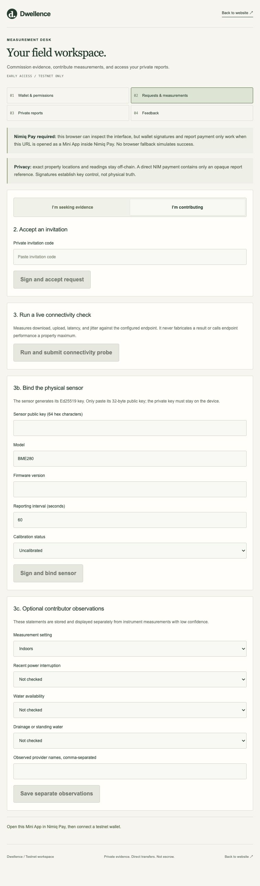
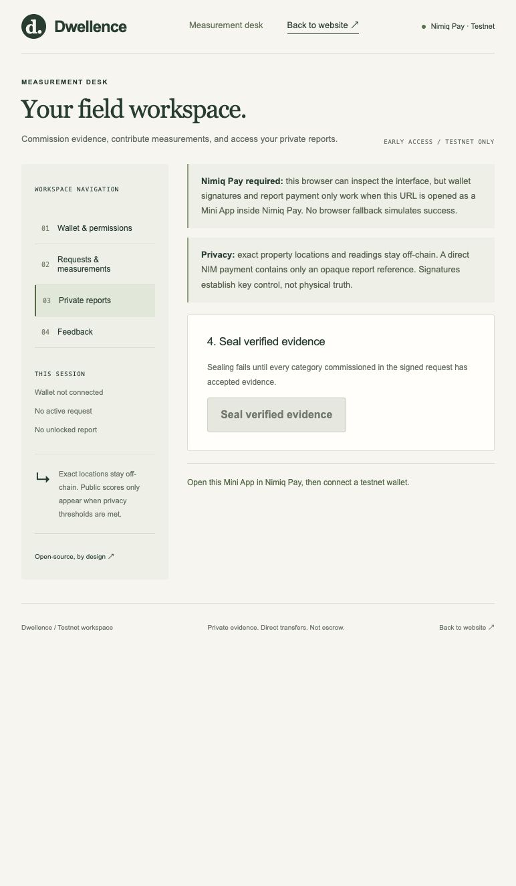

# Dwellence

> Fresh evidence for how a place actually performs.

| Field | Value |
| --- | --- |
| Category | Marketplaces |
| Pricing | Paid |
| Team name | Dwellence |
| Team members | danielAsaboro |
| X account | https://x.com/useLeash |
| Heard about it via | Discovery source not recorded. |
| Contact email | asaborodaniel@gmail.com |
| GitHub login | @danielAsaboro |
| Submitted at | 2026-09-18T20:38:50.206Z |

## Links

| Link | URL |
| --- | --- |
| Repo | [https://github.com/danielAsaboro/dwellence](<https://github.com/danielAsaboro/dwellence>) |
| Demo | [https://dwellence.usereef.xyz](<https://dwellence.usereef.xyz>) |
| Video | [https://vimeo.com/1228186980](<https://vimeo.com/1228186980>) |
| Skool post | _Not provided — optional_ |
| Social post | [https://x.com/useLeash/status/2101043941479174191](<https://x.com/useLeash/status/2101043941479174191>) |

## Description

Dwellence helps renters and buyers commission fresh property connectivity and environmental evidence. It implements Nimiq Pay signatures and direct NIM report purchases; native payments and physical sensors still await verification.

## Builder story

Dwellence focuses on the gap between a property listing and the everyday conditions someone will live with. The app commissions fresh connectivity and environmental evidence, keeps exact property results private, and coordinates direct NIM payments to contributors. The build emphasizes consent, recoverable errors, signed readings, independent payment verification, and clear limits: wallet signatures establish key control, and reports are informational. The public MIT repository passes 89 controlled tests. Live browser checks and one partial iPhone observation are recorded; physical sensors, completed native payments, and real-user feedback still need verification.

Team lead: danielAsaboro. GitHub: https://github.com/danielAsaboro
Nimiq payout address: NQ58 6E50 CCX4 JPGE MVE8 GJSH JD79 XQ5D 7K0F

## Thumbnail

## Screenshots

---

_Generated from the submission form. `submission.yaml` in this folder is the machine-readable source of truth._
