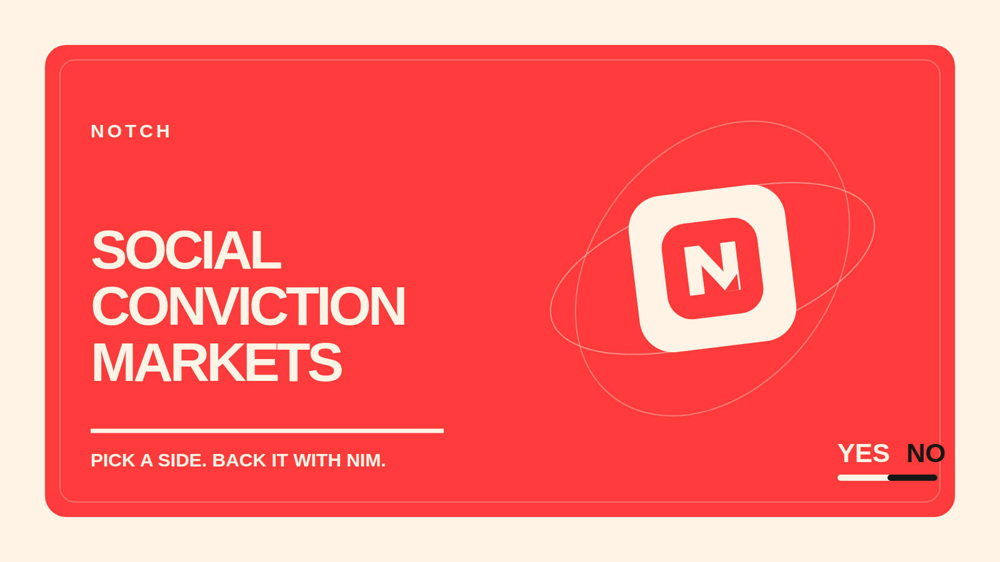
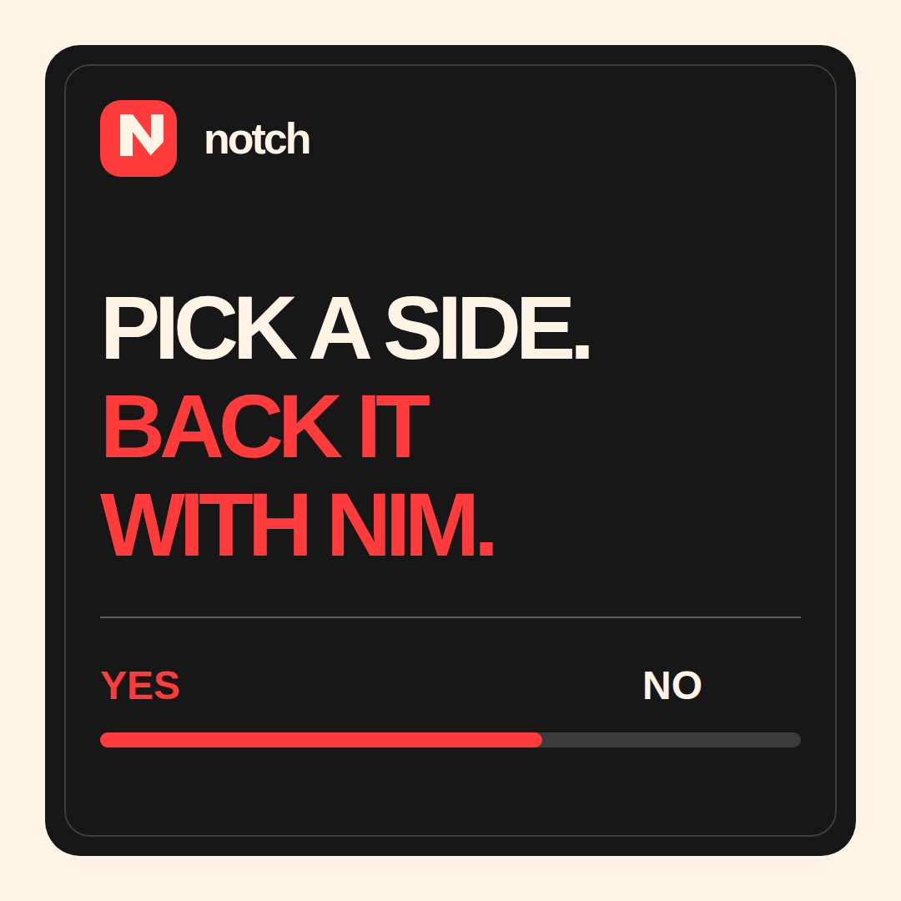
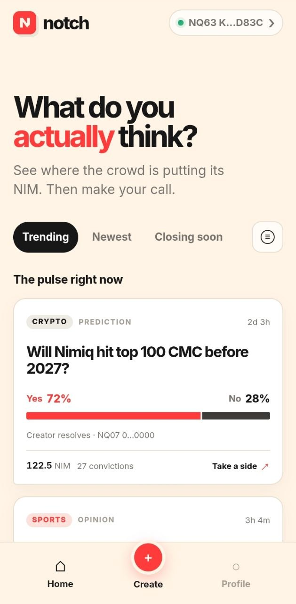
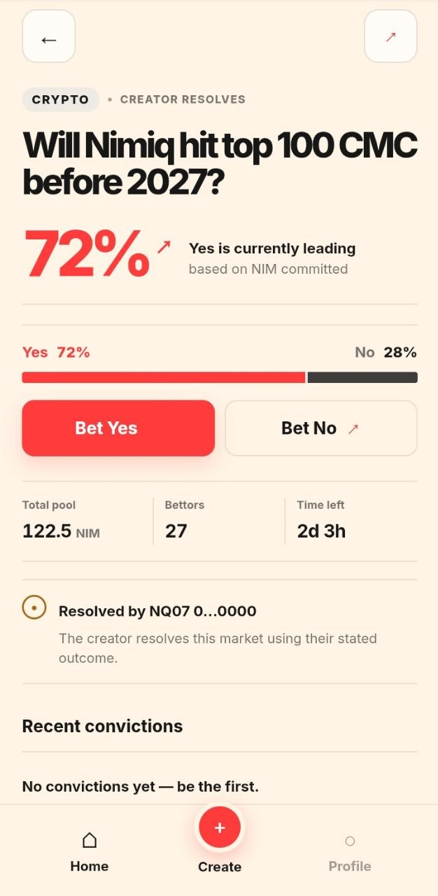
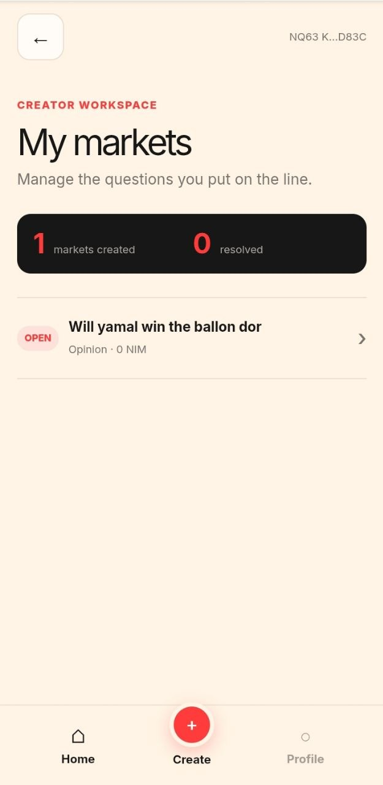
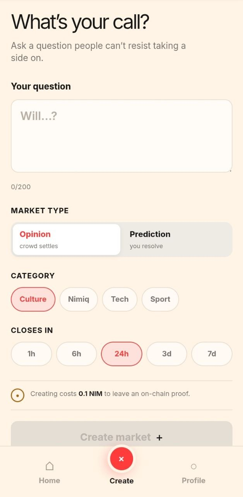

# Notch

> Put your conviction on the line.

| Field | Value |
| --- | --- |
| Category | Social |
| Pricing | Freemium |
| Team name | _Not provided — optional_ |
| Team members | _Not provided — optional_ |
| X account | szrxbt |
| Heard about it via | X |
| Contact email | theamebonetwork@gmail.com |
| GitHub login | @danielamodu |
| Submitted at | 2026-09-18T23:05:25.935Z |

## Links

| Link | URL |
| --- | --- |
| Repo | [https://github.com/danielamodu/Notch](<https://github.com/danielamodu/Notch>) |
| Demo | [https://youtu.be/3kpoV0Hlq88](<https://youtu.be/3kpoV0Hlq88>) |
| Video | [https://youtube.com/shorts/4ZsQjOOgN-c?feature=share](<https://youtube.com/shorts/4ZsQjOOgN-c?feature=share>) |
| Skool post | _Not provided — optional_ |
| Social post | [https://x.com/szrxbt/status/2101074337386176921?s=20](<https://x.com/szrxbt/status/2101074337386176921?s=20>) |

## Description

Notch is a social conviction market where anyone can create a market on any topic, pick a side, and bet NIM. Winners split the pot. The crowd decides.

## Builder story

I wanted to build something that answered one question — what do people actually believe when there's real money on it? Not polls, not likes, not retweets. Skin in the game.

Notch is a conviction market built natively on Nimiq Pay. Anyone can create a market on anything — sports, crypto, culture, tech. You pick a side, commit NIM, and the crowd settles it. Opinion markets auto-resolve when the timer ends — majority NIM wins. Prediction markets let the creator call the outcome. Winners split the full pool minus a 5% house cut.

Every action is on-chain. Market creation costs 0.1 NIM and leaves an immutable on-chain proof. Every bet is tagged with a structured memo. Every payout is broadcast with a verifiable tx hash. Your wallet address is your identity — no signup, no account.

The result is a platform that feels alive. Open Notch and you immediately see what people are putting real money behind right now. The probability numbers shift in real time as new bets come in. It's Polymarket energy inside your Nimiq Pay wallet.

## Thumbnail

## Screenshots

---

_Generated from the submission form. `submission.yaml` in this folder is the machine-readable source of truth._
