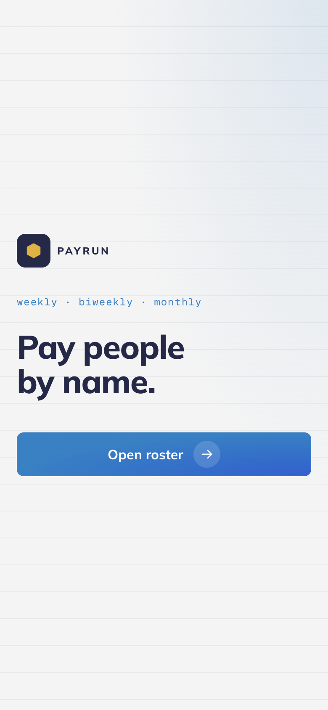
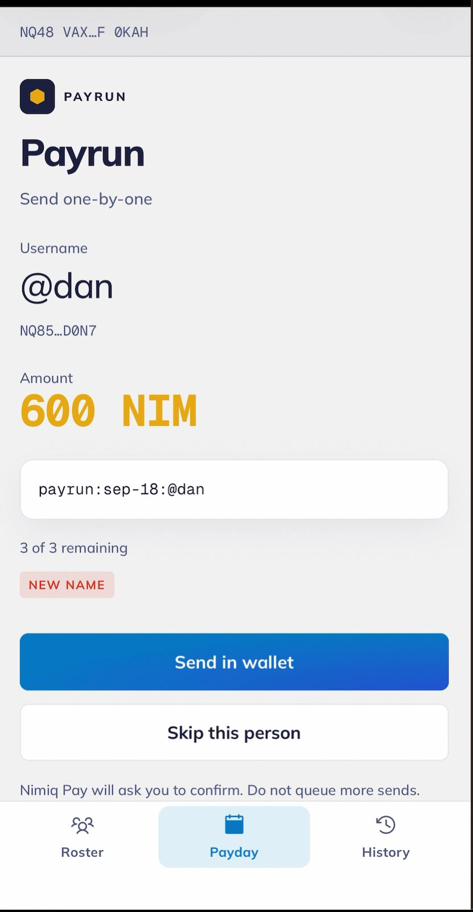
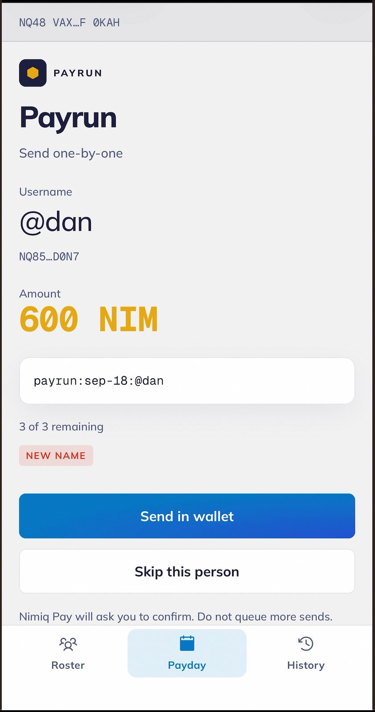
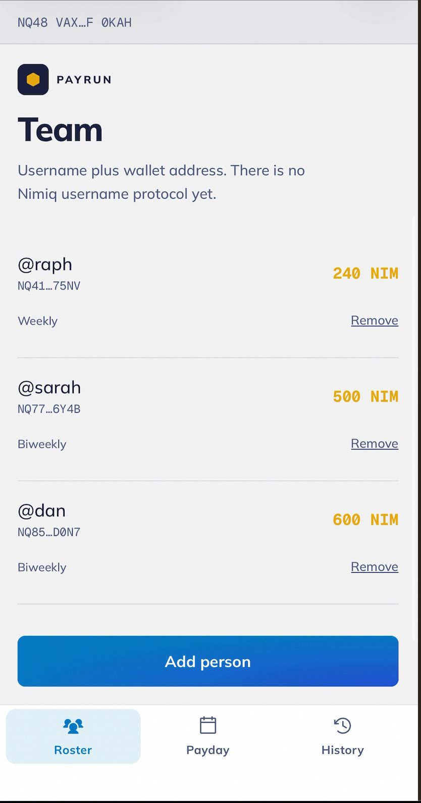

# PayRun

> Pay people by name.

| Field | Value |
| --- | --- |
| Category | Productivity |
| Pricing | Free |
| Team name | axisops-tech |
| Team members | _Not provided — optional_ |
| X account | payrun_nimiq |
| Heard about it via | I have been using Nimiq for a couple of months and kept seeing the ads in the app. A friend and I decided to enter. We shipped two mini apps: Payrun and StealthPay. |
| Contact email | mailquillofficial@gmail.com |
| GitHub login | @davy-patty |
| Submitted at | 2026-09-18T23:41:54.892Z |

## Links

| Link | URL |
| --- | --- |
| Repo | [https://github.com/davy-patty/payrun](<https://github.com/davy-patty/payrun>) |
| Demo | [https://youtube.com/shorts/jut4RCt7wSY](<https://youtube.com/shorts/jut4RCt7wSY>) |
| Video | [https://youtube.com/shorts/jut4RCt7wSY](<https://youtube.com/shorts/jut4RCt7wSY>) |
| Skool post | _Not provided — optional_ |
| Social post | _Not provided — optional_ |

## Description

Payroll for team leads who send NIM. Save a name and a wallet, review payday flags, and confirm each send.

## Builder story

Team payday kept living in a spreadsheet: names in one column, wallets in another, and someone still had to copy each send by hand. Nimiq has no username protocol, so you cannot just pay @raph. Payrun keeps the name and the wallet together, flags new people and big amount jumps, and you still confirm each send

## Thumbnail

## Screenshots

---

_Generated from the submission form. `submission.yaml` in this folder is the machine-readable source of truth._
