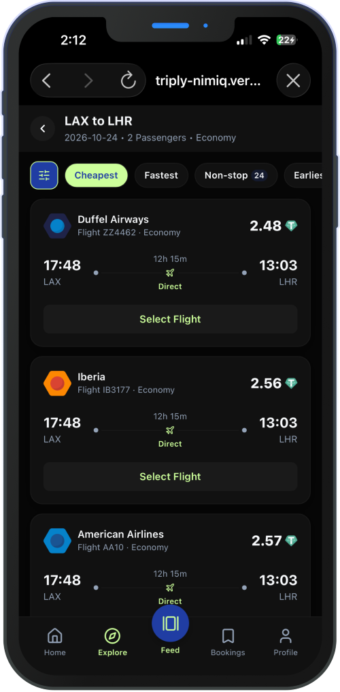
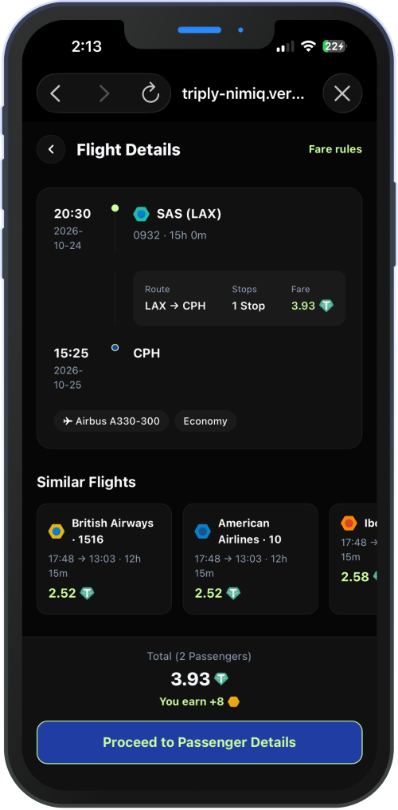
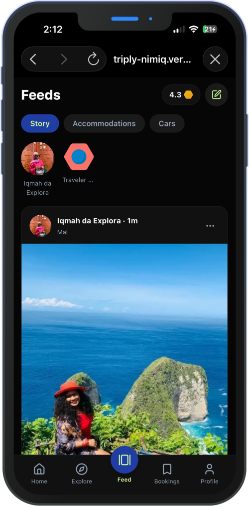
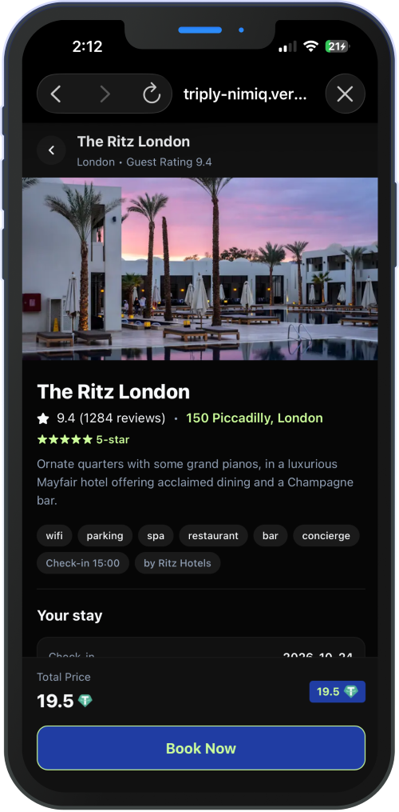
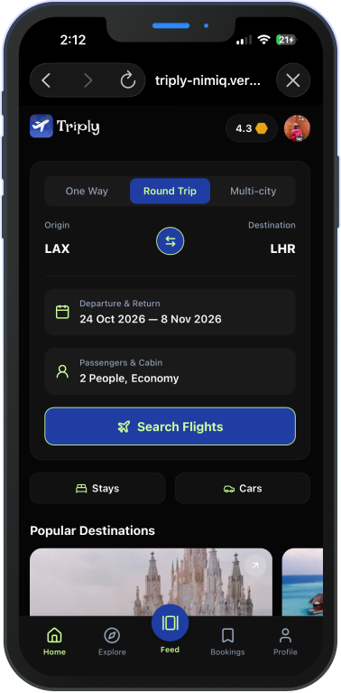

# Triply

> Book real flights, stays, and cars with crypto - settled on-chain in minutes.

| Field | Value |
| --- | --- |
| Category | Lifestyle |
| Pricing | Freemium |
| Team name | Triply |
| Team members | Ibrahim Arogundade, Taiwo Omoyeni |
| X account | TriplyOnNimiq |
| Heard about it via | From a friend on Telegram |
| Contact email | devarogundade@gmail.com |
| GitHub login | @devarogundade |
| Submitted at | 2026-09-18T11:07:59.341Z |

## Links

| Link | URL |
| --- | --- |
| Repo | [https://github.com/FlowFiApp/Triply](<https://github.com/FlowFiApp/Triply>) |
| Demo | [https://triply-nimiq.vercel.app](<https://triply-nimiq.vercel.app>) |
| Video | [https://www.youtube.com/watch?v=dKpkv-zC3og](<https://www.youtube.com/watch?v=dKpkv-zC3og>) |
| Skool post | [https://www.skool.com/miniappscompetition/meet-triply-book-real-travel-with-crypto-no-kyc-no-card?p=0c1804a1](<https://www.skool.com/miniappscompetition/meet-triply-book-real-travel-with-crypto-no-kyc-no-card?p=0c1804a1>) |
| Social post | [https://x.com/triplyonnimiq/status/2100263779044909229](<https://x.com/triplyonnimiq/status/2100263779044909229>) |

## Description

Triply is a web3 travel marketplace for everyone: search real flights, hotels, and cars, pay with USDT on Polygon, and earn NIM cashback - no sign-up, no KYC, no card. Your wallet is your account.

## Builder story

Millions of people pay for everything with crypto, except travel. Online Travel Agencies still demand cards, KYC, and bank accounts, forcing crypto users to off-ramp just to book a hotel.

So we built Triply: a travel marketplace where your wallet is your account. Search real flights through Duffel, book stays and cars, pay with USDT on Polygon, and earn NIM cashback - all settled on-chain in minutes. 

We built it as a Nimiq Mini App to prove the ecosystem can power real-world commerce: Nimiq identity is the login, Nimiq points are the loyalty loop, and the flow feels native in Nimiq Pay. 

We built the app we'd want to fly with.

## Thumbnail

## Screenshots

---

_Generated from the submission form. `submission.yaml` in this folder is the machine-readable source of truth._
