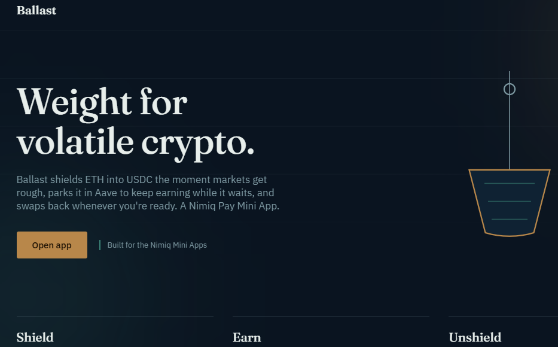
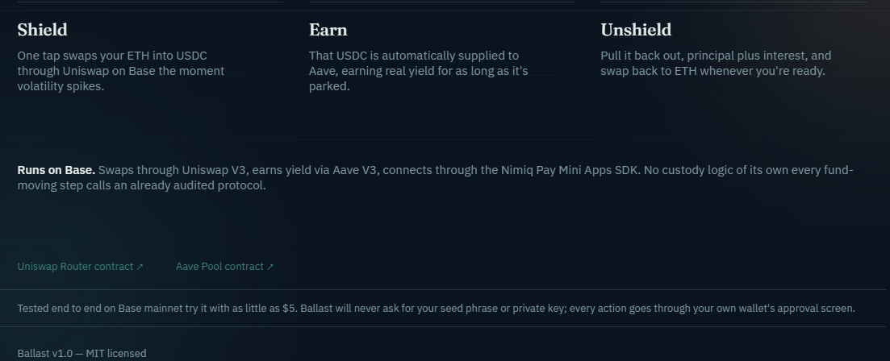
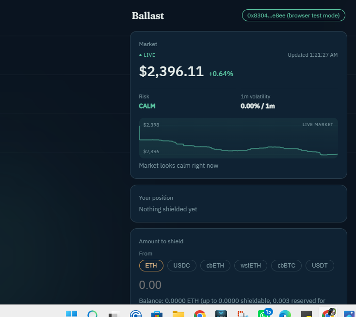

# BALLAST

> Turn a crash into parked yield, not panic.

| Field | Value |
| --- | --- |
| Category | On-chain services |
| Pricing | Free |
| Team name | NA |
| Team members | Merie Mueni |
| X account | _Not provided — optional_ |
| Heard about it via | Twitter |
| Contact email | olayojackdoopatrick@gmail.com |
| GitHub login | @devshieldhq |
| Submitted at | 2026-09-16T22:54:58.246Z |

## Links

| Link | URL |
| --- | --- |
| Repo | [https://github.com/devshieldhq/Ballast](<https://github.com/devshieldhq/Ballast>) |
| Demo | [https://ballast-steel.vercel.app](<https://ballast-steel.vercel.app>) |
| Video | [https://www.loom.com/share/42c82fa4643a498cb53349224292454e](<https://www.loom.com/share/42c82fa4643a498cb53349224292454e>) |
| Skool post | [https://www.skool.com/miniappscompetition/submitting-ballast-for-cycle-ii?p=3b338ed0](<https://www.skool.com/miniappscompetition/submitting-ballast-for-cycle-ii?p=3b338ed0>) |
| Social post | [https://x.com/merie_mueni/status/2100343158529831170?s=20](<https://x.com/merie_mueni/status/2100343158529831170?s=20>) |

## Description

Ballast shields ETH, USDT, cbETH, wstETH, and cbBTC into USDC the moment markets get rough, parks it in Aave V3 for real yield, and swaps back whenever you're ready, all through already audited protocols on Base.

## Builder story

_Not provided — optional_

## Thumbnail

## Screenshots

---

_Generated from the submission form. `submission.yaml` in this folder is the machine-readable source of truth._
