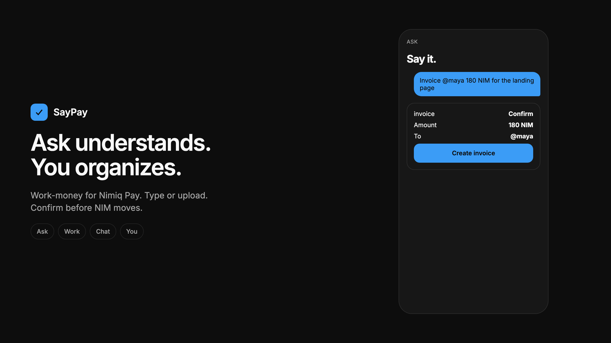
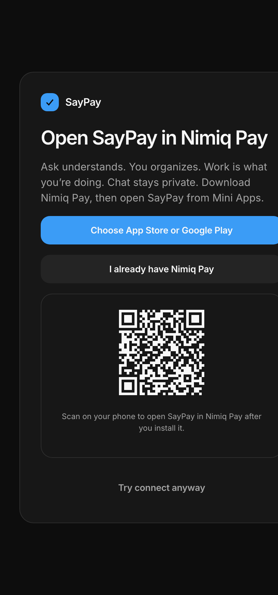
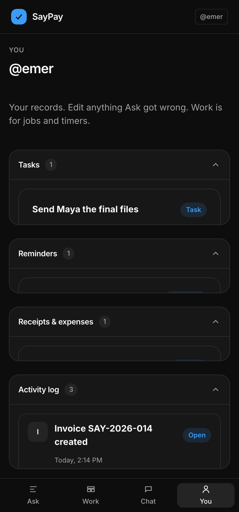
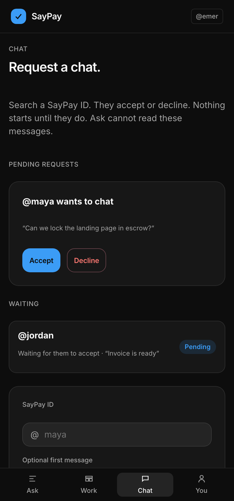
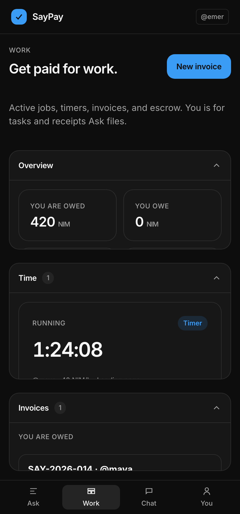

# SayPay

> Type or paste anything, Ask understands. You organizes/control. Confirm in Nimiq Pay.

| Field | Value |
| --- | --- |
| Category | Productivity |
| Pricing | Free |
| Team name | _Not provided — optional_ |
| Team members | _Not provided — optional_ |
| X account | emerxch |
| Heard about it via | From X |
| Contact email | emerxch@gmail.com |
| GitHub login | @emer-eth |
| Submitted at | 2026-09-18T23:38:58.121Z |

## Links

| Link | URL |
| --- | --- |
| Repo | [https://github.com/emer-eth/saypay](<https://github.com/emer-eth/saypay>) |
| Demo | [https://saypay-payment-assistant.emerxch.workers.dev](<https://saypay-payment-assistant.emerxch.workers.dev>) |
| Video | [https://youtube.com/shorts/n_cHWRPMp3E?feature=share](<https://youtube.com/shorts/n_cHWRPMp3E?feature=share>) |
| Skool post | _Not provided — optional_ |
| Social post | [https://x.com/emer__eth/status/2101092397224431709?s=20](<https://x.com/emer__eth/status/2101092397224431709?s=20>) |

## Description

SayPay is work-money for freelancers in Nimiq Pay. Type or upload in Ask; Gemini files tasks, reminders, and receipts in You. 
Work holds jobs, timers, invoices, and two-party escrow. Chat is request-gated and encrypted. Only Nimiq Pay moves NIM.

## Builder story

_Not provided — optional_

## Thumbnail

## Screenshots

---

_Generated from the submission form. `submission.yaml` in this folder is the machine-readable source of truth._
