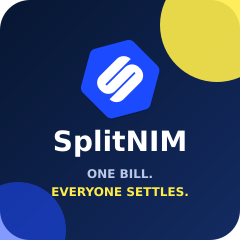
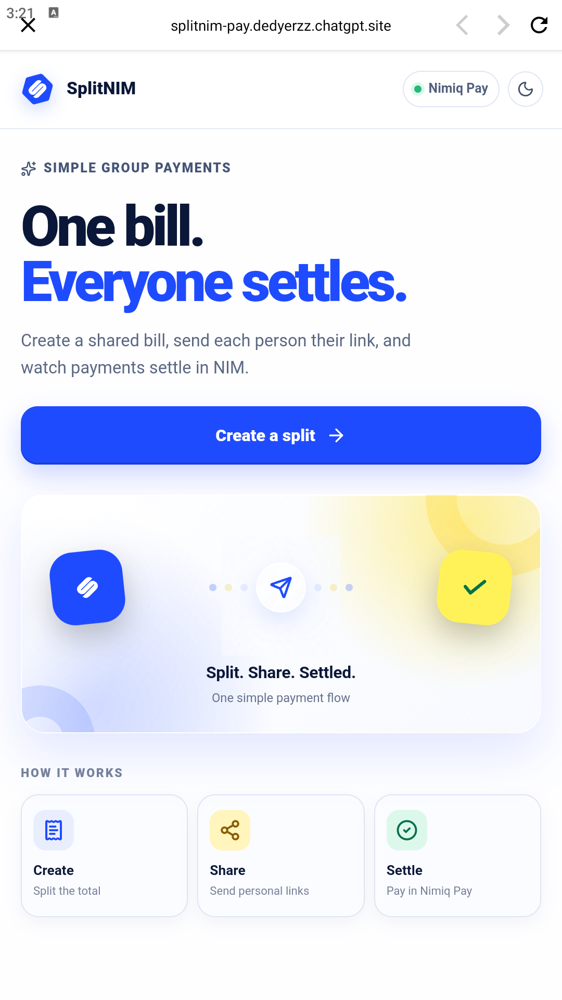
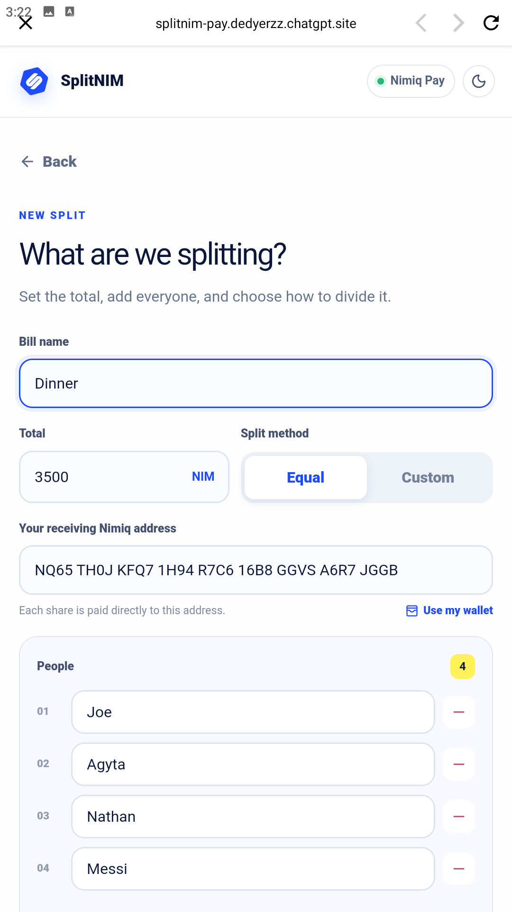
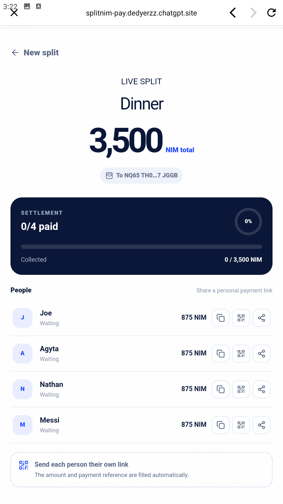
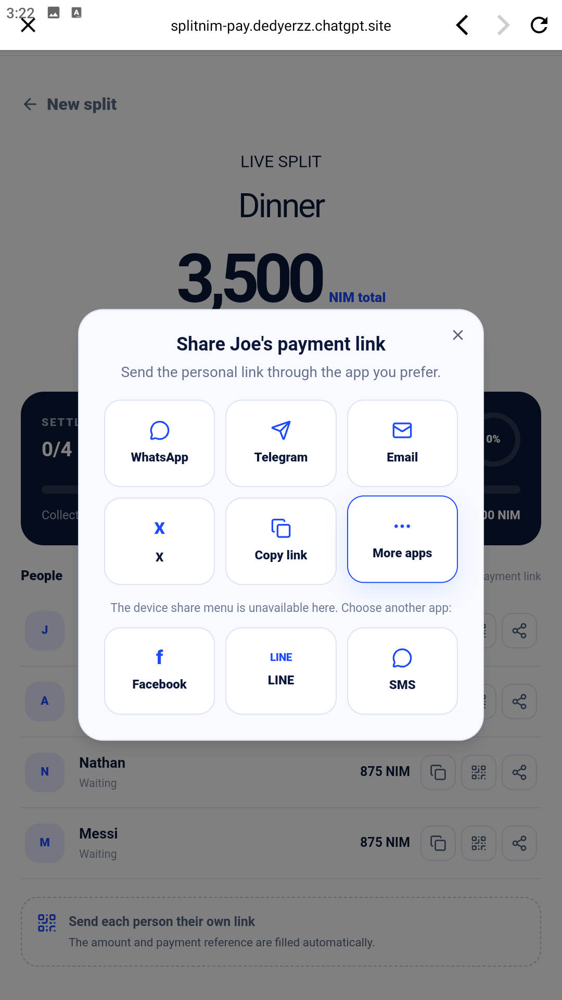
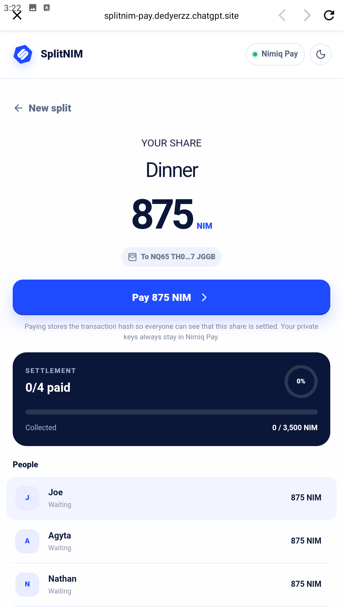

# SplitNIM

> One bill. Everyone settles.

| Field | Value |
| --- | --- |
| Category | Productivity |
| Pricing | Free |
| Team name | _Not provided — optional_ |
| Team members | _Not provided — optional_ |
| X account | erz2121 |
| Heard about it via | X and the Nimiq Community |
| Contact email | dedyerzz@gmail.com |
| GitHub login | @erz2121 |
| Submitted at | 2026-09-18T21:35:05.818Z |

## Links

| Link | URL |
| --- | --- |
| Repo | [https://github.com/erz2121/splitnim](<https://github.com/erz2121/splitnim>) |
| Demo | [https://splitnim-pay.dedyerzz.chatgpt.site](<https://splitnim-pay.dedyerzz.chatgpt.site>) |
| Video | [https://www.youtube.com/watch?v=g1uYWOnG8So](<https://www.youtube.com/watch?v=g1uYWOnG8So>) |
| Skool post | _Not provided — optional_ |
| Social post | [https://x.com/erz2121/status/2101061060182852068?s=20](<https://x.com/erz2121/status/2101061060182852068?s=20>) |

## Description

SplitNIM helps friends and groups split shared expenses and settle each share directly in NIM. Create a bill, generate personal payment links or QR codes, and track every verified on-chain payment in real time.

## Builder story

Splitting shared expenses often becomes unnecessarily complicated. Someone has to calculate every share, copy wallet addresses, remind participants, and check payment screenshots manually. I built SplitNIM to make that process simple and transparent. Each participant receives a personal payment link or QR code with the exact amount already prepared, while Nimiq Pay securely handles the transaction and SplitNIM verifies every payment on-chain.

## Thumbnail

## Screenshots

---

_Generated from the submission form. `submission.yaml` in this folder is the machine-readable source of truth._
