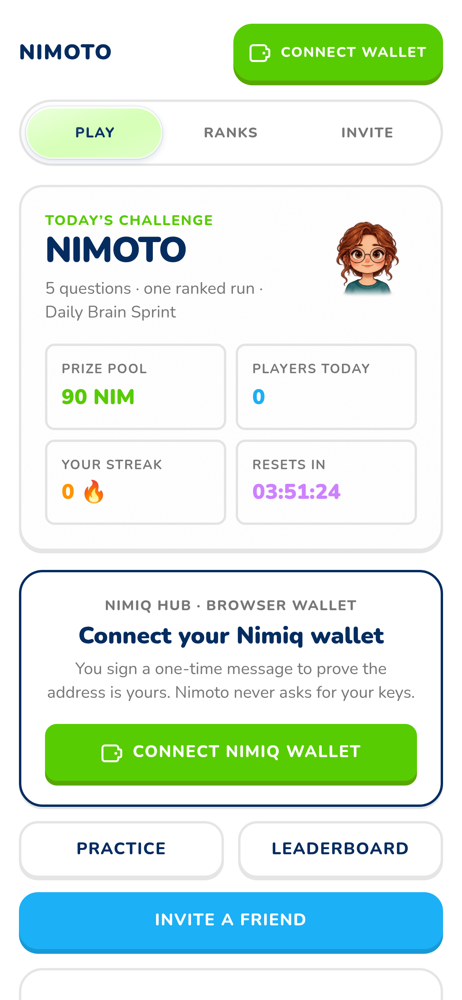
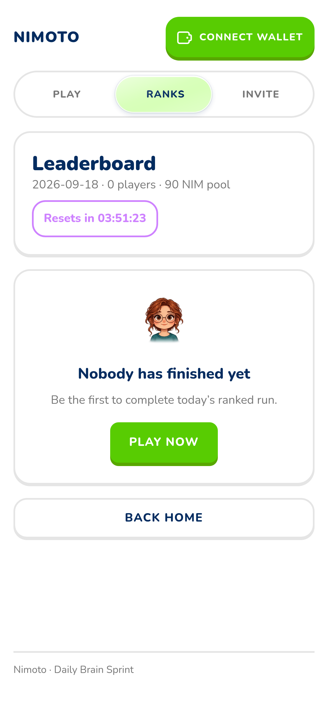
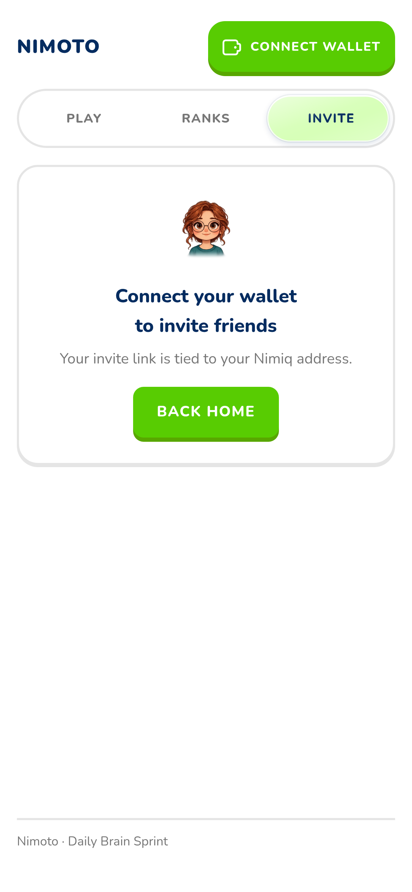

# Nimoto

> Learn something every day. Get paid in NIM for being sharp.

| Field | Value |
| --- | --- |
| Category | Education |
| Pricing | Free |
| Team name | Nimoto |
| Team members | zanbuilds |
| X account | zanbuilds |
| Heard about it via | twiiter |
| Contact email | ibrahimpima76@gmail.com |
| GitHub login | @fozagtx |
| Submitted at | 2026-09-18T20:26:09.417Z |

## Links

| Link | URL |
| --- | --- |
| Repo | [https://github.com/fozagtx/Nimoto](<https://github.com/fozagtx/Nimoto>) |
| Demo | [https://nimoto-web.onrender.com](<https://nimoto-web.onrender.com>) |
| Video | [https://youtu.be/NgxMVRklCRU](<https://youtu.be/NgxMVRklCRU>) |
| Skool post | [https://www.skool.com/miniappscompetition/you-can-now-earn-while-you-learn?p=77a97942](<https://www.skool.com/miniappscompetition/you-can-now-earn-while-you-learn?p=77a97942>) |
| Social post | [https://x.com/zanbuilds/status/2101039182483444119?s=20](<https://x.com/zanbuilds/status/2101039182483444119?s=20>) |

## Description

You want to learn something every day. But when there is nothing to win and nobody watching, distraction wins instead.

Nimoto changes that. It turns learning into a live tournament: five questions a day, a minute of your time, and real rewards at the end.

## Builder story

You want to learn something every day. But when there is nothing to win and nobody watching, distraction wins instead.

Nimoto changes that. It turns learning into a live tournament: five questions a day, a minute of your time, and real rewards at the end.

## Thumbnail

## Screenshots

---

_Generated from the submission form. `submission.yaml` in this folder is the machine-readable source of truth._
