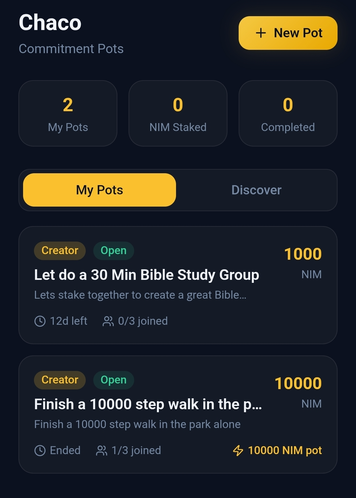

# LST Chaco

> Lets Stake Together

| Field | Value |
| --- | --- |
| Category | On-chain services |
| Pricing | Free |
| Team name | _Not provided — optional_ |
| Team members | _Not provided — optional_ |
| X account | Gchacon3 |
| Heard about it via | Ricardo told me participate |
| Contact email | gonzalo.chacon.miranda@gmail.com |
| GitHub login | @gchacon011 |
| Submitted at | 2026-09-18T22:47:40.657Z |

## Links

| Link | URL |
| --- | --- |
| Repo | [https://github.com/gchacon011/SOLANADEV](<https://github.com/gchacon011/SOLANADEV>) |
| Demo | [https://chaco-stake-flow.base44.app/](<https://chaco-stake-flow.base44.app/>) |
| Video | [https://youtu.be/JWSMz9Mh6dE?si=BAh7z2N0x8eJkzTG](<https://youtu.be/JWSMz9Mh6dE?si=BAh7z2N0x8eJkzTG>) |
| Skool post | [https://www.skool.com/miniappscompetition/today-is-the-last-day-submissions-close-tonight?p=62618667](<https://www.skool.com/miniappscompetition/today-is-the-last-day-submissions-close-tonight?p=62618667>) |
| Social post | [https://x.com/gchacon3/status/2101079537412931611](<https://x.com/gchacon3/status/2101079537412931611>) |

## Description

Staking with friends in pots

## Builder story

I love staking with friends

## Thumbnail

## Screenshots

---

_Generated from the submission form. `submission.yaml` in this folder is the machine-readable source of truth._
