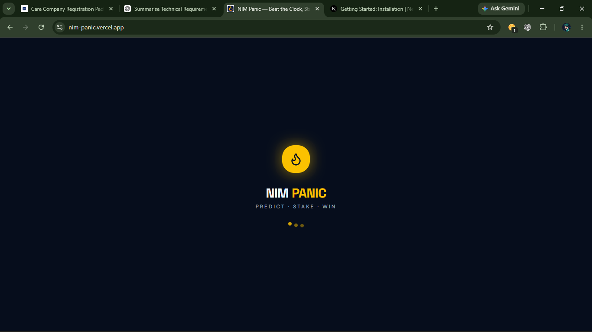
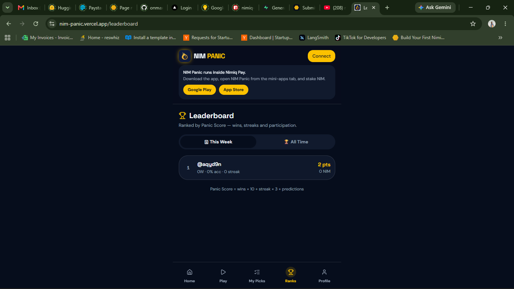
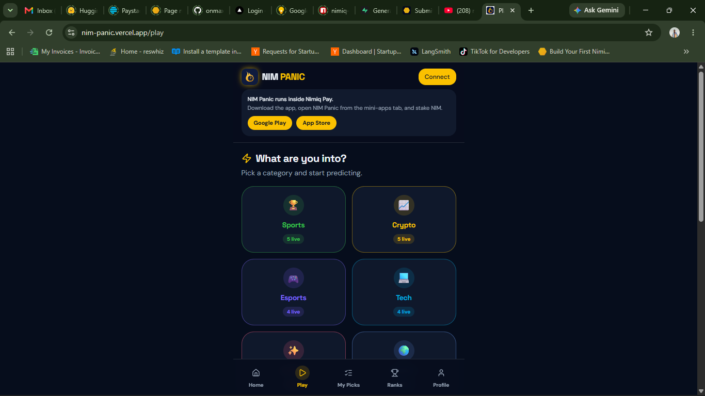

# NIMPANIC

> PREDICT, STAKE, WIN

| Field | Value |
| --- | --- |
| Category | Games |
| Pricing | Free |
| Team name | _Not provided — optional_ |
| Team members | _Not provided — optional_ |
| X account | GarryMike_M |
| Heard about it via | X |
| Contact email | garmanjimichael@gmail.com |
| GitHub login | @geemanji |
| Submitted at | 2026-09-18T12:32:08.283Z |

## Links

| Link | URL |
| --- | --- |
| Repo | [https://github.com/geemanji/nim-panic](<https://github.com/geemanji/nim-panic>) |
| Demo | [https://nim-panic.vercel.app](<https://nim-panic.vercel.app>) |
| Video | [https://www.youtube.com/watch?app=desktop&si=fuNTj0AibIp6HP9Z&v=zb_REKS09_o&feature=youtu.be](<https://www.youtube.com/watch?app=desktop&si=fuNTj0AibIp6HP9Z&v=zb_REKS09_o&feature=youtu.be>) |
| Skool post | _Not provided — optional_ |
| Social post | [https://twitter.com/GarryMike_M/status/2099726992069288178](<https://twitter.com/GarryMike_M/status/2099726992069288178>) |

## Description

NIM Panic is a fast, social prediction game built around NIM.
Players choose a prediction, select an outcome, stake NIM, and race against the countdown before the prediction locks. Once the outcome is resolved, players see their result and track their performance through streaks

## Builder story

I started building NIM Panic after spending a lot of time thinking about how to make crypto feel less complicated and more fun.
My first instinct was to build a prediction market.
Then I started using my own product and realized something was missing.
I didn't want another screen full of charts and numbers.
I wanted that feeling of:
"Wait... I have 20 seconds to make this call?"
So I started rebuilding around the feeling instead of the feature.
I'm experimenting with categories, streaks, challenges, leaderboards, 1v1s and, of course, NIM.
Some ideas will work.
Some won't.
This is NIM Panic.

## Thumbnail

## Screenshots

---

_Generated from the submission form. `submission.yaml` in this folder is the machine-readable source of truth._
